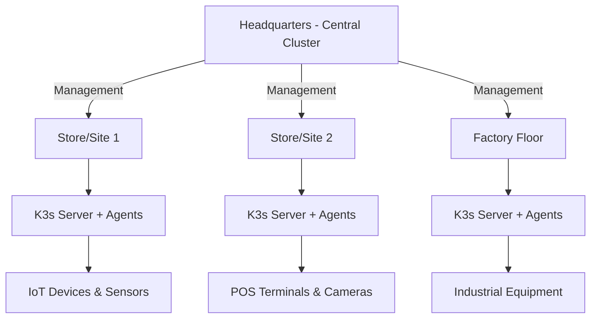

# How to Deploy K3s for Edge Computing Use Cases

Author: [nawazdhandala](https://www.github.com/nawazdhandala)

Tags: K3s, Kubernetes, Edge Computing, IoT, DevOps, Distributed Systems

Description: Learn how to deploy and configure K3s for edge computing scenarios including remote sites, retail stores, and distributed infrastructure.

## Introduction

K3s was designed with edge computing in mind — it's a lightweight Kubernetes distribution that runs on resource-constrained hardware at the edge of the network. Edge deployments have unique requirements: limited connectivity, resource constraints, autonomous operation, and the need for centralized management from a remote headquarters. This guide covers best practices for deploying K3s in edge environments.

## What Makes K3s Ideal for Edge Computing

- **Small footprint**: ~100MB binary, ~512MB RAM minimum
- **Embedded components**: No need for separate etcd, CCM, or storage installations
- **ARM support**: Runs on Raspberry Pi, NVIDIA Jetson, and other ARM devices
- **Auto-startup**: systemd service survives reboots automatically
- **Offline operation**: Continues running without connectivity to central management
- **Simple installation**: Single command deployment

## Edge Computing Architecture



## Step 1: Prepare Edge Hardware

Common edge hardware for K3s:

```bash
# Raspberry Pi 4 (4GB RAM recommended)
# NVIDIA Jetson Nano/Xavier
# Intel NUC
# Industrial PC with x86/ARM CPU

# Check system resources
free -h          # Available memory
df -h            # Disk space
nproc            # CPU cores
uname -m         # Architecture (x86_64 or aarch64)

# For Raspberry Pi, enable cgroups (required for K3s)
# Add to /boot/cmdline.txt:
# cgroup_memory=1 cgroup_enable=memory cgroup_enable=cpuset
```

## Step 2: Minimize K3s Footprint for Edge

Configure K3s to use minimal resources:

```yaml
# /etc/rancher/k3s/config.yaml
# Edge-optimized K3s configuration

# Disable components not needed at the edge
disable:
  - traefik        # If not using web routing
  - metrics-server # If not monitoring locally
  - local-storage  # If using external storage

# Limit resource usage
kubelet-arg:
  # Limit number of pods per node
  - "max-pods=50"
  # Reserve resources for the OS (don't give everything to pods)
  - "system-reserved=cpu=200m,memory=512Mi"
  - "kube-reserved=cpu=100m,memory=256Mi"
  # Eviction thresholds
  - "eviction-hard=memory.available<100Mi,nodefs.available<5%"

# Use SQLite (lighter than etcd for single-node edge)
# This is the default for single-server K3s

# Bind to specific interface
bind-address: 0.0.0.0
```

## Step 3: Edge Node Installation

```bash
# For an edge site with a single server + 2 agents:

# Install server (on the edge gateway/master)
curl -sfL https://get.k3s.io | \
  INSTALL_K3S_EXEC="
    --write-kubeconfig-mode 644
    --disable traefik
    --disable metrics-server
    --node-label site=store-101
    --node-label region=northeast
  " \
  sh -

# Install agents (on edge worker nodes)
K3S_TOKEN=$(cat /var/lib/rancher/k3s/server/node-token)
K3S_SERVER_IP="192.168.100.1"

for AGENT_IP in "192.168.100.11" "192.168.100.12"; do
  ssh pi@$AGENT_IP "curl -sfL https://get.k3s.io | \
    K3S_URL=https://$K3S_SERVER_IP:6443 \
    K3S_TOKEN=$K3S_TOKEN \
    INSTALL_K3S_EXEC='--node-label site=store-101 --node-label role=worker' \
    sh -"
done
```

## Step 4: Deploy Edge Workloads

```yaml
# edge-workloads.yaml
---
# Point-of-Sale application
apiVersion: apps/v1
kind: Deployment
metadata:
  name: pos-application
  namespace: edge-apps
spec:
  replicas: 1
  selector:
    matchLabels:
      app: pos
  template:
    metadata:
      labels:
        app: pos
    spec:
      # Pin to nodes with site label
      nodeSelector:
        site: store-101
      # Tolerate node unavailability
      tolerations:
        - key: node.kubernetes.io/not-ready
          operator: Exists
          effect: NoExecute
          tolerationSeconds: 120
      containers:
        - name: pos
          image: myregistry/pos-app:v2.1
          resources:
            requests:
              cpu: 100m
              memory: 128Mi
            limits:
              cpu: 500m
              memory: 512Mi
          # Local persistent storage for offline operation
          volumeMounts:
            - name: local-data
              mountPath: /app/data
      volumes:
        - name: local-data
          hostPath:
            path: /data/pos-app
            type: DirectoryOrCreate
---
# Local Redis for offline caching
apiVersion: apps/v1
kind: Deployment
metadata:
  name: local-cache
  namespace: edge-apps
spec:
  replicas: 1
  selector:
    matchLabels:
      app: redis-edge
  template:
    metadata:
      labels:
        app: redis-edge
    spec:
      nodeSelector:
        site: store-101
      containers:
        - name: redis
          image: redis:7-alpine
          resources:
            requests:
              memory: 64Mi
            limits:
              memory: 256Mi
```

## Step 5: Handle Intermittent Connectivity

Configure workloads to function when disconnected from the central cluster:

```yaml
# connectivity-aware-deployment.yaml
apiVersion: apps/v1
kind: Deployment
metadata:
  name: edge-app
  namespace: edge-apps
spec:
  replicas: 2  # Multiple replicas for local HA
  strategy:
    type: RollingUpdate
    rollingUpdate:
      maxUnavailable: 0  # Ensure always available
      maxSurge: 1
  template:
    spec:
      containers:
        - name: app
          image: myregistry/edge-app:latest
          env:
            # Point to local services, not central cluster
            - name: DATABASE_URL
              value: "postgresql://localhost:5432/edgedb"
            - name: REDIS_URL
              value: "redis://local-cache:6379"
            - name: OFFLINE_MODE_ENABLED
              value: "true"
          # Use local health check, not network-dependent
          livenessProbe:
            httpGet:
              path: /health
              port: 8080
            initialDelaySeconds: 30
            periodSeconds: 30
            failureThreshold: 5
```

## Step 6: Edge Observability

```yaml
# edge-monitoring.yaml
---
# Lightweight monitoring with Prometheus (edge-optimized)
apiVersion: helm.cattle.io/v1
kind: HelmChart
metadata:
  name: prometheus-edge
  namespace: kube-system
spec:
  repo: https://prometheus-community.github.io/helm-charts
  chart: prometheus
  version: "25.0.0"
  targetNamespace: monitoring
  createNamespace: true
  valuesContent: |-
    # Minimal edge configuration
    alertmanager:
      enabled: false  # Disable Alertmanager at edge
    server:
      retention: "3d"  # Short retention at edge
      resources:
        limits:
          memory: 512Mi
      persistentVolume:
        size: 5Gi
    pushgateway:
      enabled: false
    nodeExporter:
      enabled: true
    kubeStateMetrics:
      enabled: true
```

## Step 7: Remote Management with Fleet or ArgoCD

For managing multiple edge sites centrally:

```bash
# Install Fleet on the central HQ cluster
# Fleet enables GitOps management of multiple downstream clusters

# On HQ cluster
helm repo add fleet https://rancher.github.io/fleet-helm-charts/
helm install -n cattle-fleet-system --create-namespace \
  fleet-crd fleet/fleet-crd
helm install -n cattle-fleet-system \
  fleet fleet/fleet

# Register edge K3s clusters with HQ
# (In practice, this is done through Rancher or Fleet CLI)
```

## Step 8: Automated Recovery

Edge nodes need automatic recovery from failures:

```bash
# Ensure K3s auto-starts on boot
systemctl enable k3s

# Create a watchdog script
cat > /usr/local/bin/k3s-watchdog.sh << 'EOF'
#!/bin/bash
# Check if K3s is running, restart if not
if ! systemctl is-active --quiet k3s; then
  echo "K3s is not running, restarting..."
  systemctl restart k3s
  logger "K3s watchdog: restarted K3s service"
fi
EOF
chmod +x /usr/local/bin/k3s-watchdog.sh

# Add to crontab (check every 5 minutes)
echo "*/5 * * * * root /usr/local/bin/k3s-watchdog.sh" \
  > /etc/cron.d/k3s-watchdog
```

## Conclusion

K3s is purpose-built for edge computing deployments. Its lightweight footprint, simple installation, and autonomous operation make it ideal for remote sites that need container orchestration without the overhead of a full Kubernetes installation. Key best practices include disabling unused components, sizing resource reservations appropriately, designing workloads for offline operation, and implementing automated recovery mechanisms for unattended edge sites.
