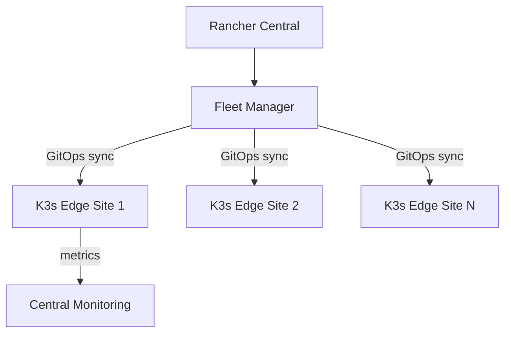

# How to Manage K3s Edge Clusters Remotely - Manage

Author: [nawazdhandala](https://www.github.com/nawazdhandala)

Tags: k3s, Edge Computing, Remote Management, Kubernetes, Fleet, SUSE Rancher, GitOps

Description: Learn how to manage K3s clusters deployed at remote edge locations using Rancher Fleet for GitOps-based configuration and Rancher's centralized multi-cluster dashboard.

---

Managing K3s clusters at edge sites - retail stores, factories, branch offices - presents unique challenges: intermittent connectivity, no local expertise, and the need to update hundreds of locations reliably. This guide shows how to handle it.

---

## Architecture for Remote Edge Management



---

## Step 1: Register Edge Clusters with Rancher

When K3s is installed at each edge site, register it with the central Rancher instance:

```bash
# Run on the edge K3s node

# The registration command is generated by Rancher UI under:
# Cluster Management > Import Existing > Generic
kubectl apply -f https://rancher.example.com/v3/import/<token>.yaml
```

For sites with limited bandwidth, configure the cattle-cluster-agent to use a proxy:

```bash
# Set proxy for cattle-cluster-agent
kubectl set env deployment/cattle-cluster-agent \
  -n cattle-system \
  HTTP_PROXY=http://proxy.site.local:3128 \
  HTTPS_PROXY=http://proxy.site.local:3128 \
  NO_PROXY=10.0.0.0/8,127.0.0.0/8
```

---

## Step 2: Deploy Applications via Fleet

Use Rancher Fleet to push application configs to all edge clusters automatically:

```yaml
# gitrepo-edge-apps.yaml
apiVersion: fleet.cattle.io/v1alpha1
kind: GitRepo
metadata:
  name: edge-applications
  namespace: fleet-default
spec:
  repo: https://github.com/my-org/edge-apps.git
  branch: main
  targets:
    - name: retail-sites
      clusterSelector:
        matchLabels:
          site-type: retail
```

---

## Step 3: Handle Disconnected Operation

K3s edge clusters must continue operating when they lose connectivity to Rancher. Configure your workloads to be self-sufficient:

```yaml
# Use image pull policy: IfNotPresent so pods use cached images
spec:
  containers:
    - name: app
      image: registry.internal.example.com/my-app:v1.2
      imagePullPolicy: IfNotPresent
```

For K3s itself, configure reconnect tolerances:

```yaml
# /etc/rancher/k3s/config.yaml on edge nodes
# Allow the cluster to operate independently for 30 days
cluster-reset: false
# Increase tolerations for cloud connectivity loss
kubelet-arg:
  - "node-status-update-frequency=10s"
```

---

## Step 4: Remote kubectl Access via Rancher Proxy

Rancher provides a kubectl proxy that works through the Rancher API - no direct network access to edge sites required:

```bash
# Download cluster-specific kubeconfig from Rancher UI
# Or use the Rancher CLI
rancher login https://rancher.example.com --token <api-token>
rancher cluster ls
rancher kubectl --cluster edge-site-001 get pods -A
```

---

## Step 5: Bulk Operations Across Edge Sites

Use Fleet's `ClusterGroup` to run operations across all sites simultaneously:

```bash
# Trigger a configmap update across all retail clusters
kubectl apply -f store-config.yaml --context rancher-fleet-default

# Check sync status across all edge clusters
kubectl get bundledeployment -n fleet-default \
  -l fleet.cattle.io/cluster-group=retail-sites \
  -o wide
```

---

## Best Practices

- Design workloads for **offline-first** operation - edge sites may be disconnected for hours or days.
- Use **read-only root filesystems** and immutable container images to reduce the need for manual intervention.
- Collect logs to a local log buffer and batch-sync to central logging when connectivity is available.
- Apply OTA updates only during **maintenance windows** configured per site timezone.
