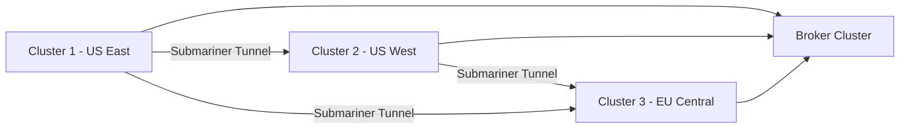

# How to Set Up K3s Multi-Cluster with Submariner

Author: [nawazdhandala](https://www.github.com/nawazdhandala)

Tags: K3s, Kubernetes, Multi-Cluster, Submariner, Networking, Federation, DevOps

Description: Learn how to connect multiple K3s clusters with Submariner to enable cross-cluster pod communication and service discovery.

## Introduction

As organizations grow, they often need multiple Kubernetes clusters — for geographic distribution, isolation, or separate team environments. Submariner is a CNCF project that connects multiple Kubernetes clusters, enabling pods to communicate across cluster boundaries and service discovery between clusters. This guide covers setting up Submariner between two or more K3s clusters.

## Architecture Overview



## Prerequisites

- Two or more K3s clusters with non-overlapping CIDR ranges
- Network connectivity between cluster nodes (at least UDP port 4500 for IPsec)
- `subctl` CLI tool installed
- Helm installed

## Step 1: Plan Non-Overlapping CIDRs

Submariner requires non-overlapping pod and service CIDRs:

```
# Cluster 1 (US East)
Pod CIDR:     10.42.0.0/16
Service CIDR: 10.43.0.0/16

# Cluster 2 (US West)
Pod CIDR:     10.44.0.0/16
Service CIDR: 10.45.0.0/16

# Cluster 3 (EU Central)
Pod CIDR:     10.46.0.0/16
Service CIDR: 10.47.0.0/16
```

Install each K3s cluster with unique CIDRs:

```bash
# Cluster 1
curl -sfL https://get.k3s.io | \
  INSTALL_K3S_EXEC="
    --cluster-cidr=10.42.0.0/16
    --service-cidr=10.43.0.0/16
  " sh -

# Cluster 2
curl -sfL https://get.k3s.io | \
  INSTALL_K3S_EXEC="
    --cluster-cidr=10.44.0.0/16
    --service-cidr=10.45.0.0/16
  " sh -
```

## Step 2: Install subctl CLI

```bash
# Install subctl on your management machine
curl -Ls https://get.submariner.io | bash

# Or download specific version
VERSION=v0.16.2
curl -Lo subctl \
  "https://github.com/submariner-io/subctl/releases/download/$VERSION/subctl-${VERSION}-linux-amd64.tar.gz" | \
  tar -xz

chmod +x subctl
mv subctl /usr/local/bin/

# Verify installation
subctl version
```

## Step 3: Deploy the Submariner Broker

The broker coordinates cluster registrations. Deploy it on a dedicated or existing cluster:

```bash
# Set kubeconfig to the broker cluster (or use Cluster 1 as broker)
export KUBECONFIG=/path/to/broker-cluster.yaml

# Deploy the Submariner broker
subctl deploy-broker

# This creates a submariner-k8s-broker namespace with certificates
# Save the broker-info.subm file generated
ls -la broker-info.subm

# Note: Keep broker-info.subm secure - it contains credentials
```

## Step 4: Join Clusters to Submariner

```bash
# Join Cluster 1 (using the saved broker-info.subm)
export KUBECONFIG=/path/to/cluster1.yaml
subctl join broker-info.subm \
  --clusterid cluster1 \
  --natt=false \
  --cable-driver libreswan

# Join Cluster 2
export KUBECONFIG=/path/to/cluster2.yaml
subctl join broker-info.subm \
  --clusterid cluster2 \
  --natt=false \
  --cable-driver libreswan

# Join Cluster 3
export KUBECONFIG=/path/to/cluster3.yaml
subctl join broker-info.subm \
  --clusterid cluster3 \
  --natt=false \
  --cable-driver libreswan
```

## Step 5: Verify Submariner Status

```bash
# Check Submariner on each cluster
export KUBECONFIG=/path/to/cluster1.yaml
subctl show all

# Check connectivity between clusters
subctl show connections

# Expected output:
# Cluster ID: cluster1
# Endpoint IP: <public-ip>
# Cable Driver: libreswan
#
# Connections:
# cluster2 <-> cluster1: connected
# cluster3 <-> cluster1: connected

# Detailed status
kubectl get submariners -A
kubectl get gateways -A
kubectl get endpoints -A
```

## Step 6: Test Cross-Cluster Pod Communication

Deploy a test service on Cluster 1 and access it from Cluster 2:

```bash
# On Cluster 1: deploy a service
export KUBECONFIG=/path/to/cluster1.yaml

kubectl apply -f - <<'EOF'
apiVersion: v1
kind: Service
metadata:
  name: cross-cluster-test
  namespace: default
  annotations:
    # Export this service to other clusters
    "submariner.io/export": "true"
spec:
  selector:
    app: cross-cluster-test
  ports:
    - port: 80
      targetPort: 8080
---
apiVersion: apps/v1
kind: Deployment
metadata:
  name: cross-cluster-test
spec:
  replicas: 1
  selector:
    matchLabels:
      app: cross-cluster-test
  template:
    metadata:
      labels:
        app: cross-cluster-test
    spec:
      containers:
        - name: test
          image: nginx:alpine
          ports:
            - containerPort: 8080
EOF

# Export the service for cross-cluster discovery
subctl export service cross-cluster-test -n default
```

On Cluster 2, access the exported service:

```bash
export KUBECONFIG=/path/to/cluster2.yaml

# Check exported services from Cluster 1
kubectl get serviceimports -A

# The service is accessible as:
# cross-cluster-test.default.svc.clusterset.local

# Test connectivity
kubectl run test --image=busybox --restart=Never -- \
  wget -O- http://cross-cluster-test.default.svc.clusterset.local/

kubectl logs test
kubectl delete pod test
```

## Step 7: Configure Globalnet for Overlapping CIDRs

If your clusters have overlapping CIDRs, use Submariner's Globalnet:

```bash
# Deploy broker with Globalnet enabled
subctl deploy-broker --globalnet

# Join clusters with Globalnet CIDRs
subctl join broker-info.subm \
  --clusterid cluster1 \
  --globalnet-cidr 242.0.0.0/8
```

## Step 8: Multi-Cluster DNS Resolution

Submariner provides DNS-based service discovery via the `clusterset.local` domain:

```bash
# Service access patterns:
# Same cluster:         service.namespace.svc.cluster.local
# Any cluster:          service.namespace.svc.clusterset.local
# Specific cluster:     service.namespace.svc.cluster.id.clusterset.local

# Configure CoreDNS to forward clusterset.local queries
kubectl edit configmap coredns -n kube-system

# Add this block:
# clusterset.local:53 {
#     forward . <submariner-lighthouse-dns-service-ip>
# }
```

## Step 9: Monitor Cross-Cluster Traffic

```bash
# Check IPsec tunnel statistics
kubectl exec -n submariner-operator \
  $(kubectl get pods -n submariner-operator -l app=submariner-gateway -o name) \
  -- ipsec status

# Check active connections
subctl show connections

# View Submariner metrics (if Prometheus is installed)
kubectl port-forward -n submariner-operator \
  service/submariner-gateway-metrics 9898:9898 &
curl http://localhost:9898/metrics | grep submariner
```

## Conclusion

Submariner enables powerful multi-cluster K3s architectures where services and pods can communicate transparently across cluster boundaries. This is valuable for geographically distributed deployments, active-active disaster recovery setups, and gradual cluster migrations. The `clusterset.local` DNS domain makes cross-cluster service discovery transparent to applications — they simply use a different DNS suffix to reach services in other clusters. For K3s edge deployments with a central HQ cluster, Submariner provides the network foundation for distributed workloads.
