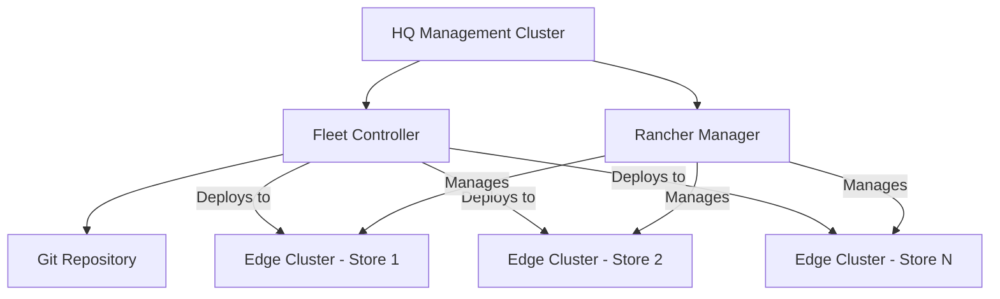

# How to Manage K3s Edge Clusters Remotely - Part 3

Author: [nawazdhandala](https://www.github.com/nawazdhandala)

Tags: k3s, Kubernetes, Edge Computing, Remote Management, Fleet, Rancher, GitOps

Description: Learn how to centrally manage multiple K3s edge clusters from a headquarters cluster using Fleet, Rancher, and GitOps practices.

## Introduction

Managing tens or hundreds of K3s edge clusters individually doesn't scale. Centralized management platforms let you deploy applications, apply configurations, and monitor all edge clusters from a single control plane. This guide covers setting up centralized management for K3s edge clusters using Rancher Fleet and GitOps approaches.

## Architecture Overview



## Method 1: Managing Clusters with Rancher Fleet

Fleet is a GitOps fleet management tool from Rancher designed specifically for managing many clusters.

### Step 1: Install Fleet on HQ Cluster

```bash
# Add Fleet Helm repository

helm repo add fleet https://rancher.github.io/fleet-helm-charts/
helm repo update

# Install Fleet CRDs
helm install -n cattle-fleet-system \
  --create-namespace \
  fleet-crd fleet/fleet-crd

# Install Fleet
helm install -n cattle-fleet-system \
  fleet fleet/fleet

# Verify Fleet is running
kubectl get pods -n cattle-fleet-system
```

### Step 2: Register Edge Clusters with Fleet

Generate a registration token for edge clusters:

```bash
# On the HQ cluster, create a cluster group for edge sites
cat <<'EOF' | kubectl apply -f -
apiVersion: fleet.cattle.io/v1alpha1
kind: ClusterGroup
metadata:
  name: edge-stores
  namespace: fleet-default
spec:
  selector:
    matchLabels:
      role: edge-store
EOF

# Get the Fleet API server URL and CA cert
FLEET_API_SERVER=$(kubectl get service -n cattle-fleet-system \
  fleet-controller -o jsonpath='{.status.loadBalancer.ingress[0].ip}')
```

Register an edge K3s cluster:

```bash
# On the HQ cluster, generate registration YAML for the edge cluster
kubectl apply -f - <<EOF
apiVersion: fleet.cattle.io/v1alpha1
kind: Cluster
metadata:
  name: edge-store-101
  namespace: fleet-default
  labels:
    role: edge-store
    location: northeast
    site-id: store-101
spec:
  kubeConfigSecret: edge-store-101-kubeconfig
EOF

# Create the kubeconfig secret from the edge cluster's kubeconfig
kubectl create secret generic edge-store-101-kubeconfig \
  --from-file=value=/path/to/edge-store-101.kubeconfig \
  -n fleet-default
```

### Step 3: Create a GitRepo for Edge Deployments

```yaml
# gitrepo-edge-apps.yaml
apiVersion: fleet.cattle.io/v1alpha1
kind: GitRepo
metadata:
  name: edge-applications
  namespace: fleet-default
spec:
  # Git repository containing edge app configurations
  repo: https://github.com/your-org/edge-deployments.git
  branch: main

  # Deploy to all edge store clusters
  targets:
    - clusterSelector:
        matchLabels:
          role: edge-store

  # Path within the repo for edge apps
  paths:
    - apps/edge-common
    - apps/retail-store
```

## Method 2: Using kubeconfig Merge for Direct Management

For smaller fleets, manage edge clusters via merged kubeconfig:

```bash
#!/bin/bash
# collect-edge-kubeconfigs.sh

EDGE_NODES=(
  "store-101:192.168.101.1"
  "store-102:192.168.102.1"
  "store-103:192.168.103.1"
)

mkdir -p ~/.kube/edge-clusters

for ENTRY in "${EDGE_NODES[@]}"; do
  SITE=$(echo $ENTRY | cut -d: -f1)
  IP=$(echo $ENTRY | cut -d: -f2)

  # Copy kubeconfig from edge cluster
  ssh root@$IP "cat /etc/rancher/k3s/k3s.yaml" | \
    sed "s/127.0.0.1/$IP/g" | \
    sed "s/default/$SITE/g" \
    > ~/.kube/edge-clusters/$SITE.yaml

  echo "Collected kubeconfig for: $SITE"
done

# Merge all kubeconfigs
export KUBECONFIG=$(ls ~/.kube/edge-clusters/*.yaml | tr '\n' ':')
kubectl config view --flatten > ~/.kube/config-all-edges

echo "Merged kubeconfig saved to ~/.kube/config-all-edges"
echo "Contexts available:"
KUBECONFIG=~/.kube/config-all-edges kubectl config get-contexts
```

## Method 3: VPN-Based Remote Access

For secure direct access to edge clusters:

```bash
# Set up WireGuard VPN tunnel to edge sites
# On HQ VPN server:
cat > /etc/wireguard/wg0.conf << 'EOF'
[Interface]
Address = 10.200.0.1/24
PrivateKey = <hq-private-key>
ListenPort = 51820

# Store 101 peer
[Peer]
PublicKey = <store-101-public-key>
AllowedIPs = 10.200.0.101/32, 192.168.101.0/24
PersistentKeepalive = 25

# Store 102 peer
[Peer]
PublicKey = <store-102-public-key>
AllowedIPs = 10.200.0.102/32, 192.168.102.0/24
PersistentKeepalive = 25
EOF

wg-quick up wg0
```

## Method 4: Using Rancher Manager

Rancher provides a comprehensive UI for managing multiple K3s clusters:

```bash
# Install Rancher on the HQ cluster
helm repo add rancher-stable \
  https://releases.rancher.com/server-charts/stable
helm repo update

# Install cert-manager first
helm install cert-manager jetstack/cert-manager \
  --namespace cert-manager \
  --create-namespace \
  --set installCRDs=true

# Install Rancher
helm install rancher rancher-stable/rancher \
  --namespace cattle-system \
  --create-namespace \
  --set hostname=rancher.hq.example.com \
  --set bootstrapPassword=admin
```

Import edge K3s clusters into Rancher:

```bash
# In the Rancher UI:
# 1. Go to Cluster Management > Import Existing
# 2. Name the cluster (e.g., "edge-store-101")
# 3. Rancher provides a kubectl command to run on the edge cluster
# 4. Run on the edge cluster:
kubectl apply -f https://rancher.hq.example.com/v3/import/<token>.yaml
```

## Method 5: Automated Cluster Registration Script

```bash
#!/bin/bash
# register-edge-cluster.sh
# Run on new edge clusters to register with HQ

HQ_RANCHER_URL="https://rancher.hq.example.com"
HQ_API_TOKEN="token-xxxxx:yyyyyy"
CLUSTER_NAME="${1:-edge-$(hostname)}"

echo "Registering cluster: $CLUSTER_NAME with Rancher"

# Create cluster in Rancher via API
CLUSTER_ID=$(curl -s -X POST \
  -H "Authorization: Bearer $HQ_API_TOKEN" \
  -H "Content-Type: application/json" \
  "$HQ_RANCHER_URL/v3/clusters" \
  -d "{
    \"name\": \"$CLUSTER_NAME\",
    \"labels\": {
      \"role\": \"edge-store\",
      \"site\": \"$CLUSTER_NAME\"
    }
  }" | jq -r '.id')

# Get the registration manifest
curl -s \
  -H "Authorization: Bearer $HQ_API_TOKEN" \
  "$HQ_RANCHER_URL/v3/clusterregistrationtokens?clusterId=$CLUSTER_ID" | \
  jq -r '.data[0].command' | bash

echo "Cluster $CLUSTER_NAME registered with ID: $CLUSTER_ID"
```

## Monitoring All Edge Clusters

```bash
# Switch between edge cluster contexts
kubectl config use-context store-101
kubectl get nodes

kubectl config use-context store-102
kubectl get nodes

# Check health of all edge clusters at once
for CONTEXT in $(kubectl config get-contexts -o name | grep "store-"); do
  echo "=== $CONTEXT ==="
  kubectl --context=$CONTEXT get nodes 2>/dev/null || echo "Unreachable"
done
```

## Conclusion

Managing K3s edge clusters at scale requires a centralized management platform. Rancher Fleet provides excellent GitOps-based management for deploying applications across many clusters, while Rancher Manager provides a comprehensive UI for operations teams. For smaller fleets, merged kubeconfig files with VPN tunnels provide a simpler management approach. The key principle is maintaining a single source of truth in Git for all cluster configurations and applications, with the management platform responsible for reconciling the desired state across all edge clusters.
