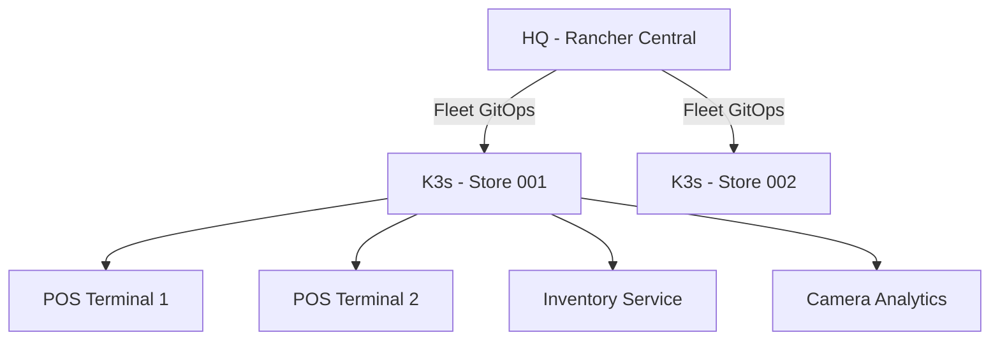

# How to Configure K3s for Retail Store Edge Computing - Computing

Author: [nawazdhandala](https://www.github.com/nawazdhandala)

Tags: k3s, Edge Computing, Retail, IoT, Kubernetes, Offline Operations, SUSE Rancher

Description: Learn how to configure K3s for retail store edge computing deployments, including point-of-sale systems, inventory management, and offline-capable application patterns.

---

Retail stores have unique edge computing requirements: applications must work without internet connectivity, integrate with POS hardware, and be remotely manageable from headquarters. K3s is an ideal platform for this use case.

---

## Retail Edge Architecture



---

## Step 1: Optimize K3s for Retail Hardware

Retail edge hardware is often constrained. Configure K3s for minimal resource usage:

```yaml
# /etc/rancher/k3s/config.yaml

# Disable unneeded components to save memory

disable:
  - traefik          # use nginx or a simple L4 LB instead
  - metrics-server   # install separately only if needed

# Limit resource usage
kubelet-arg:
  - "max-pods=30"
  - "kube-reserved=cpu=200m,memory=300Mi"
  - "system-reserved=cpu=100m,memory=200Mi"
  - "eviction-hard=memory.available<200Mi,nodefs.available<10%"
  - "image-gc-high-threshold=80"
  - "image-gc-low-threshold=60"
```

---

## Step 2: Configure Offline-Capable Workloads

Store applications must continue running when the internet connection is down:

```yaml
# pos-deployment.yaml
apiVersion: apps/v1
kind: Deployment
metadata:
  name: pos-service
  namespace: retail
spec:
  replicas: 2   # run 2 replicas for local HA
  selector:
    matchLabels:
      app: pos-service
  template:
    spec:
      containers:
        - name: pos
          image: registry.local:5000/pos-service:v2.1
          # Use local cache - do not pull from internet
          imagePullPolicy: IfNotPresent
          env:
            - name: OFFLINE_MODE
              value: "auto"
            - name: LOCAL_DB_URL
              value: "postgresql://localhost:5432/pos"
          # Store receipts and transactions locally
          volumeMounts:
            - name: transaction-store
              mountPath: /data/transactions
      volumes:
        - name: transaction-store
          hostPath:
            path: /data/pos/transactions
```

---

## Step 3: Set Up a Local Container Registry

Pre-pull all required images to a local registry on the edge node:

```bash
# Install a simple registry on the edge node
kubectl apply -f - <<EOF
apiVersion: apps/v1
kind: Deployment
metadata:
  name: local-registry
  namespace: kube-system
spec:
  replicas: 1
  selector:
    matchLabels:
      app: local-registry
  template:
    metadata:
      labels:
        app: local-registry
    spec:
      containers:
        - name: registry
          image: registry:2
          ports:
            - containerPort: 5000
          volumeMounts:
            - name: registry-data
              mountPath: /var/lib/registry
      volumes:
        - name: registry-data
          hostPath:
            path: /data/registry
EOF
```

---

## Step 4: Configure Hardware Device Access

Retail hardware (POS terminals, barcode scanners, receipt printers) must be accessible from pods:

```yaml
# Allow access to USB serial ports for POS hardware
spec:
  containers:
    - name: pos
      securityContext:
        privileged: false
      volumeMounts:
        - name: pos-device
          mountPath: /dev/ttyUSB0
  volumes:
    - name: pos-device
      hostPath:
        path: /dev/ttyUSB0
        type: CharDevice
```

---

## Step 5: Configure Sync-Back to HQ

Batch-sync transaction data to headquarters when connectivity is available:

```yaml
# sync-job.yaml - runs hourly
apiVersion: batch/v1
kind: CronJob
metadata:
  name: sync-to-hq
  namespace: retail
spec:
  schedule: "0 * * * *"
  jobTemplate:
    spec:
      template:
        spec:
          containers:
            - name: sync
              image: registry.local:5000/sync-agent:v1
              env:
                - name: HQ_ENDPOINT
                  value: "https://hq.example.com/api/sync"
                - name: STORE_ID
                  valueFrom:
                    fieldRef:
                      fieldPath: spec.nodeName
          restartPolicy: OnFailure
```

---

## Best Practices

- Use **local persistent volumes** for transaction data and configure daily backups to a local USB drive as well as cloud sync.
- Test the full store workflow in airplane mode before deploying to production.
- Apply **strict NetworkPolicies** to isolate POS systems from other store devices.
- Use Fleet to deploy store-specific configurations via cluster labels (e.g., `store-id: 001`, `region: east`).
