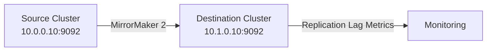

# How to Configure Kafka MirrorMaker 2 for IPv4 Cross-Cluster Replication

Author: [nawazdhandala](https://www.github.com/nawazdhandala)

Tags: Kafka, MirrorMaker 2, IPv4, Cross-Cluster, Replication, Disaster Recovery, Configuration

Description: Learn how to configure Kafka MirrorMaker 2 to replicate topics between Kafka clusters over IPv4 networks for disaster recovery and multi-datacenter deployments.

---

MirrorMaker 2 (MM2) is Kafka's built-in tool for cross-cluster replication. It uses Kafka Connect under the hood to continuously replicate topics, consumer group offsets, and topic configurations from a source cluster to a destination cluster.

## Architecture



## MirrorMaker 2 Configuration File

```properties
# /etc/kafka/mm2.properties

# --- Cluster aliases ---

clusters = source, destination

# --- Source cluster: DC A ---
source.bootstrap.servers = 10.0.0.10:9092,10.0.0.11:9092

# --- Destination cluster: DC B ---
destination.bootstrap.servers = 10.1.0.10:9092,10.1.0.11:9092

# --- Replication flows ---
# Enable replication from source to destination
source->destination.enabled = true

# --- Topic selection ---
# Replicate all topics matching this pattern
source->destination.topics = .*                   # All topics
# source->destination.topics = orders.*, payments.*  # Specific topics

# Exclude internal topics
source->destination.topics.blacklist = .*\.internal, .*_replica

# --- Consumer group offset replication ---
source->destination.groups = .*                   # Replicate all consumer groups
source->destination.emit.checkpoints.enabled = true
source->destination.sync.group.offsets.enabled = true

# --- Replication factor for replicated topics on destination ---
replication.factor = 3

# --- MirrorMaker 2 internal topics replication factor ---
checkpoints.topic.replication.factor = 3
heartbeats.topic.replication.factor = 3
offset-syncs.topic.replication.factor = 3

# --- Connect worker settings ---
offset.storage.replication.factor = 3
config.storage.replication.factor = 3
status.storage.replication.factor = 3
```

## Starting MirrorMaker 2

```bash
# Start MM2 in dedicated mode
connect-mirror-maker.sh /etc/kafka/mm2.properties &

# Check logs
tail -f /var/log/kafka/mirrormaker.log
```

## Monitoring Replication Lag

MirrorMaker 2 creates a heartbeat topic on the destination cluster. Measure lag by comparing offsets:

```bash
# Check replication status via the Connect REST API (if MM2 runs as Connect cluster)
curl -s http://10.0.0.20:8083/connectors | python3 -m json.tool

# Check consumer group offsets for the MM2 consumer group
kafka-consumer-groups.sh \
  --bootstrap-server 10.0.0.10:9092 \
  --describe \
  --group source-destination

# Monitor the heartbeat topic for replication health
kafka-console-consumer.sh \
  --bootstrap-server 10.1.0.10:9092 \
  --topic heartbeats \
  --from-beginning
```

## Topic Naming Convention

MM2 renames replicated topics on the destination with the source alias prefix:

| Source Topic | Destination Topic |
|------------|-----------------|
| `orders` | `source.orders` |
| `payments` | `source.payments` |

## Failover: Using Replicated Offsets

```bash
# After failover, translate consumer group offsets to the destination cluster
kafka-consumer-groups.sh \
  --bootstrap-server 10.1.0.10:9092 \
  --command-config /etc/kafka/client.properties \
  --execute \
  --topic source.orders \
  --group my-consumer-group \
  --reset-offsets --to-latest
```

## Key Takeaways

- MM2 preserves consumer group offsets, enabling transparent failover to the destination cluster.
- Topics are renamed with the source alias prefix (e.g., `source.orders`) to avoid naming conflicts.
- `source->destination.sync.group.offsets.enabled = true` continuously syncs consumer positions to the destination.
- Run MM2 as a Kafka Connect cluster for HA; or use dedicated mode for simpler deployments.
