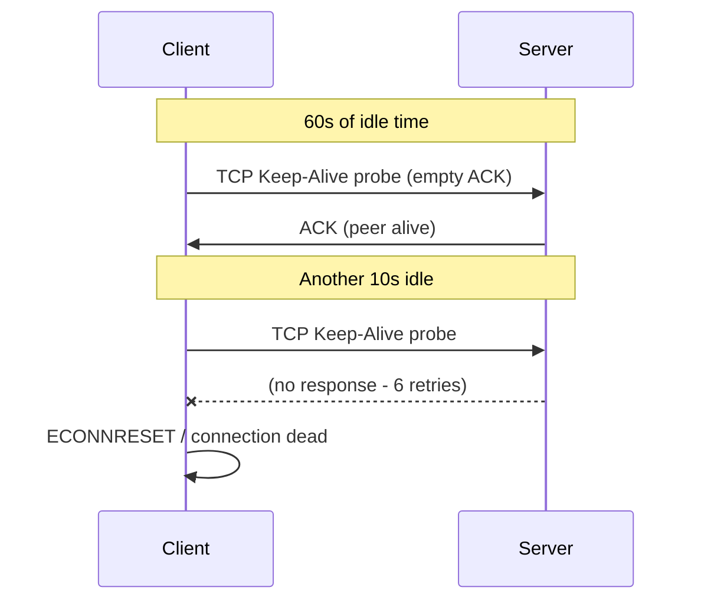

# How to Implement Keep-Alive for IPv4 TCP Connections

Author: [nawazdhandala](https://www.github.com/nawazdhandala)

Tags: IPv4, TCP, Keep-Alive, SO_KEEPALIVE, Python, Go, Networking

Description: Learn how to enable and tune TCP keepalive probes for IPv4 connections in C, Python, and Go to detect dead peers and prevent half-open connections from accumulating.

## What Is TCP Keep-Alive?

When a TCP connection is idle, both endpoints have no way to know if the other side is still reachable (the peer may have crashed, a firewall may have silently dropped the connection, or the cable may have been unplugged). TCP keep-alive sends periodic probe segments during idle periods and declares the connection dead if probes go unanswered.



## Enabling Keep-Alive in C

```c
#include <sys/socket.h>
#include <netinet/tcp.h>

/* Enable SO_KEEPALIVE and tune probe parameters (Linux-specific) */
void enable_keepalive(int fd) {
    int opt = 1;
    setsockopt(fd, SOL_SOCKET, SO_KEEPALIVE, &opt, sizeof(opt));

#ifdef __linux__
    /* Start probing after 60 seconds of inactivity */
    int idle = 60;
    setsockopt(fd, IPPROTO_TCP, TCP_KEEPIDLE, &idle, sizeof(idle));

    /* Send a probe every 10 seconds */
    int interval = 10;
    setsockopt(fd, IPPROTO_TCP, TCP_KEEPINTVL, &interval, sizeof(interval));

    /* Declare the connection dead after 6 unanswered probes */
    int count = 6;
    setsockopt(fd, IPPROTO_TCP, TCP_KEEPCNT, &count, sizeof(count));
    /* Total detection time: 60 + 6*10 = 120 seconds */
#endif
}
```

## Enabling Keep-Alive in Python

```python
import socket
import struct

def enable_keepalive(sock: socket.socket,
                     idle_sec: int = 60,
                     interval_sec: int = 10,
                     max_fails: int = 6) -> None:
    """Enable TCP keepalive with custom probe parameters."""
    # SO_KEEPALIVE: turn on keepalive probes
    sock.setsockopt(socket.SOL_SOCKET, socket.SO_KEEPALIVE, 1)

    import sys
    if sys.platform == "linux":
        # Linux-specific per-socket tuning
        sock.setsockopt(socket.IPPROTO_TCP, socket.TCP_KEEPIDLE,  idle_sec)
        sock.setsockopt(socket.IPPROTO_TCP, socket.TCP_KEEPINTVL, interval_sec)
        sock.setsockopt(socket.IPPROTO_TCP, socket.TCP_KEEPCNT,   max_fails)
    elif sys.platform == "darwin":
        # macOS uses TCP_KEEPALIVE for the idle time
        TCP_KEEPALIVE = 0x10
        sock.setsockopt(socket.IPPROTO_TCP, TCP_KEEPALIVE, idle_sec)

# Usage

s = socket.socket(socket.AF_INET, socket.SOCK_STREAM)
s.connect(("192.168.1.100", 9000))
enable_keepalive(s, idle_sec=30, interval_sec=5, max_fails=3)
```

## Enabling Keep-Alive in Go

```go
package main

import (
    "net"
    "time"
    "fmt"
)

func enableKeepalive(conn net.Conn, idleTime time.Duration, interval time.Duration, count int) error {
    tc, ok := conn.(*net.TCPConn)
    if !ok {
        return fmt.Errorf("not a TCP connection")
    }

    // Enable keepalive probes
    if err := tc.SetKeepAlive(true); err != nil {
        return err
    }

    // Set the idle time before the first probe
    if err := tc.SetKeepAlivePeriod(idleTime); err != nil {
        return err
    }

    return nil
}

func main() {
    conn, err := net.Dial("tcp4", "192.168.1.100:9000")
    if err != nil {
        panic(err)
    }
    defer conn.Close()

    // Start probing after 30s idle; probe every 5s
    if err := enableKeepalive(conn, 30*time.Second, 5*time.Second, 3); err != nil {
        fmt.Println("keepalive error:", err)
    }
    fmt.Println("Keepalive enabled")
}
```

## Keep-Alive Timing Reference

| Parameter | Linux sysctl | setsockopt constant | Description |
|-----------|-------------|--------------------| ------------|
| Idle time | `net.ipv4.tcp_keepalive_time` | `TCP_KEEPIDLE` | Seconds before first probe |
| Probe interval | `net.ipv4.tcp_keepalive_intvl` | `TCP_KEEPINTVL` | Seconds between probes |
| Probe count | `net.ipv4.tcp_keepalive_probes` | `TCP_KEEPCNT` | Failures before ECONNRESET |

```bash
# View system defaults
sysctl net.ipv4.tcp_keepalive_time    # default 7200 (2 hours)
sysctl net.ipv4.tcp_keepalive_intvl   # default 75
sysctl net.ipv4.tcp_keepalive_probes  # default 9

# Override for the entire system (requires root)
sysctl -w net.ipv4.tcp_keepalive_time=60
```

## Application-Level Keep-Alive vs TCP Keep-Alive

| | TCP Keep-Alive | Application Keep-Alive |
|--|---------------|------------------------|
| Mechanism | Kernel-level TCP probes | Application sends a ping message |
| Detects | OS/NIC-level failures | Application-level freezes |
| Configuration | `setsockopt` | Custom protocol |
| Overhead | Minimal (empty ACK) | Protocol-defined |

## Conclusion

Enable TCP keepalive with `SO_KEEPALIVE` on long-lived connections such as database links, message broker connections, and persistent client sessions. On Linux, tune `TCP_KEEPIDLE` (idle time before probing), `TCP_KEEPINTVL` (probe interval), and `TCP_KEEPCNT` (max failures) per socket using `setsockopt` - this overrides the system-wide defaults for that socket only. When a dead peer is detected, the next `recv()` or `send()` returns an error (`ECONNRESET` or `ETIMEDOUT`). For protocols that already implement heartbeats (WebSocket ping/pong, gRPC PING frames), TCP keepalive provides an additional lower-level safety net for infrastructure failures.
