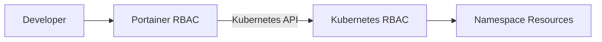

# How to Set Up Kubernetes RBAC Alongside Portainer RBAC

Author: [nawazdhandala](https://www.github.com/nawazdhandala)

Tags: Portainer, Kubernetes, RBAC, Security, Access Control, Multi-Tenant

Description: Configure Kubernetes Role-Based Access Control in conjunction with Portainer's access control system to create a layered, least-privilege security model for multi-team Kubernetes clusters.

---

Portainer provides its own RBAC layer (environments, teams, roles) that controls what users can do within the Portainer interface. But when Portainer connects to a Kubernetes cluster, it also uses Kubernetes RBAC for the operations it performs on the cluster. Aligning both RBAC systems gives you defense-in-depth: unauthorized actions are blocked at both the Portainer level and the Kubernetes API level.

## Two Layers of Access Control



- **Portainer RBAC**: Controls what the user sees and can trigger in Portainer (deploy stacks, view logs, manage images)
- **Kubernetes RBAC**: Controls what Portainer's service account can actually do on the cluster

## Step 1: Create a Namespace per Team

In Portainer or via manifest:

```yaml
# namespaces.yaml

apiVersion: v1
kind: Namespace
metadata:
  name: team-backend
---
apiVersion: v1
kind: Namespace
metadata:
  name: team-frontend
```

## Step 2: Create Kubernetes Roles per Team

Define what operations are allowed per namespace:

```yaml
# backend-role.yaml
apiVersion: rbac.authorization.k8s.io/v1
kind: Role
metadata:
  name: backend-developer
  namespace: team-backend
rules:
  - apiGroups: ["apps"]
    resources: ["deployments", "replicasets"]
    verbs: ["get", "list", "watch", "create", "update", "patch"]
  - apiGroups: [""]
    resources: ["pods", "pods/log", "pods/exec"]
    verbs: ["get", "list", "watch", "create"]
  - apiGroups: [""]
    resources: ["services", "configmaps"]
    verbs: ["get", "list", "create", "update"]
  # Secrets - read only, no create/update from developers
  - apiGroups: [""]
    resources: ["secrets"]
    verbs: ["get", "list"]
```

## Step 3: Bind Roles to Service Accounts

Create service accounts that Portainer will use for each team's environment:

```yaml
# backend-rbac.yaml
apiVersion: v1
kind: ServiceAccount
metadata:
  name: portainer-backend-sa
  namespace: team-backend
---
apiVersion: rbac.authorization.k8s.io/v1
kind: RoleBinding
metadata:
  name: backend-developer-binding
  namespace: team-backend
subjects:
  - kind: ServiceAccount
    name: portainer-backend-sa
    namespace: team-backend
roleRef:
  kind: Role
  name: backend-developer
  apiGroup: rbac.authorization.k8s.io
```

## Step 4: Configure Portainer Environments Per Team

In Portainer, create a separate Kubernetes environment for each team, using the team's service account kubeconfig. This way, even if a Portainer admin accidentally grants the wrong team access, the Kubernetes RBAC still restricts operations to the correct namespace.

## Step 5: Portainer Team Access Mapping

| Portainer Role | Kubernetes Role | Scope |
|---|---|---|
| Environment Administrator | `cluster-admin` | Admin namespace only |
| Standard User | `backend-developer` | team-backend namespace |
| Read-Only User | `view` (built-in) | Assigned namespace |

Set team access on the environment in Portainer under **Environment > Access**.

## Step 6: Audit Kubernetes RBAC

Periodically review role bindings using Portainer's terminal:

```bash
# Who has access to what in each namespace?
kubectl get rolebindings -n team-backend -o wide
kubectl auth can-i create deployments --as=system:serviceaccount:team-backend:portainer-backend-sa -n team-backend
```

## Summary

Running Kubernetes RBAC alongside Portainer RBAC creates a two-layer defense that prevents unauthorized actions even if Portainer's own access controls are misconfigured. Namespace-scoped service accounts, granular role definitions, and Portainer environment isolation combine to give each team exactly the access they need - nothing more.
