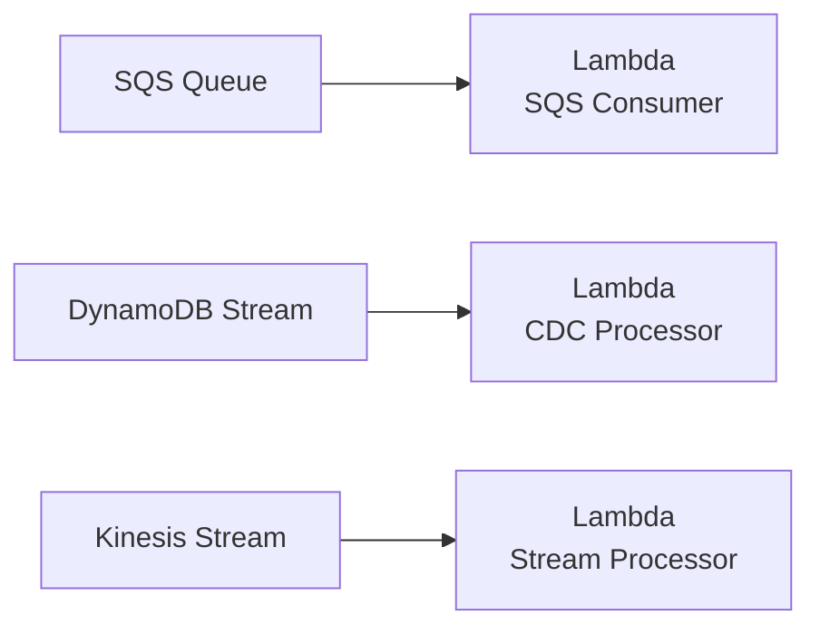

# How to Set Up Lambda Event Source Mappings with OpenTofu

Author: [nawazdhandala](https://www.github.com/nawazdhandala)

Tags: OpenTofu, AWS, Lambda, SQS, DynamoDB Streams, Kinesis, Event Source Mapping, Infrastructure as Code

Description: Learn how to configure Lambda event source mappings with OpenTofu for SQS queues, DynamoDB Streams, and Kinesis streams, including batching, error handling, and filtering.

---

Event source mappings connect Lambda functions to streaming or queue-based event sources. OpenTofu defines the mapping configuration — batch size, error handling, filtering, and concurrency — as code alongside the Lambda function and its event source.

## Event Source Mapping Patterns



## SQS Event Source Mapping

```hcl
# sqs_trigger.tf
resource "aws_lambda_event_source_mapping" "sqs" {
  event_source_arn = aws_sqs_queue.input.arn
  function_name    = aws_lambda_function.processor.arn
  enabled          = true

  # Process up to 10 messages per invocation
  batch_size = 10

  # Wait up to 20 seconds to fill the batch
  maximum_batching_window_in_seconds = 20

  # Scale concurrency based on queue depth
  scaling_config {
    maximum_concurrency = 100
  }

  # Report partial batch failures to SQS
  function_response_types = ["ReportBatchItemFailures"]

  # Filter to process only specific message attributes
  filter_criteria {
    filter {
      pattern = jsonencode({
        body = {
          eventType = ["ORDER_CREATED", "ORDER_UPDATED"]
        }
      })
    }
  }
}

# Dead-letter queue for the SQS source
resource "aws_sqs_queue" "dlq" {
  name                      = "${var.function_name}-dlq"
  message_retention_seconds = 1209600  # 14 days
}

resource "aws_sqs_queue" "input" {
  name                       = "${var.function_name}-input"
  visibility_timeout_seconds = 300  # Must be >= Lambda timeout

  redrive_policy = jsonencode({
    deadLetterTargetArn = aws_sqs_queue.dlq.arn
    maxReceiveCount     = 3
  })
}

# Grant Lambda permission to consume from SQS
resource "aws_iam_role_policy_attachment" "sqs_consumer" {
  role       = aws_iam_role.lambda_execution.name
  policy_arn = "arn:aws:iam::aws:policy/service-role/AWSLambdaSQSQueueExecutionRole"
}
```

## DynamoDB Streams Event Source Mapping

```hcl
# dynamodb_trigger.tf
resource "aws_dynamodb_table" "events" {
  name         = "${var.environment}-events"
  billing_mode = "PAY_PER_REQUEST"
  hash_key     = "id"

  attribute {
    name = "id"
    type = "S"
  }

  # Enable streams for CDC processing
  stream_enabled   = true
  stream_view_type = "NEW_AND_OLD_IMAGES"
}

resource "aws_lambda_event_source_mapping" "dynamodb_stream" {
  event_source_arn  = aws_dynamodb_table.events.stream_arn
  function_name     = aws_lambda_function.cdc_processor.arn
  starting_position = "LATEST"
  enabled           = true

  batch_size                         = 100
  maximum_batching_window_in_seconds = 5
  parallelization_factor             = 2  # Process 2 shards per function instance

  # Retry failed batches up to 2 times
  maximum_retry_attempts = 2

  # Destination for unprocessable records
  destination_config {
    on_failure {
      destination_arn = aws_sqs_queue.dlq.arn
    }
  }

  # Filter for specific DynamoDB operations
  filter_criteria {
    filter {
      pattern = jsonencode({
        eventName = ["INSERT", "MODIFY"]
      })
    }
  }
}

resource "aws_iam_role_policy_attachment" "dynamodb_streams" {
  role       = aws_iam_role.lambda_execution.name
  policy_arn = "arn:aws:iam::aws:policy/service-role/AWSLambdaDynamoDBExecutionRole"
}
```

## Kinesis Event Source Mapping

```hcl
# kinesis_trigger.tf
resource "aws_lambda_event_source_mapping" "kinesis" {
  event_source_arn  = aws_kinesis_stream.events.arn
  function_name     = aws_lambda_function.stream_processor.arn
  starting_position = "LATEST"
  enabled           = true

  batch_size                         = 500
  maximum_batching_window_in_seconds = 5

  # Process multiple shards in parallel per Lambda instance
  parallelization_factor = 5

  # Split batches on error instead of failing the whole batch
  bisect_batch_on_function_error = true

  maximum_retry_attempts = 3

  destination_config {
    on_failure {
      destination_arn = aws_sns_topic.processing_failures.arn
    }
  }
}

resource "aws_iam_role_policy" "kinesis_consumer" {
  name = "kinesis-consumer"
  role = aws_iam_role.lambda_execution.id

  policy = jsonencode({
    Version = "2012-10-17"
    Statement = [{
      Effect = "Allow"
      Action = [
        "kinesis:GetRecords",
        "kinesis:GetShardIterator",
        "kinesis:DescribeStream",
        "kinesis:ListStreams",
        "kinesis:ListShards"
      ]
      Resource = aws_kinesis_stream.events.arn
    }]
  })
}
```

## Best Practices

- Set SQS `visibility_timeout_seconds` to at least 6x the Lambda function timeout to prevent duplicate processing.
- Use `ReportBatchItemFailures` with SQS to mark only failed messages for retry rather than reprocessing the entire batch.
- Set `bisect_batch_on_function_error = true` for Kinesis to binary-search for the poisoned record rather than retrying indefinitely.
- Always configure a `destination_config` with an on-failure destination for streams — otherwise unprocessable records are silently dropped.
- Use `filter_criteria` to reduce Lambda invocations for events you don't need to process — you pay per invocation.
