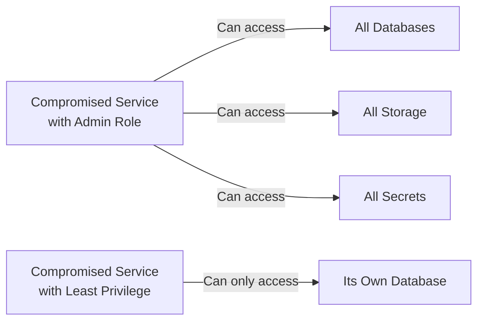

# How to Implement Least Privilege with OpenTofu

Author: [nawazdhandala](https://www.github.com/nawazdhandala)

Tags: OpenTofu, Security, Least Privilege, IAM, AWS, GCP, Azure, Infrastructure as Code

Description: Learn how to implement least-privilege access across AWS, Azure, and GCP using OpenTofu to minimize the blast radius of compromised credentials or misconfigured services.

---

Least privilege is the security principle that every identity should have access only to what it needs to do its job - nothing more. OpenTofu enables you to encode this principle as code, making over-permissive access visible in pull requests and drift detectable via plan.

## The Blast Radius Problem

When a service runs with excessive permissions, a single compromise can expose your entire infrastructure. By limiting permissions to exactly what's needed, you contain the damage.



## AWS: Scoped IAM Policies

```hcl
# aws_least_privilege.tf

# Instead of attaching AmazonS3FullAccess, define exactly what the app needs
resource "aws_iam_policy" "app_s3_policy" {
  name        = "AppS3AccessPolicy"
  description = "Scoped S3 access for the application"

  policy = jsonencode({
    Version = "2012-10-17"
    Statement = [
      {
        # Only allow read access to the app's own bucket
        Effect = "Allow"
        Action = [
          "s3:GetObject",
          "s3:PutObject",
          "s3:DeleteObject",
        ]
        # Restrict to specific bucket and path prefix
        Resource = [
          "${aws_s3_bucket.app_data.arn}/uploads/*",
        ]
      },
      {
        # Allow listing but only within the uploads prefix
        Effect   = "Allow"
        Action   = ["s3:ListBucket"]
        Resource = aws_s3_bucket.app_data.arn
        Condition = {
          StringLike = {
            "s3:prefix" = ["uploads/*"]
          }
        }
      }
    ]
  })
}
```

## Azure: Scoped Role Assignments

```hcl
# azure_least_privilege.tf
# Grant Key Vault Secrets User (read-only) instead of Key Vault Administrator
resource "azurerm_role_assignment" "app_kv_access" {
  scope                = azurerm_key_vault.app_kv.id
  role_definition_name = "Key Vault Secrets User"
  principal_id         = azurerm_linux_web_app.app.identity[0].principal_id
}

# Storage Blob Data Reader instead of Storage Account Contributor
resource "azurerm_role_assignment" "app_storage_access" {
  scope                = "${azurerm_storage_account.app.id}/blobServices/default/containers/${azurerm_storage_container.uploads.name}"
  role_definition_name = "Storage Blob Data Contributor"
  principal_id         = azurerm_linux_web_app.app.identity[0].principal_id
}
```

## GCP: Resource-Level IAM Bindings

```hcl
# gcp_least_privilege.tf
# Grant access to a specific Secret Manager secret, not all secrets
resource "google_secret_manager_secret_iam_member" "db_password_access" {
  secret_id = google_secret_manager_secret.db_password.secret_id
  role      = "roles/secretmanager.secretAccessor"
  member    = "serviceAccount:${google_service_account.app.email}"
}

# Grant access to a specific Pub/Sub topic, not all topics
resource "google_pubsub_topic_iam_member" "events_publisher" {
  topic  = google_pubsub_topic.app_events.name
  role   = "roles/pubsub.publisher"
  member = "serviceAccount:${google_service_account.app.email}"
}
```

## Using Variables to Enforce Scoping

Use input variables to require explicit resource ARNs/IDs in policy definitions.

```hcl
# enforced_scope.tf
variable "allowed_s3_bucket_arns" {
  description = "List of S3 bucket ARNs the application is allowed to access"
  type        = list(string)
  # No default - must be explicitly provided
}

resource "aws_iam_policy" "scoped_s3" {
  name = "ScopedS3Policy"

  policy = jsonencode({
    Version = "2012-10-17"
    Statement = [
      {
        Effect   = "Allow"
        Action   = ["s3:GetObject", "s3:PutObject"]
        Resource = [for arn in var.allowed_s3_bucket_arns : "${arn}/*"]
      }
    ]
  })
}
```

## Auditing Over-Permissive Access

Use policy validation to catch broad permissions before they reach production.

```hcl
# validation.tf
variable "iam_policy_json" {
  description = "IAM policy document to validate"
  type        = string

  validation {
    # Reject policies that use wildcard resources with write actions
    condition = !can(regex("\"Resource\":\\s*\"\\*\"", var.iam_policy_json)) || !can(regex("\"(Put|Delete|Create|Update|Write)", var.iam_policy_json))
    error_message = "Write actions must not use wildcard (*) resources. Scope the policy to specific resources."
  }
}
```

## Best Practices

- Start with zero permissions and add what's needed incrementally - it's easier to grant more than to revoke.
- Use tagging and conditions in policies to restrict access by environment (e.g., only allow access to production resources from production roles).
- Run regular access reviews using tools like AWS IAM Access Analyzer, Azure Access Reviews, or GCP Policy Analyzer.
- Make policy documents variables when possible so they can be reviewed in PRs independently of resource configs.
