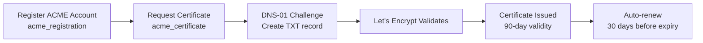

# How to Manage Let's Encrypt Certificates with OpenTofu

Author: [nawazdhandala](https://www.github.com/nawazdhandala)

Tags: OpenTofu, Let's Encrypt, TLS, ACME, Certificate, DNS, Infrastructure as Code

Description: Learn how to automatically provision and renew Let's Encrypt TLS certificates using OpenTofu's ACME provider with DNS-01 challenges via Route 53, Cloudflare, or Azure DNS.

---

Let's Encrypt provides free, automated TLS certificates via the ACME protocol. The OpenTofu ACME provider handles certificate requests and DNS-01 challenges, integrating with Route 53, Cloudflare, and Azure DNS for automatic domain validation without opening inbound ports.

## Certificate Provisioning Flow



## ACME Provider Setup

```hcl
# providers.tf

terraform {
  required_providers {
    acme = {
      source  = "vancluever/acme"
      version = "~> 2.0"
    }
    tls = {
      source  = "hashicorp/tls"
      version = "~> 4.0"
    }
  }
}

# Use staging for testing - switch to production URL for real certs
provider "acme" {
  server_url = var.environment == "production" ? (
    "https://acme-v02.api.letsencrypt.org/directory"
  ) : (
    "https://acme-staging-v02.api.letsencrypt.org/directory"
  )
}
```

## Account Registration and Certificate

```hcl
# acme.tf

# Generate account private key
resource "tls_private_key" "acme_account" {
  algorithm = "RSA"
  rsa_bits  = 2048
}

# Register ACME account
resource "acme_registration" "main" {
  account_key_pem = tls_private_key.acme_account.private_key_pem
  email_address   = var.acme_email
}

# Request certificate with DNS-01 challenge via Route 53
resource "acme_certificate" "main" {
  account_key_pem           = acme_registration.main.account_key_pem
  common_name               = var.domain_name
  subject_alternative_names = ["*.${var.domain_name}"]

  dns_challenge {
    provider = "route53"
    config = {
      AWS_HOSTED_ZONE_ID = aws_route53_zone.main.zone_id
      # Uses default AWS credentials from provider
    }
  }

  # Renew 30 days before expiry
  min_days_remaining = 30

  depends_on = [acme_registration.main]
}
```

## Cloudflare DNS Challenge

```hcl
# Alternative: DNS challenge via Cloudflare
resource "acme_certificate" "cloudflare" {
  account_key_pem           = acme_registration.main.account_key_pem
  common_name               = var.domain_name
  subject_alternative_names = ["*.${var.domain_name}"]

  dns_challenge {
    provider = "cloudflare"
    config = {
      CF_API_TOKEN = var.cloudflare_api_token
    }
  }

  min_days_remaining = 30
}
```

## Store and Deploy Certificate

```hcl
# Store in AWS Secrets Manager
resource "aws_secretsmanager_secret" "cert" {
  name = "${var.environment}/acme/certificate"
}

resource "aws_secretsmanager_secret_version" "cert" {
  secret_id = aws_secretsmanager_secret.cert.id
  secret_string = jsonencode({
    certificate       = acme_certificate.main.certificate_pem
    private_key       = acme_certificate.main.private_key_pem
    issuer_ca         = acme_certificate.main.issuer_pem
    certificate_chain = "${acme_certificate.main.certificate_pem}${acme_certificate.main.issuer_pem}"
  })
}

# Import into ACM for ALB use
resource "aws_acm_certificate" "imported" {
  certificate       = acme_certificate.main.certificate_pem
  private_key       = acme_certificate.main.private_key_pem
  certificate_chain = acme_certificate.main.issuer_pem

  lifecycle {
    create_before_destroy = true
  }

  tags = {
    Environment = var.environment
    ManagedBy   = "opentofu"
    ExpiresAt   = acme_certificate.main.certificate_not_after
  }
}
```

## Kubernetes TLS Secret

```hcl
# Deploy certificate to Kubernetes
resource "kubernetes_secret" "tls" {
  metadata {
    name      = "${replace(var.domain_name, ".", "-")}-tls"
    namespace = "ingress-nginx"
  }

  type = "kubernetes.io/tls"

  data = {
    "tls.crt" = "${acme_certificate.main.certificate_pem}${acme_certificate.main.issuer_pem}"
    "tls.key" = acme_certificate.main.private_key_pem
  }

  lifecycle {
    create_before_destroy = true
  }
}
```

## Certificate Expiry Output

```hcl
output "certificate_expiry" {
  description = "Certificate expiry date - run tofu apply to renew when approaching"
  value       = acme_certificate.main.certificate_not_after
}
```

## Best Practices

- Always test with the Let's Encrypt staging server (`acme-staging-v02`) before switching to production - staging has much higher rate limits and prevents hitting production rate limits during development.
- Use wildcard certificates (`*.example.com`) to cover all subdomains with a single certificate - wildcard certs require DNS-01 challenge (not HTTP-01), which is why the DNS integration is important.
- Set `min_days_remaining = 30` - Let's Encrypt certificates are valid for 90 days, so renewing at 30 days gives a comfortable buffer.
- Store the full chain (`certificate_pem + issuer_pem`) when importing to ACM or Kubernetes - incomplete chains cause TLS warnings in some clients.
- Run `tofu apply` on a schedule (e.g., weekly via CI/CD) so certificate renewal is detected and applied automatically before expiry.
