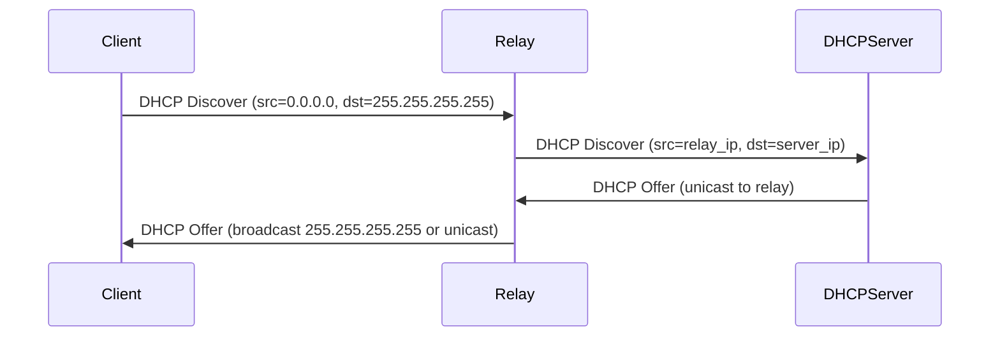

# How to Understand Limited Broadcast vs Directed Broadcast

Author: [nawazdhandala](https://www.github.com/nawazdhandala)

Tags: IPv4, Networking, Broadcast, DHCP, Network Security

Description: Limited broadcast (255.255.255.255) stays on the local segment while directed broadcast targets all hosts in a specific subnet, and understanding the distinction is critical for DHCP design and preventing amplification attacks.

## Side-by-Side Comparison

| Property | Limited Broadcast | Directed Broadcast |
|----------|------------------|-------------------|
| Address | 255.255.255.255 | Subnet broadcast (e.g., 10.1.2.255/24) |
| Scope | Local segment only | Specific subnet (may be remote) |
| Router handling | Never forwarded | Can be forwarded (but disabled by default) |
| TTL after forwarding | N/A (not forwarded) | Decremented normally |
| Primary use | DHCP Discover, BOOTP | Subnet-wide announcements, historical management |

## Limited Broadcast (255.255.255.255)

The limited broadcast is used when a host doesn't know its network address. It is always local — every router discards it rather than forwarding it.

**Main protocol that relies on limited broadcast: DHCP Discover**

```
Client (0.0.0.0) --DHCP Discover--> 255.255.255.255
(Router does NOT forward this)
```

## Directed Broadcast

A directed broadcast is the last address of a specific subnet. Routers *could* forward directed broadcasts across subnets, but RFC 2644 changed the default behavior to discard them:

```bash
# Check if directed broadcast forwarding is enabled (Linux router)
cat /proc/sys/net/ipv4/conf/eth1/bc_forwarding
# 0 = disabled (secure default)

# Enable directed broadcast forwarding on eth1 (NOT recommended in production)
echo 1 | sudo tee /proc/sys/net/ipv4/conf/eth1/bc_forwarding
```

## DHCP and the Limited Broadcast

DHCP relays (DHCP relay agents) exist because DHCP Discover packets can't cross routers. The relay agent converts the limited broadcast to a unicast or directed broadcast sent to the DHCP server:



## Detecting Directed Broadcast in Python

```python
import ipaddress

def is_directed_broadcast(ip: str, network_cidr: str) -> bool:
    """Return True if ip is the directed broadcast for network_cidr."""
    net = ipaddress.IPv4Network(network_cidr, strict=False)
    return ipaddress.IPv4Address(ip) == net.broadcast_address

# Limited broadcast check
def is_limited_broadcast(ip: str) -> bool:
    return ip == "255.255.255.255"

print(is_limited_broadcast("255.255.255.255"))         # True
print(is_directed_broadcast("10.1.2.255", "10.1.2.0/24"))  # True
print(is_directed_broadcast("10.1.2.254", "10.1.2.0/24"))  # False
```

## Security: Smurf Attack Prevention

Directed broadcast forwarding enables Smurf DDoS amplification. Always ensure it is disabled on production routers:

```bash
# Disable directed broadcast forwarding on all interfaces (Linux)
for iface in $(ls /proc/sys/net/ipv4/conf/); do
    echo 0 > /proc/sys/net/ipv4/conf/$iface/bc_forwarding
done
```

## Key Takeaways

- `255.255.255.255` (limited broadcast) is confined to the local segment; routers always drop it.
- Directed broadcast targets a specific subnet's last address and historically could be routed.
- RFC 2644 made discarding directed broadcasts the default; always verify this on routers.
- DHCP relays bridge the limited broadcast gap by forwarding DHCP messages as unicasts.
