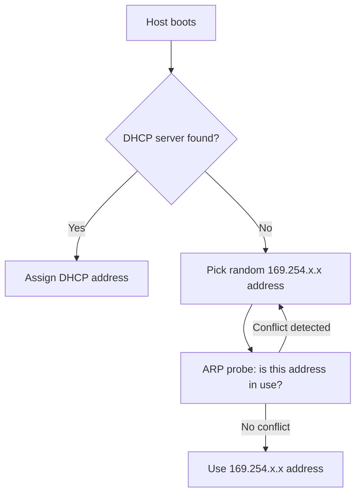

# How to Use Link-Local Addresses (169.254.x.x) in IPv4

Author: [nawazdhandala](https://www.github.com/nawazdhandala)

Tags: IPv4, Networking, Link-Local, APIPA, Network Diagnostics, RFC 3927

Description: IPv4 link-local addresses (169.254.0.0/16) are self-assigned by hosts that cannot obtain an IP via DHCP, allowing limited local-network communication without a DHCP server, defined in RFC 3927.

## What Are Link-Local Addresses?

The `169.254.0.0/16` block is reserved for IPv4 link-local addressing (RFC 3927). On Windows, this is called Automatic Private IP Addressing (APIPA). These addresses are:
- Self-assigned (no DHCP required)
- Only valid on the local link (not routed beyond layer 2)
- Assigned when DHCP fails or is unavailable

## APIPA Address Assignment Process



## When You See 169.254.x.x

Finding a `169.254.x.x` address usually indicates:
1. DHCP server is down or unreachable
2. Network cable is unplugged
3. Wrong VLAN assignment
4. DHCP pool is exhausted

```bash
# Windows: check if APIPA is assigned
ipconfig | findstr 169.254

# Linux
ip addr show | grep 169.254

# macOS
ifconfig | grep 169.254
```

## Manually Assigning a Link-Local Address on Linux

```bash
# Manually assign a link-local address
sudo ip addr add 169.254.50.100/16 dev eth0

# Verify
ip addr show eth0 | grep 169.254
```

## Valid Uses for Link-Local Addresses

1. **Zero-configuration networking**: Printers and IoT devices can communicate on a local segment without DHCP.
2. **Cloud metadata services**: AWS, Azure, and GCP use `169.254.169.254` as the instance metadata endpoint.
3. **Direct serial/USB network links**: Point-to-point connections with no DHCP.

```python
import urllib.request

# Access AWS EC2 instance metadata via link-local address
try:
    url = "http://169.254.169.254/latest/meta-data/instance-id"
    with urllib.request.urlopen(url, timeout=2) as resp:
        instance_id = resp.read().decode()
        print(f"Instance ID: {instance_id}")
except Exception as e:
    print(f"Not on EC2 or metadata not available: {e}")
```

## Link-Local Is Not Routed

Routers must not forward packets with link-local source or destination addresses between interfaces:

```bash
# iptables: drop link-local traffic at the routing boundary
iptables -A FORWARD -s 169.254.0.0/16 -j DROP
iptables -A FORWARD -d 169.254.0.0/16 -j DROP
```

## Key Takeaways

- `169.254.0.0/16` is assigned automatically when DHCP fails (APIPA on Windows).
- Seeing 169.254.x.x on a host usually indicates a DHCP problem.
- Link-local addresses are confined to the local network segment; routers must not forward them.
- Cloud providers use `169.254.169.254` for instance metadata services on this same range.
