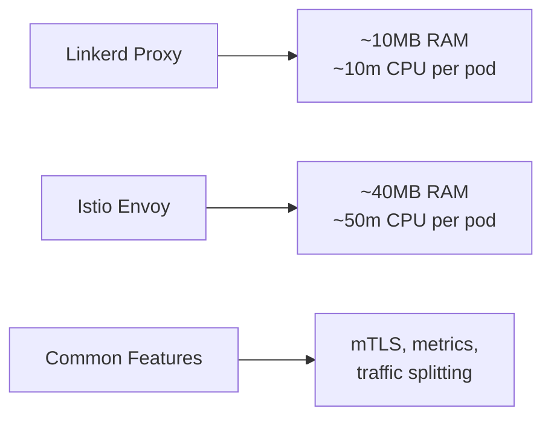

# How to Deploy Linkerd with OpenTofu

Author: [nawazdhandala](https://www.github.com/nawazdhandala)

Tags: OpenTofu, Linkerd, Service Mesh, Kubernetes, mTLS, Helm, Infrastructure as Code

Description: Learn how to deploy Linkerd service mesh on Kubernetes using OpenTofu with automatic mTLS, load balancing, and observability for microservices without sidecar resource overhead.

---

Linkerd is a lightweight service mesh focused on simplicity and low resource overhead. It provides automatic mTLS, latency-aware load balancing, and Prometheus-compatible metrics with smaller CPU and memory footprint than Istio. OpenTofu deploys Linkerd using its official Helm charts.

## Linkerd vs Istio Resource Comparison



## Linkerd CRDs and Control Plane

```hcl
# linkerd.tf

# Step 1: CRDs

resource "helm_release" "linkerd_crds" {
  name             = "linkerd-crds"
  repository       = "https://helm.linkerd.io/stable"
  chart            = "linkerd-crds"
  version          = "1.8.0"
  namespace        = "linkerd"
  create_namespace = true
}

# Step 2: Control plane
resource "helm_release" "linkerd_control_plane" {
  name       = "linkerd-control-plane"
  repository = "https://helm.linkerd.io/stable"
  chart      = "linkerd-control-plane"
  version    = "1.16.11"
  namespace  = "linkerd"

  values = [
    yamlencode({
      # Identity certificates (generated separately)
      identityTrustAnchorsPEM = var.linkerd_trust_anchor_pem
      identity = {
        issuer = {
          tls = {
            crtPEM = var.linkerd_issuer_cert_pem
            keyPEM = var.linkerd_issuer_key_pem
          }
        }
      }

      controllerReplicas = var.environment == "production" ? 3 : 1

      proxy = {
        resources = {
          cpu = {
            request = "10m"
            limit   = "100m"
          }
          memory = {
            request = "10Mi"
            limit   = "250Mi"
          }
        }
      }
    })
  ]

  depends_on = [helm_release.linkerd_crds]
}
```

## Generate Linkerd Certificates

```bash
# Generate trust anchor (self-signed root CA)
step certificate create root.linkerd.cluster.local ca.crt ca.key \
  --profile root-ca \
  --no-password \
  --insecure \
  --not-after 8760h

# Generate issuer certificate signed by trust anchor
step certificate create identity.linkerd.cluster.local issuer.crt issuer.key \
  --profile intermediate-ca \
  --not-after 8760h \
  --no-password \
  --insecure \
  --ca ca.crt \
  --ca-key ca.key
```

## Linkerd Viz Dashboard

```hcl
resource "helm_release" "linkerd_viz" {
  name       = "linkerd-viz"
  repository = "https://helm.linkerd.io/stable"
  chart      = "linkerd-viz"
  version    = "30.12.11"
  namespace  = "linkerd-viz"

  create_namespace = true

  values = [
    yamlencode({
      dashboard = {
        replicas = 1
        enforcedHostRegexp = ".*"  # Restrict to specific hosts in production
      }

      # Prometheus integration
      prometheusUrl = "http://kube-prometheus-stack-prometheus.monitoring:9090"
    })
  ]

  depends_on = [helm_release.linkerd_control_plane]
}
```

## Enable Injection for Namespaces

```hcl
resource "kubernetes_namespace" "apps" {
  metadata {
    name = "apps"
    annotations = {
      "linkerd.io/inject" = "enabled"
    }
  }
}
```

## Traffic Splitting with SMI

```hcl
# Canary deployment using Linkerd traffic split
resource "kubernetes_manifest" "traffic_split" {
  manifest = {
    apiVersion = "split.smi-spec.io/v1alpha2"
    kind       = "TrafficSplit"
    metadata = {
      name      = "app-canary"
      namespace = "apps"
    }
    spec = {
      service = "app-service"
      backends = [
        { service = "app-stable", weight = "90" }
        { service = "app-canary", weight = "10" }
      ]
    }
  }
}
```

## Best Practices

- Generate Linkerd certificates with `step` CLI and store them as Kubernetes Secrets - never commit certificate keys to git.
- Rotate issuer certificates before they expire - set up a reminder 30 days before the `not-after` date in your certificates.
- Use Linkerd's built-in Prometheus metrics with the viz extension rather than adding a separate Prometheus deployment.
- Annotate namespaces for injection at the namespace level (`linkerd.io/inject: enabled`) rather than individual pods.
- Linkerd's proxy resource footprint is much lower than Istio - this makes it suitable for cost-sensitive environments or clusters with many small services.
