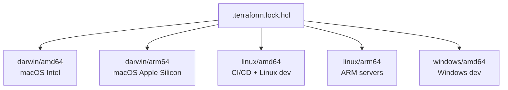

# How to Manage Lock File Checksums Across Platforms with OpenTofu

Author: [nawazdhandala](https://www.github.com/nawazdhandala)

Tags: OpenTofu, Lock File, Checksum, Cross-Platform, Darwin, Linux, Window, Infrastructure as Code

Description: Learn how to manage OpenTofu lock file checksums for multiple operating systems and CPU architectures so teams using macOS, Linux, and Windows can all use the same committed lock file.

---

The `.terraform.lock.hcl` file stores cryptographic checksums for each provider binary per platform. When team members or CI/CD systems use different operating systems or CPU architectures, the lock file must include checksums for all platforms - otherwise `tofu init` fails with a hash mismatch error.

## Platform Checksum Architecture



## Understanding Checksum Types

The lock file contains two types of checksums:
- `h1:` - hash of the zip file containing the provider binary for a specific platform
- `zh:` - hash of the source zip (platform-independent)

```hcl
# .terraform.lock.hcl - example with multiple platforms

provider "registry.opentofu.org/hashicorp/aws" {
  version     = "5.40.0"
  constraints = "~> 5.0"

  hashes = [
    # darwin/amd64 - macOS Intel
    "h1:Abc123...",
    # darwin/arm64 - macOS Apple Silicon (M1/M2/M3)
    "h1:Def456...",
    # linux/amd64 - most CI/CD systems
    "h1:Ghi789...",
    # linux/arm64 - Graviton EC2, ARM runners
    "h1:Jkl012...",
    # windows/amd64 - Windows developers
    "h1:Mno345...",
    # Source zip hash (platform-independent)
    "zh:Pqr678...",
  ]
}
```

## Adding Platform Checksums

```bash
# Add checksums for all platforms your team uses
# Run this from the root of your OpenTofu configuration

tofu providers lock \
  -platform=darwin/amd64 \
  -platform=darwin/arm64 \
  -platform=linux/amd64 \
  -platform=linux/arm64

# For teams with Windows developers
tofu providers lock \
  -platform=darwin/amd64 \
  -platform=darwin/arm64 \
  -platform=linux/amd64 \
  -platform=linux/arm64 \
  -platform=windows/amd64
```

## Fixing Hash Mismatch Errors

```bash
# Error: Error installing provider
# The checksum for provider "registry.opentofu.org/hashicorp/aws" version "5.40.0"
# did not match any of the checksums recorded in the dependency lock file.

# Solution: Add the missing platform's checksum
tofu providers lock -platform=darwin/arm64

# Then commit the updated lock file
git add .terraform.lock.hcl
git commit -m "Add darwin/arm64 checksums to lock file for M1/M2 Mac support"
```

## CI/CD Script to Validate Lock File

```bash
#!/bin/bash
# scripts/validate-lock-file.sh
# Run this in CI to ensure lock file includes all required platforms

REQUIRED_PLATFORMS=("linux/amd64" "linux/arm64" "darwin/amd64" "darwin/arm64")

for platform in "${REQUIRED_PLATFORMS[@]}"; do
  arch=${platform#*/}
  os=${platform%/*}

  echo "Checking platform: $platform"

  # Run providers lock for this platform in dry-run mode
  tofu providers lock -platform="${os}/${arch}" 2>&1

  if git diff --quiet .terraform.lock.hcl; then
    echo "✓ $platform checksums present"
  else
    echo "✗ $platform checksums missing - adding..."
    git add .terraform.lock.hcl
  fi
done
```

## GitHub Actions Workflow

```yaml
# .github/workflows/lock-file.yml
name: Validate Lock File

on:
  push:
    paths:
      - '**.tf'
      - '.terraform.lock.hcl'

jobs:
  validate-lock:
    runs-on: ubuntu-latest
    steps:
      - uses: actions/checkout@v4

      - name: Setup OpenTofu
        uses: opentofu/setup-opentofu@v1
        with:
          tofu_version: "1.6.x"

      - name: Init
        run: tofu init

      - name: Add all platform checksums
        run: |
          tofu providers lock \
            -platform=linux/amd64 \
            -platform=linux/arm64 \
            -platform=darwin/amd64 \
            -platform=darwin/arm64

      - name: Check for changes
        run: |
          if ! git diff --quiet .terraform.lock.hcl; then
            echo "Lock file is missing platform checksums. Run:"
            echo "  tofu providers lock -platform=linux/amd64 -platform=darwin/amd64 -platform=darwin/arm64"
            echo ""
            echo "And commit the result."
            git diff .terraform.lock.hcl
            exit 1
          fi
          echo "Lock file includes all required platform checksums"
```

## Team Onboarding Checklist

```bash
# For new M1/M2/M3 Mac users joining a team:
# 1. Check if darwin/arm64 checksums are in the lock file
grep "darwin/arm64" .terraform.lock.hcl || echo "Missing darwin/arm64 checksums"

# 2. If missing, add them and create a PR
tofu providers lock -platform=darwin/arm64

# 3. This requires running tofu init at least once first
# The providers must be downloaded before checksums can be generated
tofu init
tofu providers lock \
  -platform=linux/amd64 \
  -platform=darwin/amd64 \
  -platform=darwin/arm64
```

## Best Practices

- Run `tofu providers lock -platform=...` for every platform used by your team when first creating a configuration or adding a new provider - don't wait for team members to hit hash mismatch errors.
- Include `darwin/arm64` by default for any Mac-using team - Apple Silicon became the default Mac architecture in 2020, and omitting it causes errors for every developer with an M-series Mac.
- Set up a CI check that validates platform checksums when `providers.tf` changes - this catches the omission automatically when providers are added or updated.
- After running `tofu providers lock`, always review the lock file diff to ensure only the expected checksums were added - unexpected changes may indicate provider version resolution differences.
- Document the `tofu providers lock` command in your team's CONTRIBUTING.md with the exact platforms to include - make it easy for contributors to update the lock file correctly.
