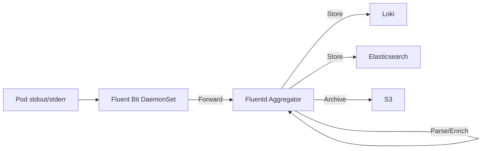

# How to Configure Log Aggregation Pipelines in Rancher

Author: [nawazdhandala](https://www.github.com/nawazdhandala)

Tags: Rancher, Log Aggregation, Loki, Fluentd, Fluent Bit, Logging Pipeline

Description: Configure production-grade log aggregation pipelines in Rancher using Fluent Bit for collection, Fluentd for processing, and Loki or Elasticsearch for storage.

## Introduction

Log aggregation in Kubernetes requires collecting logs from transient pods, enriching them with Kubernetes metadata, and routing them to a centralized store. This guide covers building a complete log pipeline using Fluent Bit and Fluentd on Rancher.

## Pipeline Architecture



## Step 1: Deploy Fluent Bit as DaemonSet

Fluent Bit collects logs from every node with minimal resource usage.

```yaml
# fluent-bit-values.yaml
config:
  inputs: |
    [INPUT]
        Name              tail
        Tag               kube.*
        Path              /var/log/containers/*.log
        Parser            cri          # Parse CRI/containerd log format
        DB                /var/log/flb_kube.db
        Mem_Buf_Limit     50MB
        Skip_Long_Lines   On
        Refresh_Interval  10

  filters: |
    [FILTER]
        Name                kubernetes
        Match               kube.*
        Kube_URL            https://kubernetes.default.svc:443
        Merge_Log           On           # Parse JSON logs into fields
        Keep_Log            Off
        K8S-Logging.Parser  On
        K8S-Logging.Exclude On

    [FILTER]
        Name    grep
        Match   kube.*
        Exclude log  ^$    # Drop empty log lines

  outputs: |
    [OUTPUT]
        Name          forward
        Match         *
        Host          fluentd.observability.svc.cluster.local
        Port          24224
        Shared_Key    changeme
```

```bash
helm repo add fluent https://fluent.github.io/helm-charts
helm install fluent-bit fluent/fluent-bit \
  --namespace observability \
  --values fluent-bit-values.yaml
```

## Step 2: Deploy Fluentd Aggregator

Fluentd handles parsing, enrichment, and routing to multiple outputs.

```yaml
# fluentd-values.yaml
replicaCount: 2

fileConfigs:
  01_sources.conf: |
    <source>
      @type forward
      port 24224
      shared_key changeme
    </source>

  02_filters.conf: |
    <filter kube.**>
      @type record_transformer
      enable_ruby true
      <record>
        # Add environment tag based on namespace
        environment ${record.dig("kubernetes", "namespace_name") =~ /prod/ ? "production" : "staging"}
      </record>
    </filter>

    <filter kube.**>
      @type parser
      key_name log
      reserve_data true
      <parse>
        @type json
        time_key timestamp
        time_format %Y-%m-%dT%H:%M:%S.%NZ
      </parse>
    </filter>

  03_outputs.conf: |
    <match kube.**>
      @type loki
      url http://loki.observability.svc.cluster.local:3100
      <label>
        namespace $.kubernetes.namespace_name
        app $.kubernetes.labels.app
        pod $.kubernetes.pod_name
      </label>
      flush_interval 5s
    </match>
```

```bash
helm install fluentd fluent/fluentd \
  --namespace observability \
  --values fluentd-values.yaml
```

## Step 3: Configure Rancher Logging via UI

Rancher provides a built-in Logging integration. Navigate to your cluster in the Rancher UI, go to **Cluster > Logging**, and configure:

1. Enable cluster logging
2. Set the output to your Fluentd endpoint
3. Configure namespace-level log filters

## Step 4: Verify the Pipeline

```bash
# Check Fluent Bit is collecting logs
kubectl logs -n observability daemonset/fluent-bit | grep "flush"

# Check Fluentd is forwarding
kubectl logs -n observability deployment/fluentd | grep "chunk"

# Query logs in Loki via Grafana
# {app="myapp", namespace="production"} | json | level="error"
```

## Conclusion

A two-tier log pipeline with Fluent Bit and Fluentd provides the right balance of efficiency and flexibility. Fluent Bit's minimal footprint handles high-volume collection on every node, while Fluentd's rich plugin ecosystem handles complex routing and transformation requirements.
