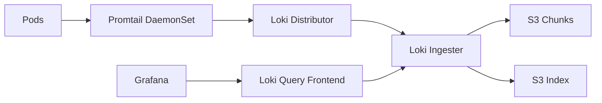

# How to Deploy Loki with OpenTofu

Author: [nawazdhandala](https://www.github.com/nawazdhandala)

Tags: OpenTofu, Loki, Grafana, Log Aggregation, Kubernetes, Helm, Infrastructure as Code

Description: Learn how to deploy Grafana Loki on Kubernetes using OpenTofu for cost-effective log aggregation with S3 backend storage, Promtail for log collection, and Grafana integration.

---

Loki indexes log metadata (labels) instead of log content, making it dramatically cheaper than Elasticsearch for log aggregation. It integrates natively with Grafana and uses S3 (or compatible object storage) as a cost-effective backend. OpenTofu deploys the full Loki stack including Promtail for log collection.

## Loki Architecture



## S3 Storage for Loki

```hcl
# loki_storage.tf

resource "aws_s3_bucket" "loki_chunks" {
  bucket = "${var.environment}-loki-chunks"
}

resource "aws_s3_bucket" "loki_ruler" {
  bucket = "${var.environment}-loki-ruler"
}

resource "aws_iam_role" "loki" {
  name = "${var.cluster_name}-loki"

  assume_role_policy = jsonencode({
    Version = "2012-10-17"
    Statement = [{
      Effect = "Allow"
      Principal = {
        Federated = var.oidc_provider_arn
      }
      Action = "sts:AssumeRoleWithWebIdentity"
      Condition = {
        StringEquals = {
          "${var.oidc_provider_url}:sub" = "system:serviceaccount:monitoring:loki"
        }
      }
    }]
  })
}

resource "aws_iam_role_policy" "loki_s3" {
  role = aws_iam_role.loki.id
  policy = jsonencode({
    Version = "2012-10-17"
    Statement = [{
      Effect   = "Allow"
      Action   = ["s3:GetObject", "s3:PutObject", "s3:DeleteObject", "s3:ListBucket"]
      Resource = [
        aws_s3_bucket.loki_chunks.arn,
        "${aws_s3_bucket.loki_chunks.arn}/*",
        aws_s3_bucket.loki_ruler.arn,
        "${aws_s3_bucket.loki_ruler.arn}/*",
      ]
    }]
  })
}
```

## Loki Deployment

```hcl
resource "helm_release" "loki" {
  name             = "loki"
  repository       = "https://grafana.github.io/helm-charts"
  chart            = "loki"
  version          = "5.41.5"
  namespace        = "monitoring"

  values = [
    yamlencode({
      loki = {
        auth_enabled = false

        storage = {
          type = "s3"
          s3 = {
            region = var.aws_region
          }
          bucketNames = {
            chunks = aws_s3_bucket.loki_chunks.id
            ruler  = aws_s3_bucket.loki_ruler.id
          }
        }

        schema_config = {
          configs = [{
            from        = "2024-01-01"
            store       = "tsdb"
            object_store = "s3"
            schema      = "v12"
            index = {
              prefix = "loki_index_"
              period = "24h"
            }
          }]
        }

        limits_config = {
          retention_period = var.environment == "production" ? "720h" : "168h"  # 30d or 7d
        }
      }

      serviceAccount = {
        annotations = {
          "eks.amazonaws.com/role-arn" = aws_iam_role.loki.arn
        }
      }

      singleBinary = {
        replicas = var.environment == "production" ? 2 : 1
        resources = {
          requests = { cpu = "100m", memory = "256Mi" }
          limits   = { cpu = "500m", memory = "1Gi" }
        }
      }
    })
  ]
}
```

## Promtail for Log Collection

```hcl
resource "helm_release" "promtail" {
  name       = "promtail"
  repository = "https://grafana.github.io/helm-charts"
  chart      = "promtail"
  version    = "6.15.3"
  namespace  = "monitoring"

  values = [
    yamlencode({
      config = {
        clients = [{
          url = "http://loki:3100/loki/api/v1/push"
        }]
      }

      # Add extra labels to all logs
      extraArgs = [
        "--client.external-labels=cluster=${var.cluster_name},environment=${var.environment}"
      ]

      tolerations = [{ operator = "Exists" }]  # Collect from all nodes
    })
  ]

  depends_on = [helm_release.loki]
}
```

## Best Practices

- Use S3 as the storage backend for Loki - it's dramatically cheaper than persistent volumes for log data.
- Set log retention periods per environment - production logs may need 30 days for compliance; dev needs 7 days.
- Use Workload Identity (IRSA on EKS) for Loki's S3 access rather than long-lived credentials.
- Configure Loki as a data source in Grafana - then you can correlate metrics and logs in the same dashboard using LogQL.
- Label logs with `cluster` and `environment` extra labels via Promtail - it makes filtering across multi-cluster setups easier.
