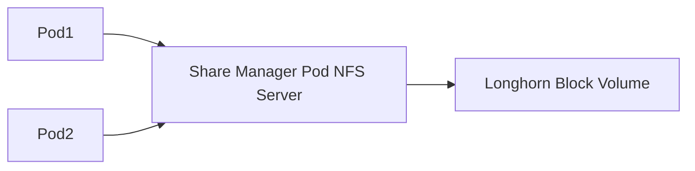

# How to Configure Longhorn Network File System Server

Author: [nawazdhandala](https://www.github.com/nawazdhandala)

Tags: Longhorn, NFS, ReadWriteMany, Kubernetes, Storage, Share Manager, SUSE Rancher

Description: Learn how to configure Longhorn's built-in NFS share manager for ReadWriteMany volumes, including NFS server settings, client configuration, and performance tuning.

---

Longhorn implements ReadWriteMany (RWX) volumes by running a dedicated NFS server pod (share manager) per RWX volume. This guide covers how to configure and tune the NFS share manager for production use.

---

## How Longhorn NFS Share Manager Works



Each RWX PVC gets its own NFS share manager pod. The pod serves as an NFS 4.1 server backed by a standard Longhorn block volume.

---

## Step 1: Ensure NFS Client Is Installed on All Nodes

```bash
# Ubuntu/Debian
sudo apt-get install -y nfs-common

# RHEL/CentOS/Rocky
sudo yum install -y nfs-utils

# Verify NFS client modules are loaded
lsmod | grep nfs
```

---

## Step 2: Configure NFS Options in StorageClass

```yaml
# storageclass-nfs.yaml
apiVersion: storage.k8s.io/v1
kind: StorageClass
metadata:
  name: longhorn-rwx
provisioner: driver.longhorn.io
allowVolumeExpansion: true
parameters:
  numberOfReplicas: "3"
  staleReplicaTimeout: "2880"
  # NFS version and options
  nfsOptions: "vers=4.1,noresvport,hard,timeo=600,retrans=5"
```

---

## Step 3: Configure Share Manager Pod Resources

Set resource limits for the NFS share manager pod to prevent it from consuming too many cluster resources:

```bash
# Set share manager pod resources via Longhorn settings
kubectl patch setting.longhorn.io guaranteed-instance-manager-cpu \
  -n longhorn-system \
  --type merge \
  -p '{"value":"12"}'  # 12% of CPU (12m per CPU)
```

---

## Step 4: Configure Share Manager Image

Pin the share manager to a specific image version for reproducibility:

```bash
kubectl patch setting.longhorn.io share-manager-image \
  -n longhorn-system \
  --type merge \
  -p '{"value":"longhornio/longhorn-share-manager:v1.6.2"}'
```

---

## Step 5: Monitor Share Manager Health

```bash
# List all share manager pods
kubectl get pods -n longhorn-system \
  -l longhorn.io/component=share-manager

# Check share manager pod logs
kubectl logs -n longhorn-system \
  -l longhorn.io/component=share-manager \
  --tail=100

# Verify NFS exports from within the share manager
kubectl exec -n longhorn-system \
  <share-manager-pod-name> \
  -- exportfs -v
```

---

## Step 6: Troubleshoot NFS Mount Failures

If pods cannot mount the RWX volume:

```bash
# On the node where the pod is running, check NFS mounts
showmount -e <share-manager-pod-IP>

# Check for stale NFS file handle errors
dmesg | grep nfs | tail -20

# Force unmount and remount
umount -f -l /var/lib/kubelet/pods/<pod-id>/volumes/...
```

---

## NFS Client Mount Options

The `nfsOptions` in the StorageClass control how pods mount the NFS share:

| Option | Description |
|---|---|
| `vers=4.1` | Use NFS version 4.1 |
| `noresvport` | Don't use reserved ports (needed in some firewalls) |
| `hard` | Keep retrying on connection failure (recommended) |
| `timeo=600` | Timeout in tenths of a second |
| `retrans=5` | Number of retries before giving up |

---

## Best Practices

- Use `vers=4.1` not `vers=3` — NFS4 provides better locking semantics.
- Run the share manager on nodes with SSD storage to minimize NFS server latency.
- Set `hard` mount option for production — `soft` will silently lose writes on network issues.
- Place the share manager pod on a node with reserved resources using Longhorn's node affinity settings.
