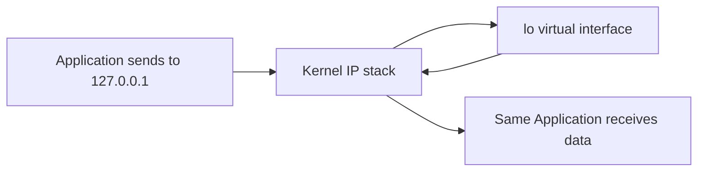

# How to Understand the Loopback Address 127.0.0.1

Author: [nawazdhandala](https://www.github.com/nawazdhandala)

Tags: IPv4, Networking, Loopback, Localhost, Network Diagnostics

Description: The loopback address 127.0.0.1 is a virtual interface that allows a host to communicate with itself without sending traffic onto any physical network, used extensively for local service testing...

## What Is the Loopback Interface?

The entire `127.0.0.0/8` block is reserved for loopback. On Linux and macOS the loopback interface is named `lo`; on Windows it is the Microsoft Loopback Adapter. The most commonly used address is `127.0.0.1`, also known as `localhost`.

```bash
# View the loopback interface on Linux

ip addr show lo

# Ping the loopback address to verify the IP stack is functional
ping 127.0.0.1 -c 4
```

## How Loopback Traffic Works

When a process sends a packet to `127.0.0.1`, the kernel recognizes the destination as local and routes it directly back through the virtual `lo` interface - no physical NIC or network involved. The packet is never transmitted on any external medium.



## Using Loopback for Local Service Testing

```python
import socket

# Start a simple echo server on loopback
server = socket.socket(socket.AF_INET, socket.SOCK_STREAM)
server.setsockopt(socket.SOL_SOCKET, socket.SO_REUSEADDR, 1)
server.bind(("127.0.0.1", 9090))
server.listen(1)
print("Echo server listening on 127.0.0.1:9090")

conn, addr = server.accept()
with conn:
    data = conn.recv(1024)
    conn.sendall(data)  # Echo back
```

```python
# Client connecting to the echo server
import socket

client = socket.socket(socket.AF_INET, socket.SOCK_STREAM)
client.connect(("127.0.0.1", 9090))
client.sendall(b"Hello, loopback!")
response = client.recv(1024)
print(f"Received: {response}")
client.close()
```

## Loopback in /etc/hosts

By convention, `localhost` maps to `127.0.0.1`:

```text
# /etc/hosts
127.0.0.1   localhost
::1         localhost ip6-localhost
```

## The Full 127.0.0.0/8 Block

While `127.0.0.1` is the standard address, any address in `127.0.0.0/8` loops back. This is useful for:
- Binding multiple services on distinct loopback IPs without aliases
- Running multiple isolated service instances on one host

```bash
# Bind a service to a different loopback address
ip addr add 127.0.0.2/8 dev lo
# Now you can listen on 127.0.0.2:8080 separately from 127.0.0.1:8080
```

## Security Consideration

Services bound to loopback are not reachable from other hosts. However, processes on the same machine can access them. Ensure sensitive local services (databases, admin APIs) are protected by authentication even on loopback.

## Key Takeaways

- `127.0.0.0/8` is the loopback range; `127.0.0.1` is the standard address.
- Loopback traffic never leaves the kernel; no physical transmission occurs.
- Use loopback to test services locally without firewall or routing concerns.
- Binding services to `127.0.0.1` (not `0.0.0.0`) limits access to the local machine.
