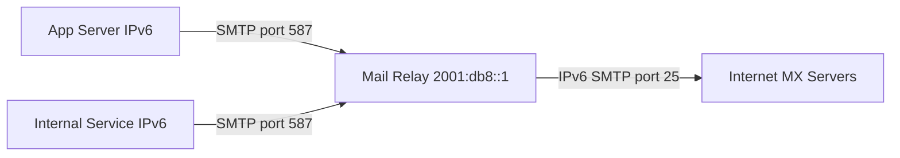

# How to Configure Mail Relay over IPv6

Author: [nawazdhandala](https://www.github.com/nawazdhandala)

Tags: Postfix, IPv6, Email, SMTP Relay, Mail Server, Networking

Description: Configure Postfix as a mail relay over IPv6, enabling applications and internal servers to route outbound email through a central relay using IPv6 connections.

## Introduction

Mail relaying over IPv6 allows internal servers, applications, and network segments that only have IPv6 connectivity to send outbound email through a central mail relay. This is common in IPv6-only data center segments, containerized environments, and cloud VPCs with IPv6-only subnets.

## Architecture Overview



## Setting Up the Relay Server

Configure Postfix on the relay server to accept connections from IPv6 clients:

```bash
# /etc/postfix/main.cf on the relay server

# Listen on all interfaces including IPv6

inet_protocols = all

# Accept relay from internal IPv6 networks
mynetworks = 127.0.0.0/8 [::1]/128 [2001:db8::/32]

# The relay host will route to the internet
relayhost =

# Bind outbound to a specific IPv6 address
smtp_bind_address6 = 2001:db8::1
```

For relay via submission (port 587) with authentication:

```bash
# /etc/postfix/master.cf - enable submission port
sudo postconf -M 'submission/inet=submission inet n - y - - smtpd'
sudo postconf -P 'submission/inet/syslog_name=postfix/submission'
sudo postconf -P 'submission/inet/smtpd_tls_security_level=encrypt'
sudo postconf -P 'submission/inet/smtpd_sasl_auth_enable=yes'
sudo postconf -P 'submission/inet/smtpd_recipient_restrictions=permit_sasl_authenticated,reject'

sudo systemctl reload postfix
```

## Configuring Clients to Relay via IPv6

On application servers and internal hosts, configure Postfix to relay through the central server:

```bash
# On client server - configure relay host with IPv6 address
sudo postconf -e 'relayhost = [2001:db8::1]:587'
sudo postconf -e 'inet_protocols = all'
sudo postconf -e 'smtp_sasl_auth_enable = yes'
sudo postconf -e 'smtp_sasl_password_maps = hash:/etc/postfix/sasl_passwd'
sudo postconf -e 'smtp_sasl_security_options = noanonymous'
sudo postconf -e 'smtp_tls_security_level = encrypt'

# Create the SASL password file
echo "[2001:db8::1]:587  mailrelay:password" | sudo tee /etc/postfix/sasl_passwd
sudo postmap /etc/postfix/sasl_passwd
sudo chmod 600 /etc/postfix/sasl_passwd

sudo systemctl reload postfix
```

## Configuring Applications to Use the IPv6 Relay

For applications using SMTP directly (e.g., web apps):

```python
# Python example: Send email via IPv6 relay
import smtplib
from email.mime.text import MIMEText

def send_via_ipv6_relay(sender, recipient, subject, body):
    """Send email through an IPv6 SMTP relay."""
    msg = MIMEText(body)
    msg['Subject'] = subject
    msg['From'] = sender
    msg['To'] = recipient

    # Connect to relay using IPv6 address
    # Python's smtplib handles IPv6 in brackets
    with smtplib.SMTP('2001:db8::1', 587) as smtp:
        smtp.ehlo()
        smtp.starttls()
        smtp.login('mailrelay', 'password')
        smtp.sendmail(sender, [recipient], msg.as_string())

send_via_ipv6_relay(
    'app@example.com',
    'user@external.com',
    'Hello from IPv6',
    'This message was relayed over IPv6.'
)
```

## Testing the IPv6 Relay

```bash
# Test SMTP connection to the relay over IPv6
nc -6 -v 2001:db8::1 587

# Send a test email via the relay
swaks --from sender@example.com \
      --to recipient@external.com \
      --server [2001:db8::1]:587 \
      --tls \
      --auth-user mailrelay \
      --auth-password password

# Monitor the relay log
sudo tail -f /var/log/mail.log | grep "relay"
```

## Firewall Configuration

```bash
# On the relay server, allow IPv6 submission connections
sudo ip6tables -A INPUT -p tcp --dport 587 -s 2001:db8::/32 -j ACCEPT
sudo ip6tables -A INPUT -p tcp --dport 25 -j ACCEPT

# Save rules
sudo ip6tables-save | sudo tee /etc/ip6tables.rules
```

## Monitoring Relay Queue and Throughput

```bash
# Check relay queue
sudo postqueue -p | grep "^[0-9A-F]"

# Count messages relayed per hour by protocol
sudo grep "$(date '+%b %e %H')" /var/log/mail.log | \
    grep "status=sent" | \
    grep -oE 'relay=\S+' | sort | uniq -c | sort -rn | head -10
```

## Conclusion

Configuring Postfix as an IPv6 mail relay involves enabling `inet_protocols = all`, defining IPv6 client networks in `mynetworks`, and setting up SASL authentication for submission clients. Applications connect using the relay's IPv6 address on port 587, and the relay handles onward delivery to the internet using its stable IPv6 address with proper PTR and SPF records.
