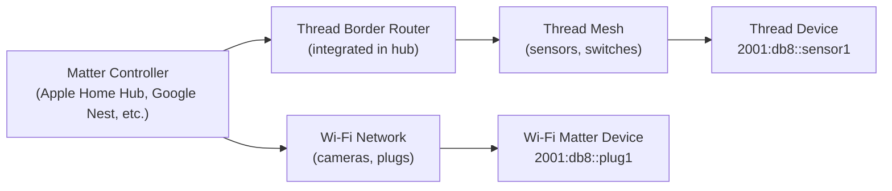

# How to Configure Matter Protocol with IPv6

Author: [nawazdhandala](https://www.github.com/nawazdhandala)

Tags: IPv6, Matter, IoT, Thread, Wi-Fi, Smart Home

Description: Configure the Matter smart home protocol over IPv6, including Thread and Wi-Fi transport options, commissioning, and Matter bridge setup.

## Introduction

Matter (formerly Project CHIP) is the smart home interoperability standard supported by Apple, Google, Amazon, and Samsung. Matter runs exclusively over IPv6 using either Thread (for battery-powered devices) or Wi-Fi/Ethernet (for powered devices). Every Matter device requires an IPv6 address.

## Matter Network Topology



## Prerequisites

- Matter controller (Apple HomePod Mini, Google Nest Hub, Amazon Echo 4th gen, or CHIP tool)
- IPv6-capable home network
- For Thread devices: Thread Border Router (built into most modern hubs)

## Setting Up a Matter Development Environment

```bash
# Install the Matter SDK (chip-tool)
sudo apt-get install git gcc g++ python3-pip libssl-dev libavahi-client-dev

# Clone the Matter SDK
git clone --recurse-submodules https://github.com/project-chip/connectedhomeip.git
cd connectedhomeip

# Bootstrap dependencies
./scripts/bootstrap.sh

# Build chip-tool (command-line controller)
source scripts/activate.sh
gn gen out/host
ninja -C out/host chip-tool

# Verify chip-tool is built
./out/host/chip-tool --version
```

## Commissioning a Matter Device

Matter commissioning pairs a device with a controller:

```bash
# Commission a Matter device over Wi-Fi (IPv6)
# The device must be in commissioning mode (indicated by light pattern)

# Get the device's QR code or setup PIN from the packaging
# Example: PIN = 20202021, discriminator = 3840

chip-tool pairing code-wifi \
    1 \                        # Node ID to assign
    "YOUR-WIFI-SSID" \
    "wifi-password" \
    "MT:Y.K9042C00KA0648G00" # Pairing code from QR code

# Commission a Thread device (via existing Thread network)
chip-tool pairing ble-thread \
    2 \                        # Node ID
    hex:<thread-dataset-hex> \ # Active Thread dataset
    20202021 \                 # Setup PIN
    3840                       # Discriminator
```

## Interacting with a Commissioned Matter Device

```bash
# After commissioning, interact with the device using its node ID

# Read an attribute (e.g., temperature from a sensor - node ID 1, endpoint 1)
chip-tool temperaturemeasurement read measured-value 1 1

# Control a light (on/off cluster - node ID 2, endpoint 1)
chip-tool onoff on 2 1
chip-tool onoff off 2 1

# Read the IPv6 address of the device
chip-tool basicinformation read node-label 1 0

# Subscribe to attribute changes (push-based monitoring)
chip-tool temperaturemeasurement subscribe measured-value 10 60 1 1
```

## IPv6 Requirements for Matter

```bash
# Verify your network has IPv6 enabled
ip -6 addr show | grep "scope global"

# For Thread devices, verify Thread Border Router is advertising RA
rdisc6 eth0
# Check for prefix from Thread mesh (fdXX::/64)

# Matter requires mDNS for device discovery over IPv6
# Verify mDNS works for IPv6 multicast
avahi-browse -a | grep _matter
# Or:
dns-sd -B _matter._tcp
```

## Setting Up a Matter Bridge

A Matter bridge exposes non-Matter devices (e.g., Zigbee, Z-Wave) as Matter devices over IPv6:

```bash
# Build the bridge example from the Matter SDK
cd connectedhomeip/examples/bridge-app/linux
gn gen out
ninja -C out

# Run the bridge (listens on IPv6 for Matter traffic)
./out/bridge-app \
    --wifi \
    --interface eth0 \
    --discriminator 3840 \
    --passcode 20202021
```

## Verifying Matter IPv6 Traffic

```bash
# Matter uses UDP port 5540 for secure channel
# Capture Matter traffic
sudo tcpdump -i eth0 -v "udp port 5540"

# Matter uses mDNS (port 5353) for discovery
sudo tcpdump -i eth0 "udp port 5353 and ip6"

# Check for Matter operational messages
sudo tcpdump -i eth0 "ip6 and udp port 5540" -A | head -100
```

## Conclusion

Matter runs exclusively over IPv6, using Thread (via a Thread Border Router) for battery-powered devices and Wi-Fi for powered devices. Commissioning with `chip-tool` demonstrates the full IPv6-based pairing and communication flow. The Matter ecosystem's requirement for IPv6 makes it one of the most significant drivers of consumer IPv6 adoption, as every Matter-compatible hub and device requires functional IPv6 networking.
