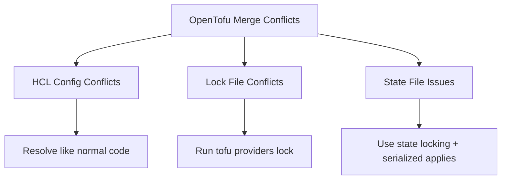

# How to Handle Merge Conflicts in OpenTofu Configurations

Author: [nawazdhandala](https://www.github.com/nawazdhandala)

Tags: OpenTofu, Merge Conflicts, Git, State Management, Team Workflow, Infrastructure as Code

Description: Learn how to prevent and resolve merge conflicts in OpenTofu configurations, including HCL formatting conventions, state file conflicts, and lock file conflict resolution strategies.

---

Merge conflicts in OpenTofu projects fall into three categories: HCL configuration conflicts, `.terraform.lock.hcl` conflicts, and state file issues from concurrent applies. Each requires a different resolution approach.

## Conflict Categories



## Preventing HCL Conflicts

```bash
# Enforce consistent formatting to reduce cosmetic conflicts
tofu fmt -recursive .

# Pre-commit hook to auto-format before commit
# .pre-commit-config.yaml
repos:
  - repo: https://github.com/antonbabenko/pre-commit-terraform
    rev: v1.86.0
    hooks:
      - id: terraform_fmt   # Formats all .tf files
```

## Resolving Lock File Conflicts

```bash
# .terraform.lock.hcl conflicts are common when two PRs update provider versions
# DON'T manually edit lock files — regenerate them instead

# 1. Accept one version of the conflict (either <<< or >>>)
git checkout --ours .terraform.lock.hcl
# OR
git checkout --theirs .terraform.lock.hcl

# 2. Delete the lock file and regenerate
rm .terraform.lock.hcl
tofu init

# 3. If you need checksums for multiple platforms
tofu providers lock \
  -platform=linux_amd64 \
  -platform=linux_arm64 \
  -platform=darwin_amd64 \
  -platform=darwin_arm64

# 4. Stage and continue
git add .terraform.lock.hcl
git rebase --continue
```

## Resolving HCL Conflicts

```hcl
# Conflict example in variables.tf
<<<<<<< HEAD
variable "instance_type" {
  type    = string
  default = "t3.medium"  # Team A wants t3.medium
}
=======
variable "instance_type" {
  type    = string
  default = "t3.large"   # Team B wants t3.large
>>>>>>> feature/scale-up
}

# Resolution: Use variable with no default, forcing explicit values per environment
variable "instance_type" {
  type        = string
  description = "EC2 instance type — set per environment in tfvars"
}
```

## Conflict-Reducing Patterns

```hcl
# Use separate files per concern to reduce overlap
# resources/ec2.tf, resources/rds.tf, resources/iam.tf
# instead of one monolithic main.tf

# Use for_each with maps instead of counted resources
# This reduces index-based conflicts
resource "aws_security_group_rule" "allow_https" {
  for_each = var.allowed_cidrs  # Map key avoids positional conflicts

  type        = "ingress"
  from_port   = 443
  to_port     = 443
  protocol    = "tcp"
  cidr_blocks = [each.value]
  security_group_id = aws_security_group.app.id
}
```

## Handling State Inconsistencies After Conflicts

```bash
# After resolving conflicts and deploying, verify state is consistent
tofu plan

# If resources show as drifted, refresh state
tofu refresh

# If a resource exists in state but was deleted elsewhere
tofu state rm 'aws_instance.web[0]'

# If a resource exists in cloud but not in state, import it
tofu import aws_instance.web i-1234567890abcdef0
```

## Team Workflow to Minimize Conflicts

```bash
# Keep PRs small — large PRs that touch many files create more conflicts

# Update from main frequently
git fetch origin
git rebase origin/main

# Use feature flags for long-running changes
variable "enable_new_vpc_design" {
  type    = bool
  default = false  # Ship disabled, enable later
}
```

## Best Practices

- Enforce `tofu fmt` via pre-commit hooks — most HCL conflicts are whitespace or formatting differences that automatic formatting eliminates.
- Never manually edit `.terraform.lock.hcl` after a conflict — delete and regenerate with `tofu init`.
- Keep infrastructure PRs small and focused — large PRs that touch many modules cause the most conflicts.
- Use `for_each` with named keys instead of `count` to avoid index-shifting conflicts when items are added or removed.
- Serialize applies to the same environment — don't allow two PRs to target the same environment simultaneously.
