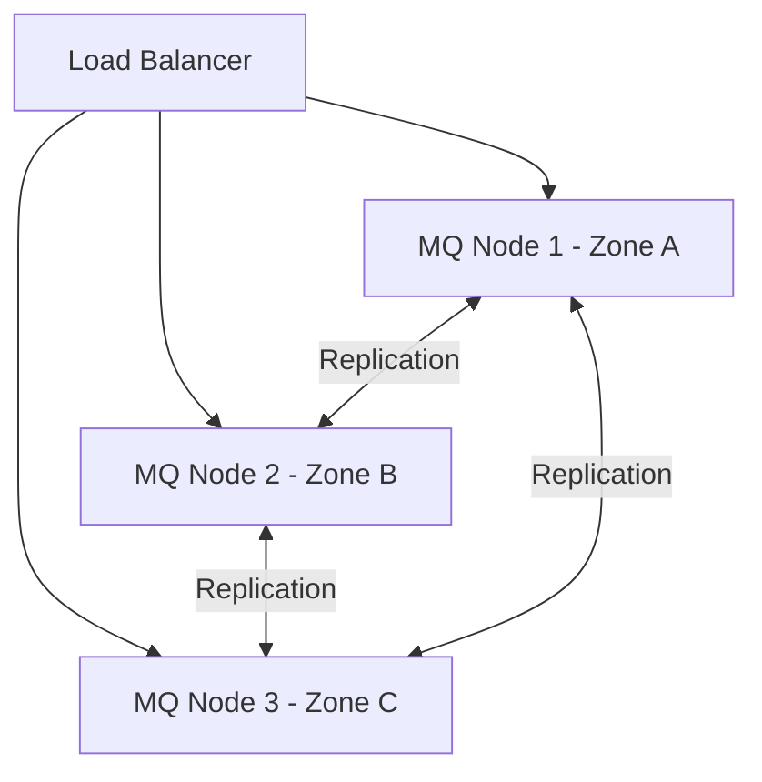

# How to Configure Message Queue High Availability in Rancher

Author: [nawazdhandala](https://www.github.com/nawazdhandala)

Tags: Rancher, High Availability, Message Queue, Kubernetes, RabbitMQ, Kafka

Description: Learn how to configure high availability for message queue workloads in Rancher using replication, anti-affinity rules, and pod disruption budgets.

## Introduction

Message queues are critical infrastructure. A queue failure can cascade to application failures across your entire platform. Proper HA configuration in Rancher uses a combination of pod replicas, anti-affinity rules, pod disruption budgets, and persistent storage replication.

## HA Architecture



## Step 1: Pod Anti-Affinity Rules

Anti-affinity ensures message queue replicas are spread across different physical nodes.

```yaml
# Apply to any MQ StatefulSet
spec:
  affinity:
    podAntiAffinity:
      requiredDuringSchedulingIgnoredDuringExecution:
        - labelSelector:
            matchExpressions:
              - key: app.kubernetes.io/name
                operator: In
                values:
                  - rabbitmq    # Replace with your MQ label
          topologyKey: kubernetes.io/hostname   # One pod per node
```

## Step 2: Topology Spread Constraints

For clusters with availability zones, spread pods across zones:

```yaml
spec:
  topologySpreadConstraints:
    - maxSkew: 1
      topologyKey: topology.kubernetes.io/zone
      whenUnsatisfiable: DoNotSchedule
      labelSelector:
        matchLabels:
          app.kubernetes.io/name: rabbitmq
```

## Step 3: Pod Disruption Budgets

A PodDisruptionBudget prevents Kubernetes from taking down too many replicas during maintenance.

```yaml
# mq-pdb.yaml
apiVersion: policy/v1
kind: PodDisruptionBudget
metadata:
  name: rabbitmq-pdb
  namespace: messaging
spec:
  minAvailable: 2    # Always keep at least 2 replicas available
  selector:
    matchLabels:
      app.kubernetes.io/name: rabbitmq
```

```bash
kubectl apply -f mq-pdb.yaml
```

## Step 4: Storage Replication

Use a StorageClass with multiple replicas to protect message data:

```yaml
# ha-storage-class.yaml
apiVersion: storage.k8s.io/v1
kind: StorageClass
metadata:
  name: mq-ha-storage
provisioner: driver.longhorn.io
parameters:
  numberOfReplicas: "3"    # Replicate data 3 ways
  dataLocality: "disabled" # Allow replicas on any node
reclaimPolicy: Retain      # Preserve data on PVC deletion
```

## Step 5: Resource Requests and Limits

Ensure Kubernetes can always schedule MQ pods by setting accurate resource requests:

```yaml
resources:
  requests:
    memory: "512Mi"     # Guaranteed allocation
    cpu: "250m"
  limits:
    memory: "2Gi"
    cpu: "2"
```

## Step 6: Liveness and Readiness Probes

Configure probes so Kubernetes removes unhealthy pods from load balancing:

```yaml
livenessProbe:
  exec:
    command:
      - rabbitmq-diagnostics    # RabbitMQ health check
      - -q
      - ping
  initialDelaySeconds: 60
  periodSeconds: 30
  timeoutSeconds: 15

readinessProbe:
  exec:
    command:
      - rabbitmq-diagnostics
      - -q
      - check_port_connectivity
  initialDelaySeconds: 20
  periodSeconds: 10
```

## Conclusion

Message queue HA in Rancher requires coordination across multiple Kubernetes features. Anti-affinity and topology spread constraints handle node-level resilience, PodDisruptionBudgets protect during planned maintenance, and replicated storage protects against disk failures. Together these form a robust HA foundation.
