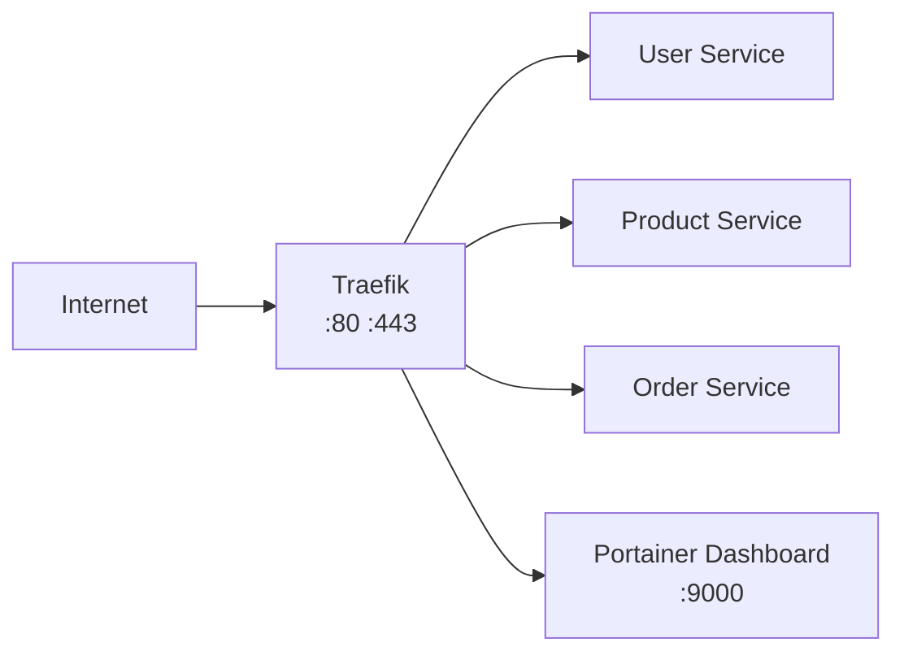

# How to Set Up a Microservices Gateway with Portainer and Traefik

Author: [nawazdhandala](https://www.github.com/nawazdhandala)

Tags: Portainer, Traefik, API Gateway, Microservices, Reverse Proxy, Docker, Load Balancing

Description: Learn how to set up Traefik as a microservices API gateway with Portainer, providing automatic service discovery, load balancing, and TLS termination.

---

Traefik integrates tightly with Docker — it watches for container labels and automatically configures routing rules as services start and stop. Combined with Portainer for management, it provides a powerful microservices gateway without manual configuration.

## Architecture



## Compose Stack

```yaml
version: "3.8"

services:
  traefik:
    image: traefik:v3.0
    restart: unless-stopped
    command:
      - --api.dashboard=true
      - --providers.docker=true
      - --providers.docker.network=gateway_net
      - --providers.docker.exposedByDefault=false
      - --entrypoints.web.address=:80
      - --entrypoints.websecure.address=:443
      # Let's Encrypt automatic TLS
      - --certificatesresolvers.le.acme.httpchallenge=true
      - --certificatesresolvers.le.acme.email=admin@example.com
      - --certificatesresolvers.le.acme.storage=/certs/acme.json
    ports:
      - "80:80"
      - "443:443"
    volumes:
      - /var/run/docker.sock:/var/run/docker.sock:ro
      - traefik_certs:/certs
    labels:
      - "traefik.enable=true"
      - "traefik.http.routers.dashboard.rule=Host(`traefik.example.com`)"
      - "traefik.http.routers.dashboard.service=api@internal"
    networks:
      - gateway_net

  user-service:
    image: user-service:latest
    restart: unless-stopped
    networks:
      - gateway_net
    labels:
      - "traefik.enable=true"
      - "traefik.http.routers.users.rule=Host(`api.example.com`) && PathPrefix(`/users`)"
      - "traefik.http.routers.users.entrypoints=websecure"
      - "traefik.http.routers.users.tls.certresolver=le"
      - "traefik.http.services.users.loadbalancer.server.port=3001"
      # Strip /users prefix before forwarding to service
      - "traefik.http.middlewares.strip-users.stripprefix.prefixes=/users"
      - "traefik.http.routers.users.middlewares=strip-users"

  product-service:
    image: product-service:latest
    restart: unless-stopped
    networks:
      - gateway_net
    labels:
      - "traefik.enable=true"
      - "traefik.http.routers.products.rule=Host(`api.example.com`) && PathPrefix(`/products`)"
      - "traefik.http.routers.products.entrypoints=websecure"
      - "traefik.http.routers.products.tls.certresolver=le"
      - "traefik.http.services.products.loadbalancer.server.port=3002"

networks:
  gateway_net:
    name: gateway_network
    driver: bridge

volumes:
  traefik_certs:
```

## Adding New Services

Adding a new microservice requires only Docker labels — no Traefik config changes:

```yaml
  new-service:
    image: new-service:latest
    networks:
      - gateway_net
    labels:
      - "traefik.enable=true"
      - "traefik.http.routers.new.rule=PathPrefix(`/new`)"
      - "traefik.http.services.new.loadbalancer.server.port=3003"
```

Deploy via Portainer and the route is active within seconds.
