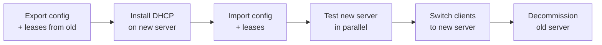

# How to Migrate a DHCP Server to a New Machine

Author: [nawazdhandala](https://www.github.com/nawazdhandala)

Tags: DHCP, Migration, Linux, sysadmin, Network Management

Description: Migrating a DHCP server involves exporting the configuration and lease database from the old server, importing on the new server, and performing a controlled cutover to minimize client disruption.

## Migration Steps Overview



## Step 1: Export from Old Server (Linux ISC dhcpd)

```bash
# On the old DHCP server
# Backup configuration
sudo cp /etc/dhcp/dhcpd.conf /tmp/dhcpd.conf.backup

# Backup current leases
sudo cp /var/lib/dhcp/dhcpd.leases /tmp/dhcpd.leases.backup

# Create a single archive
sudo tar czf /tmp/dhcp-migration.tar.gz \
  /etc/dhcp/dhcpd.conf \
  /etc/default/isc-dhcp-server \
  /var/lib/dhcp/dhcpd.leases

# Transfer to new server
scp /tmp/dhcp-migration.tar.gz admin@new-server:/tmp/
```

## Step 2: Prepare New Server

```bash
# On the new server
sudo apt install isc-dhcp-server

# Extract the backup
cd /tmp
sudo tar xzf dhcp-migration.tar.gz

# Copy configuration
sudo cp tmp/etc/dhcp/dhcpd.conf /etc/dhcp/dhcpd.conf
sudo cp tmp/etc/default/isc-dhcp-server /etc/default/isc-dhcp-server
sudo cp tmp/var/lib/dhcp/dhcpd.leases /var/lib/dhcp/dhcpd.leases

# Update interface binding if the interface name changed
sudo sed -i 's/eth0/enp3s0/' /etc/default/isc-dhcp-server
```

## Step 3: Validate Configuration

```bash
# Test config for errors before starting
sudo dhcpd -t -cf /etc/dhcp/dhcpd.conf

# Verify no syntax errors
echo "Configuration test: $?"
```

## Step 4: Parallel Testing

Run the new server alongside the old one (using a test subnet or lower priority):

```bash
# Start new server and watch logs
sudo systemctl start isc-dhcp-server
journalctl -u isc-dhcp-server -f
```

## Step 5: Cutover

```bash
# 1. Stop the old DHCP server
# On old server:
sudo systemctl stop isc-dhcp-server
sudo systemctl disable isc-dhcp-server

# 2. If old server had a different IP, update relay agents (ip helper-address)
# 3. New server is now primary

# Verify clients are getting leases from new server
journalctl -u isc-dhcp-server -n 20 | grep DHCPACK
```

## Windows Server Export/Import

```powershell
# Export on old server
Export-DhcpServer -File "C:\dhcp-export.xml" -Leases

# Copy file to new server, then import
Import-DhcpServer -File "C:\dhcp-export.xml" `
  -BackupPath "C:\dhcp-backup" -Leases -Force

# Re-authorize in AD
Add-DhcpServerInDC -DnsName "new-dhcp.example.local" -IPAddress 192.168.1.11
```

## Key Takeaways

- Always backup both config and leases together for a complete migration.
- Test the new server's configuration with `dhcpd -t` before starting the service.
- Run servers in parallel briefly to verify operation before switching off the old server.
- Update DHCP relay agent (`ip helper-address`) references if the server IP changes.
