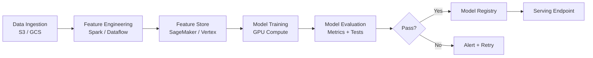

# How to Deploy ML Pipeline Infrastructure with OpenTofu

Author: [nawazdhandala](https://www.github.com/nawazdhandala)

Tags: OpenTofu, MLOps, Machine Learning, Pipelines, Step Functions, Kubeflow, Infrastructure as Code

Description: Learn how to provision end-to-end ML pipeline infrastructure using OpenTofu, including data ingestion, feature stores, training orchestration, model registry, and serving infrastructure.

---

An ML pipeline connects data ingestion, feature engineering, model training, evaluation, and serving into a repeatable workflow. OpenTofu provisions the underlying infrastructure - compute, storage, IAM, and orchestration - that ML pipelines run on.

## ML Pipeline Architecture



## S3 Buckets for ML Data Lake

```hcl
# storage.tf

locals {
  ml_buckets = {
    raw       = "raw data ingested from sources"
    processed = "cleaned and transformed datasets"
    features  = "feature store snapshots"
    artifacts = "model checkpoints and final models"
    metrics   = "training metrics and evaluation results"
  }
}

resource "aws_s3_bucket" "ml" {
  for_each = local.ml_buckets

  bucket = "${var.prefix}-ml-${each.key}-${var.environment}"

  tags = {
    Purpose     = each.value
    Environment = var.environment
    ManagedBy   = "opentofu"
  }
}

resource "aws_s3_bucket_versioning" "ml" {
  for_each = aws_s3_bucket.ml

  bucket = each.value.id
  versioning_configuration {
    status = "Enabled"
  }
}

# Lifecycle: move old training data to Glacier
resource "aws_s3_bucket_lifecycle_configuration" "ml_artifacts" {
  bucket = aws_s3_bucket.ml["artifacts"].id

  rule {
    id     = "archive-old-checkpoints"
    status = "Enabled"

    transition {
      days          = 30
      storage_class = "GLACIER"
    }

    expiration {
      days = 365
    }

    filter {
      prefix = "checkpoints/"
    }
  }
}
```

## Step Functions ML Pipeline Orchestrator

```hcl
# step_functions.tf
resource "aws_sfn_state_machine" "ml_pipeline" {
  name     = "${var.prefix}-ml-pipeline"
  role_arn = aws_iam_role.step_functions.arn
  type     = "STANDARD"

  definition = jsonencode({
    Comment = "ML Training Pipeline"
    StartAt = "DataValidation"

    States = {
      DataValidation = {
        Type     = "Task"
        Resource = aws_lambda_function.data_validation.arn
        Next     = "FeatureEngineering"
        Retry = [{
          ErrorEquals     = ["States.TaskFailed"]
          IntervalSeconds = 30
          MaxAttempts     = 2
        }]
        Catch = [{
          ErrorEquals = ["States.ALL"]
          Next        = "NotifyFailure"
        }]
      }

      FeatureEngineering = {
        Type     = "Task"
        Resource = "arn:aws:states:::glue:startJobRun.sync"
        Parameters = {
          JobName = aws_glue_job.feature_engineering.name
        }
        Next = "TrainModel"
      }

      TrainModel = {
        Type     = "Task"
        Resource = "arn:aws:states:::sagemaker:createTrainingJob.sync"
        Parameters = {
          TrainingJobName = "$.trainingJobName"
          AlgorithmSpecification = {
            TrainingImage     = var.training_image_uri
            TrainingInputMode = "File"
          }
          RoleArn           = aws_iam_role.sagemaker.arn
          ResourceConfig = {
            InstanceCount  = 1
            InstanceType   = var.training_instance_type
            VolumeSizeInGB = 100
          }
        }
        Next = "EvaluateModel"
      }

      EvaluateModel = {
        Type     = "Task"
        Resource = aws_lambda_function.model_evaluation.arn
        Next     = "MetricCheck"
      }

      MetricCheck = {
        Type = "Choice"
        Choices = [{
          Variable      = "$.accuracy"
          NumericGreaterThan = var.min_accuracy_threshold
          Next          = "RegisterModel"
        }]
        Default = "NotifyPoorPerformance"
      }

      RegisterModel = {
        Type     = "Task"
        Resource = aws_lambda_function.model_registration.arn
        End      = true
      }

      NotifyFailure = {
        Type     = "Task"
        Resource = "arn:aws:states:::sns:publish"
        Parameters = {
          TopicArn = aws_sns_topic.ml_alerts.arn
          Message  = "ML pipeline failed"
        }
        End = true
      }

      NotifyPoorPerformance = {
        Type     = "Task"
        Resource = "arn:aws:states:::sns:publish"
        Parameters = {
          TopicArn = aws_sns_topic.ml_alerts.arn
          Message  = "Model performance below threshold"
        }
        End = true
      }
    }
  })
}
```

## EventBridge Scheduled Pipeline Trigger

```hcl
# scheduler.tf
resource "aws_cloudwatch_event_rule" "ml_pipeline" {
  name                = "${var.prefix}-ml-pipeline-schedule"
  description         = "Trigger ML retraining pipeline"
  schedule_expression = var.retraining_schedule  # e.g., "cron(0 2 * * ? *)" = 2 AM daily

  is_enabled = var.environment == "production"
}

resource "aws_cloudwatch_event_target" "ml_pipeline" {
  rule      = aws_cloudwatch_event_rule.ml_pipeline.name
  target_id = "ml-pipeline"
  arn       = aws_sfn_state_machine.ml_pipeline.arn
  role_arn  = aws_iam_role.eventbridge_sfn.arn

  input = jsonencode({
    environment   = var.environment
    dataSource    = "s3://${aws_s3_bucket.ml["raw"].id}/latest/"
    experimentName = "${var.model_name}-scheduled-${formatdate("YYYYMMDD", timestamp())}"
  })
}
```

## MLflow Tracking Server

```hcl
# mlflow.tf - self-hosted MLflow for experiment tracking
resource "aws_ecs_task_definition" "mlflow" {
  family                   = "${var.prefix}-mlflow"
  requires_compatibilities = ["FARGATE"]
  network_mode             = "awsvpc"
  cpu                      = 1024
  memory                   = 2048
  execution_role_arn       = aws_iam_role.ecs_execution.arn
  task_role_arn            = aws_iam_role.mlflow.arn

  container_definitions = jsonencode([{
    name  = "mlflow"
    image = "ghcr.io/mlflow/mlflow:latest"
    portMappings = [{ containerPort = 5000 }]
    command = [
      "mlflow", "server",
      "--host", "0.0.0.0",
      "--backend-store-uri", "postgresql://${aws_db_instance.mlflow.endpoint}/${var.db_name}",
      "--default-artifact-root", "s3://${aws_s3_bucket.ml["artifacts"].id}/mlflow",
    ]
  }])
}
```

## Best Practices

- Use Step Functions for ML pipeline orchestration - it provides built-in retry logic, failure handling, visual execution history, and integrations with SageMaker/Glue/Lambda.
- Version all datasets in S3 with date-partitioned prefixes - reproducible training requires knowing exactly which data was used for each run.
- Implement a model quality gate before registration - automate the evaluation step and only register models that exceed accuracy, latency, and fairness thresholds.
- Schedule retraining during off-peak hours using EventBridge - GPU-intensive training jobs should run when compute costs are lowest (usually nights and weekends).
- Track all experiments in MLflow or a managed experiment tracker - without experiment tracking, it's impossible to compare model versions or reproduce results.
