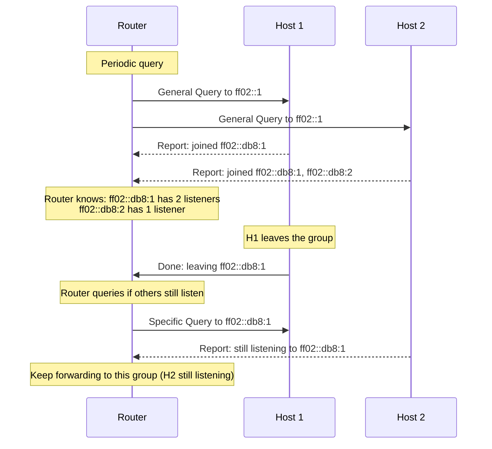

# How to Understand MLD (Multicast Listener Discovery) Protocol

Author: [nawazdhandala](https://www.github.com/nawazdhandala)

Tags: IPv6, MLD, Multicast, Protocol, Network Management

Description: A comprehensive explanation of the MLD (Multicast Listener Discovery) protocol for IPv6, which manages multicast group membership on links and within routers.

## What Is MLD?

MLD (Multicast Listener Discovery) is the IPv6 equivalent of IGMP (Internet Group Management Protocol) for IPv4. It allows IPv6 routers to discover which multicast groups have active listeners on each link, enabling them to correctly forward multicast traffic.

MLD is defined in RFC 2710 (MLDv1) and RFC 3810 (MLDv2). It is a sub-protocol of ICMPv6 (ICMPv6 type 130, 131, 132).

## Why MLD Is Needed

Without MLD, routers would have to forward all multicast traffic to all links — wasting bandwidth. MLD allows routers to learn which links have active listeners for each multicast group and only forward traffic to those links.

## MLD Message Types

| ICMPv6 Type | Message Name | Direction | Purpose |
|---|---|---|---|
| 130 | Multicast Listener Query | Router → Link | Ask which groups have listeners |
| 131 | Multicast Listener Report | Host → Router | Announce group membership |
| 132 | Multicast Listener Done | Host → Router | Leave a multicast group |
| 143 | Version 2 Report (MLDv2) | Host → Router | MLDv2 combined report |

## MLD Operation Flow



## MLD Messages in Detail

### General Query

Sent by routers to `ff02::1` to discover all group memberships:

```bash
# Capture general MLD queries
tcpdump -i eth0 -n 'icmp6 and ip6[40] == 130'

# Typical output:
# <router-ip> > ff02::1: HBH icmp6: multicast listener query v2 [max resp delay 10000]
```

### Multicast Listener Report

Hosts send reports to the specific multicast group address (to reduce report suppression needs):

```bash
# Capture MLD reports from hosts
tcpdump -i eth0 -n 'icmp6 and (ip6[40] == 131 or ip6[40] == 143)'
```

### Done Message

Sent when a host leaves a group. Sent to `ff02::2` (all routers):

```bash
# Capture MLD Done messages
tcpdump -i eth0 -n 'icmp6 and ip6[40] == 132'
```

## MLD Timers

**Query Interval**: How often the router sends General Queries (default: 125 seconds)

**Max Response Time**: How long hosts wait before sending a Report in response to a Query (default: 10 seconds). This creates a random delay to suppress duplicate reports.

**Last Listener Query Interval**: How quickly the router sends Specific Queries after receiving a Done message (default: 1 second)

## Viewing MLD State on Linux

```bash
# View MLD group memberships from the host perspective
ip -6 maddr show

# View multicast routing state (requires kernel multicast routing)
# Install smcroute or pimd
cat /proc/net/ip6_mr_vif    # Multicast VIFs
cat /proc/net/ip6_mr_cache  # Multicast routing cache

# Check if the kernel has MLD support
dmesg | grep -i 'mld\|multicast'
```

## Checking MLD with netlink

```bash
# Monitor MLD-related kernel events
ip monitor mroute

# Check current multicast groups (sockets that have joined groups)
ss -6 -unlp | grep -E 'ff0|mcast'
```

## MLD and Network Devices

MLD requires network support at the layer 2 device level:
- **Managed switches**: Should support MLD snooping to efficiently forward multicast
- **Unmanaged switches**: Flood multicast to all ports (no snooping)
- **Routers**: Run the full MLD protocol (querier role)

## ICMPv6 and MLD Relationship

MLD messages are carried as ICMPv6 messages with the Hop-by-Hop Options extension header containing the Router Alert option. This ensures that routers process MLD messages even when they are not the destination:

```
IPv6 Header
  - Hop-by-Hop Options Header (with Router Alert = MLD)
  - ICMPv6 (type 130/131/132/143 = MLD message)
```

## Summary

MLD is the IPv6 multicast group management protocol. Routers send General Queries to `ff02::1` to discover group memberships; hosts respond with Reports; hosts send Done messages when leaving. This allows routers to forward multicast only to links with active listeners. MLD operates via ICMPv6 messages and requires the Hop-by-Hop Router Alert option. MLDv2 (RFC 3810) adds source-specific multicast support, replacing MLDv1 for modern deployments.
