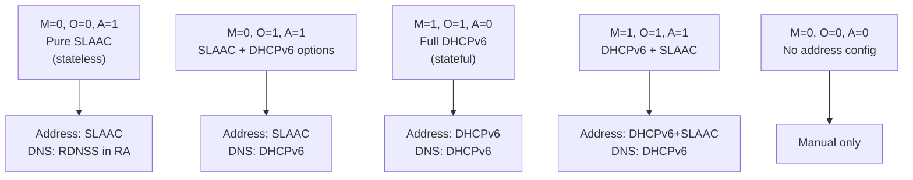

# How to Understand M/O/A Flag Combinations in Router Advertisements

Author: [nawazdhandala](https://www.github.com/nawazdhandala)

Tags: IPv6, Router Advertisement, M Flag, O Flag, SLAAC, DHCPv6

Description: Understand the Managed (M), Other (O), and Autonomous (A) flag combinations in IPv6 Router Advertisements and how they control client address configuration behavior.

## Introduction

IPv6 Router Advertisements contain three critical flags that control how clients configure their network settings. Understanding these flags and their combinations is essential for deploying the right IPv6 configuration model for your network.

## The Three Flags

### M Flag (Managed Address Configuration)
- **M=0**: Clients use SLAAC to configure addresses autonomously from the advertised prefix
- **M=1**: Clients MUST use DHCPv6 to obtain addresses; SLAAC addresses may also be formed

### O Flag (Other Configuration)
- **O=0**: Clients do not use DHCPv6 for anything
- **O=1**: Clients use DHCPv6 for configuration options (DNS, NTP, etc.) but NOT for addresses

### A Flag (Autonomous Address Configuration) - Per Prefix
- **A=1** (AdvAutonomous on): Clients may form a SLAAC address from this prefix
- **A=0** (AdvAutonomous off): Clients should NOT form a SLAAC address from this prefix

## All Meaningful Combinations



## Combination Details

### Pure SLAAC (M=0, O=0, A=1)

The simplest configuration. Clients configure their own addresses and use RDNSS for DNS:

```text
interface eth1 {
    AdvSendAdvert on;
    AdvManagedFlag off;    # M=0
    AdvOtherConfigFlag off; # O=0
    prefix 2001:db8:1:1::/64 {
        AdvAutonomous on;  # A=1
    };
    RDNSS 2001:db8:1:1::53 {
        AdvRDNSSLifetime 600;
    };
};
```

### SLAAC with DHCPv6 for Options (M=0, O=1, A=1)

Clients form their own address via SLAAC but use DHCPv6 for DNS, NTP, and other options:

```text
interface eth1 {
    AdvSendAdvert on;
    AdvManagedFlag off;     # M=0: no DHCPv6 for addresses
    AdvOtherConfigFlag on;  # O=1: use DHCPv6 for DNS etc.
    prefix 2001:db8:1:1::/64 {
        AdvAutonomous on;   # A=1: still form SLAAC address
    };
};
```

### Full Stateful DHCPv6 (M=1, O=1, A=0)

All configuration comes from DHCPv6; no SLAAC:

```text
interface eth1 {
    AdvSendAdvert on;
    AdvManagedFlag on;      # M=1: use DHCPv6 for addresses
    AdvOtherConfigFlag on;  # O=1: use DHCPv6 for options
    prefix 2001:db8:1:1::/64 {
        AdvAutonomous off;  # A=0: no SLAAC
        AdvOnLink on;       # Still advertise prefix for on-link determination
    };
};
```

### DHCPv6 + SLAAC (M=1, O=1, A=1) - "Mixed Mode"

Clients get a DHCPv6 address AND a SLAAC address. Unusual but valid:

```text
interface eth1 {
    AdvSendAdvert on;
    AdvManagedFlag on;      # M=1: get DHCPv6 address
    AdvOtherConfigFlag on;  # O=1: get DHCPv6 options
    prefix 2001:db8:1:1::/64 {
        AdvAutonomous on;   # A=1: also form SLAAC address
    };
};
```

## Flag Interaction Matrix

| M | O | A | Address Source | DNS Source |
|---|---|---|---|---|
| 0 | 0 | 1 | SLAAC | RDNSS (from RA) |
| 0 | 1 | 1 | SLAAC | DHCPv6 |
| 1 | 0 | 0 | DHCPv6 | RDNSS or manual |
| 1 | 1 | 0 | DHCPv6 | DHCPv6 |
| 1 | 1 | 1 | DHCPv6 + SLAAC | DHCPv6 |
| 0 | 0 | 0 | Manual only | Manual only |

## Checking Current Flags on a Client

```bash
# View the flags set in the RA received by a client

rdisc6 eth0 | grep -E "Stateful|Stateless|conf"

# Or from the kernel's accepted RA state
cat /proc/net/if_inet6
# The kernel stores received RA flags internally
```

## Conclusion

The M, O, and A flag combination determines the entire IPv6 client configuration strategy. Pure SLAAC (M=0/O=0/A=1 + RDNSS) is the simplest and most resilient option. Full DHCPv6 (M=1/O=1/A=0) provides centralized control. The O=1 without M=1 pattern is a useful middle ground for environments that want SLAAC addressing but centralized DNS delivery. Choose the combination that matches your operational requirements for address tracking, DNS management, and deployment simplicity.
