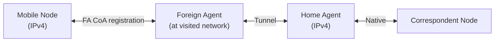
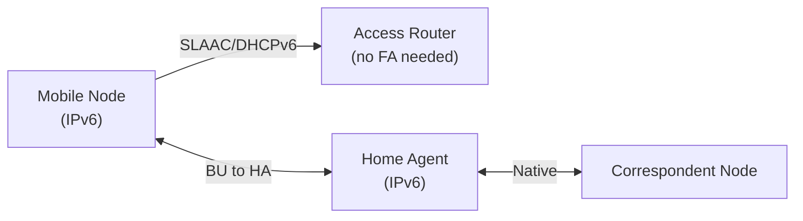

# How to Understand the Differences Between Mobile IPv4 and Mobile IPv6

Author: [nawazdhandala](https://www.github.com/nawazdhandala)

Tags: Mobile IPv6, Mobile IPv4, MIPv4, MIPv6, Comparison, Networking

Description: Compare Mobile IPv4 and Mobile IPv6 protocols to understand architectural differences, security improvements, and migration considerations.

## Introduction

Mobile IPv4 (MIPv4, RFC 5944) and Mobile IPv6 (MIPv6, RFC 6275) solve the same problem — maintaining connectivity during IP address changes — but with different architectures reflecting lessons learned between their designs.

## Side-by-Side Comparison

| Feature | Mobile IPv4 | Mobile IPv6 |
|---|---|---|
| RFC | 5944 (formerly 3344) | 6275 |
| Foreign Agent | Required for efficiency | Not needed (MN gets CoA directly) |
| Tunneling | IP-in-IP (proto 4) | IPv6-in-IPv6 (Next Header 41) |
| Route Optimization | Optional, complex, rarely deployed | Integral part of specification |
| Security | Optional (no mandatory IPsec) | IPsec mandatory for BU authentication |
| Return Routability | Not present | Built-in for RO with CNs |
| Header Overhead | Higher (IP-in-IP + inner IP) | Lower (fixed IPv6 header) |
| NAT compatibility | Poor (needs NAT traversal) | No NAT in native IPv6 |
| Co-located CoA | Supported (but requires NAT) | Default operation |
| Dynamic HA Discovery | DHAAD (RFC 3775) | DHAAD (RFC 4067) |

## Architecture Differences

### Foreign Agent in MIPv4



MIPv4 typically uses a Foreign Agent on the visited network to provide a CoA. The MN registers the FA's address as its CoA.

### No Foreign Agent in MIPv6



MIPv6 Mobile Nodes acquire their CoA directly via SLAAC or DHCPv6, eliminating the Foreign Agent requirement.

## Security Improvements in MIPv6

### MIPv4 Security Weaknesses

- BU to HA protected by optional SPI/HMAC
- No standardized mechanism to authenticate BUs to CNs
- Vulnerable to binding update spoofing

### MIPv6 Security Improvements

```python
# MIPv6 security layers

# Layer 1: HA-MN authentication (mandatory)
# IPsec ESP or AH protects all BUs to HA
# Configured via IKEv2 or manual SA

# Layer 2: CN authentication via Return Routability
# Proves reachability at both HoA and CoA before BU is accepted

# Example: IPsec policy for BU protection
"""
ip xfrm policy add \
    src 2001:db8:foreign::50/128 \
    dst 2001:db8:home::1/128 \
    proto 135 \         # Mobility Header
    dir out \
    tmpl src 2001:db8:foreign::50 \
         dst 2001:db8:home::1 \
         proto esp \
         mode transport
"""
```

## Migration Considerations

### Dual-Stack Deployment

```
During IPv4→IPv6 transition:
- Deploy both MIPv4 and MIPv6 daemons
- MIPv4 for IPv4 connectivity
- MIPv6 for IPv6 connectivity
- Monitor both bindings independently
```

### Tunnel Overhead Comparison

```
MIPv4 Bidirectional Tunneling:
  Outer IPv4: 20 bytes
  Inner IPv4: 20 bytes
  Total overhead: 40 bytes (+ payload)

MIPv6 Bidirectional Tunneling:
  Outer IPv6: 40 bytes
  Inner IPv6: 40 bytes
  Total overhead: 80 bytes (+ payload)

MIPv6 is less efficient per-packet but the larger IPv6 addresses
support far more nodes without NAT.
```

## Key Advantages of MIPv6 over MIPv4

1. **No Foreign Agent**: Simpler deployment; any access router works
2. **Route Optimization**: Standard, not optional — better performance
3. **Mandatory IPsec**: Stronger security baseline
4. **No NAT**: Native addresses eliminate NAT traversal complexity
5. **Larger address space**: Home Agent can serve vastly more mobile nodes

## Conclusion

MIPv6 is a ground-up redesign that addresses MIPv4's limitations in security, scalability, and deployment complexity. If you are deploying new mobile infrastructure, MIPv6 is the correct choice. For legacy IPv4 environments, MIPv4 remains available. Use OneUptime to monitor mobility health metrics across both protocols during migration.
