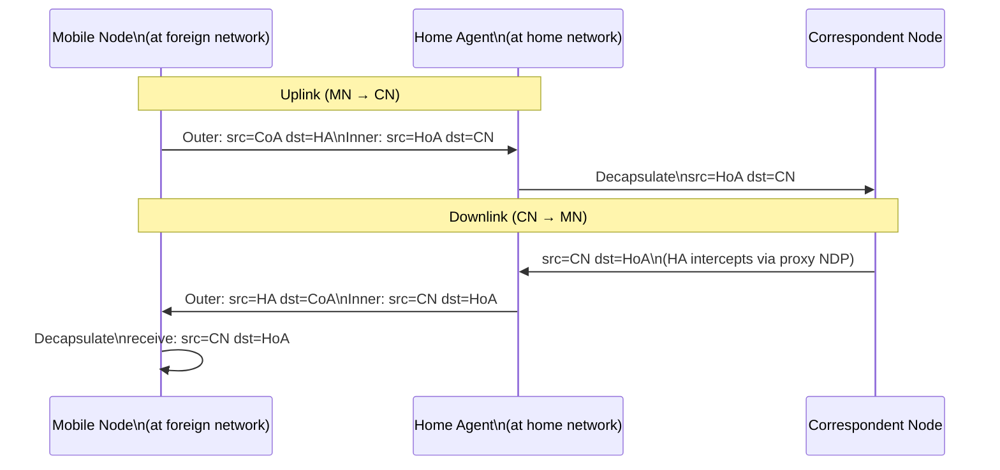

# How to Understand Mobile IPv6 Bidirectional Tunneling

Author: [nawazdhandala](https://www.github.com/nawazdhandala)

Tags: Mobile IPv6, Bidirectional Tunneling, MIPv6, Networking, Tunneling

Description: Understand how Mobile IPv6 bidirectional tunneling works to route traffic between a Mobile Node and Correspondent Nodes via the Home Agent using IPv6-in-IPv6 encapsulation.

## Introduction

Bidirectional Tunneling (BT) is the default routing mode in Mobile IPv6. All traffic between the Mobile Node (MN) and a Correspondent Node (CN) passes through the Home Agent (HA), regardless of where the MN is located. It is simpler than Route Optimization but introduces suboptimal routing.

## How Bidirectional Tunneling Works



## Tunnel Packet Structure

### Uplink (MN to CN via HA)

```text
Outer IPv6 Header:
  Source:      2001:db8:foreign::50 (CoA)
  Destination: 2001:db8:home::1 (HA)
  Next Header: 41 (IPv6 encapsulation)

Inner IPv6 Header:
  Source:      2001:db8:home::100 (HoA)
  Destination: 2001:db8:cn::200 (CN)
  Next Header: 6 (TCP)

TCP/Application Payload
```

### Downlink (CN to MN via HA)

```text
Outer IPv6 Header:
  Source:      2001:db8:home::1 (HA)
  Destination: 2001:db8:foreign::50 (CoA)
  Next Header: 41 (IPv6 encapsulation)

Inner IPv6 Header:
  Source:      2001:db8:cn::200 (CN)
  Destination: 2001:db8:home::100 (HoA)
  Next Header: 6 (TCP)

TCP/Application Payload
```

## Setting Up the Tunnel on Linux

The HA uses a ip6ip6 (IPv6-in-IPv6) tunnel interface.

```bash
# On the Home Agent - create a tunnel interface for the MN

# (normally managed by the MIPv6 daemon)

# Manual tunnel example
sudo ip tunnel add ha-mip6 mode ip6ip6 \
  local 2001:db8:home::1 \
  remote 2001:db8:foreign::50

sudo ip link set ha-mip6 up
sudo ip -6 route add 2001:db8:home::100/128 dev ha-mip6

# Verify tunnel
ip tunnel show ha-mip6
ip -6 route show dev ha-mip6
```

On the Mobile Node:

```bash
# Mobile Node creates a tunnel back to the HA
sudo ip tunnel add mn-home mode ip6ip6 \
  local 2001:db8:foreign::50 \
  remote 2001:db8:home::1

sudo ip link set mn-home up
sudo ip -6 addr add 2001:db8:home::100/128 dev mn-home

# Route all traffic through the tunnel to the HA
sudo ip -6 route add default dev mn-home
```

## Advantages and Disadvantages

| Aspect | Bidirectional Tunneling | Route Optimization |
|---|---|---|
| CN compatibility | Any CN (no MIPv6 support needed) | CN must support MIPv6 |
| Routing efficiency | Suboptimal (via HA) | Optimal (direct) |
| HA load | High | Low |
| Latency | Higher (extra hop) | Lower (direct) |
| Setup complexity | Simple | Complex (Return Routability) |

## When to Use Bidirectional Tunneling

- Default mode for all MIPv6 deployments
- Always used when CN does not support Route Optimization
- Fallback when Return Routability fails

## Monitoring Tunnel Health

```bash
# Check tunnel statistics on the HA
ip -6 -s tunnel show

# Monitor tunnel traffic
tcpdump -i ha-mip6 -n

# Check for tunnel encapsulation errors
netstat -s6 | grep -i "tunnel\|encap"
```

## Conclusion

Bidirectional tunneling provides universal MIPv6 support without requiring CN changes. The tradeoff is increased latency and HA load due to traffic triangulation. Use OneUptime to monitor both the tunnel interface and application-layer latency to quantify the triangulation penalty.
