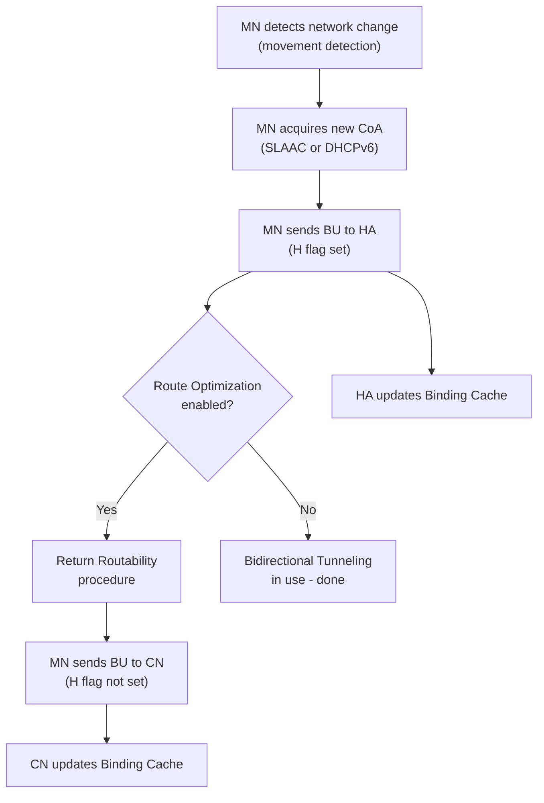

# How to Understand Mobile IPv6 Binding Update Messages

Author: [nawazdhandala](https://www.github.com/nawazdhandala)

Tags: Mobile IPv6, Binding Update, MIPv6, Networking, RFC 6275

Description: Understand the structure, flags, and lifecycle of Mobile IPv6 Binding Update messages used to register Care-of Addresses with Home Agents and Correspondent Nodes.

## Introduction

The Binding Update (BU) message is the most important Mobile IPv6 signaling message. It is sent by the Mobile Node to register its current Care-of Address with the Home Agent and, when using Route Optimization, with Correspondent Nodes.

## When BUs Are Sent



## BU Message Structure

```text
IPv6 Header:
  Src: CoA, Dst: HA (for home registration)
  -- or --
  Src: CoA, Dst: CN (for route optimization, with Home Address option)

Mobility Header (MH Type = 5, Binding Update):
  Sequence Number: 42       (monotonically increasing, wraps at 65535)
  A flag: 1                 (request Binding Acknowledgement)
  H flag: 1                 (home registration, sent to HA)
  L flag: 0                 (link-local addr compat, usually 0)
  K flag: 0                 (key management mobility capability)
  Lifetime: 150             (600 seconds = 150 * 4-second units)

Mobility Options (TLV-encoded):
  Alternate CoA Option:     2001:db8:foreign::50
```

## Binding Update to Home Agent (Home Registration)

```python
# Pseudo-code for Home Registration BU

def send_home_registration(mn, ha_address, hoa, coa, lifetime=600):
    """
    Send a Binding Update to the Home Agent.
    H flag = True (home registration)
    A flag = True (request acknowledgement)
    """
    # BU protected by IPsec (AH or ESP) between MN and HA
    bu = BindingUpdate(
        sequence_number=mn.next_sequence_number(),
        flags={
            "A": True,   # Acknowledge
            "H": True,   # Home registration
            "L": False,
            "K": False,
        },
        lifetime=lifetime // 4,  # Convert seconds to 4-second units
        options=[
            AlternateCoAOption(coa=coa)
        ]
    )

    # Sent from CoA to HA, with Home Address Destination Option
    packet = IPv6Packet(
        src=coa,
        dst=ha_address,
        mobility_header=bu,
        # Destination Options Header with Home Address option
        destination_options=HomeAddressOption(hoa=hoa)
    )

    mn.send(packet)
    print(f"Sent BU seq={bu.sequence_number} to HA, CoA={coa}")
```

## Binding Acknowledgement (BA) Response

The HA sends a BA in response to a BU with A flag set.

```text
Mobility Header (MH Type = 6, Binding Acknowledgement):
  Status:          0     (Binding Update accepted)
  K flag:          0
  Sequence:        42    (matches BU sequence number)
  Lifetime:        150   (granted lifetime - may differ from requested)

Status Codes:
  0   = Binding Update Accepted
  1   = Accepted but prefix discovery required
  128 = Reason unspecified
  129 = Administratively prohibited
  130 = Insufficient resources
  133 = Not home subnet
  135 = Sequence number out of window
  136 = Expired home nonce index
  137 = Expired care-of nonce index
```

## Binding Update Lifetime Management

```bash
# Monitor binding lifetime on the Home Agent (UMIP)

# Bindings must be refreshed before expiry

# View current bindings
mip6d -n

# Example output:
# HoA: 2001:db8:home::100
# CoA: 2001:db8:foreign::50
# Lifetime: 597 (expires in 597 seconds)
# Sequence: 42
```

```python
# MN should refresh BU before lifetime/2 expires (RFC 6275 §9.5.1)
import time

def binding_refresh_loop(mn, refresh_interval_fraction=0.5):
    """
    Refresh the binding at half the granted lifetime.
    """
    while True:
        lifetime_secs = mn.current_binding_lifetime()
        sleep_time = lifetime_secs * refresh_interval_fraction
        time.sleep(sleep_time)
        mn.send_binding_update(
            coa=mn.current_coa,
            lifetime=lifetime_secs
        )
        print(f"Refreshed binding, next refresh in {sleep_time}s")
```

## Deregistration

```python
def deregister(mn, ha_address, hoa):
    """
    Send BU with Lifetime=0 to remove the binding.
    MN is returning to the home network.
    """
    bu = BindingUpdate(
        sequence_number=mn.next_sequence_number(),
        flags={"A": True, "H": True},
        lifetime=0  # Deregistration
    )
    mn.send(IPv6Packet(src=hoa, dst=ha_address, mobility_header=bu))
    print("Deregistered from Home Agent")
```

## Conclusion

Binding Update messages form the core of Mobile IPv6 signaling. Understanding sequence numbers, flag semantics, and lifetime management helps diagnose MIPv6 connectivity issues. Use OneUptime to monitor Home Agent response times and detect delayed or dropped Binding Acknowledgements.
