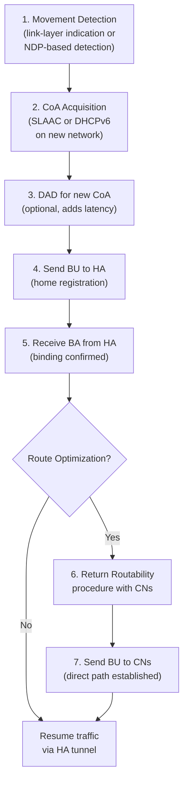

# How to Understand Mobile IPv6 Handover Process

Author: [nawazdhandala](https://www.github.com/nawazdhandala)

Tags: Mobile IPv6, Handover, MIPv6, Networking, Mobility, RFC 6275

Description: Understand the Mobile IPv6 handover process including movement detection, Care-of Address acquisition, and Binding Update signaling that occurs when a Mobile Node changes networks.

## Introduction

The MIPv6 handover process is the sequence of events that occurs when a Mobile Node moves from one network to another. Minimizing handover latency is critical for maintaining ongoing connections (TCP, VoIP) during mobility events.

## Handover Phases



## Phase 1: Movement Detection

Movement detection determines when the MN has moved to a new network.

```bash
# Method 1: Link-layer indication (fastest - immediate)

# The wireless driver signals when association with a new AP completes
# This triggers immediate movement detection in the kernel

# Method 2: NDP-based detection (slower - default)
# MN notices it no longer receives RAs from the previous router
# Or receives an RA from a new router with a different prefix

# Check current default router and prefix
ip -6 route show default
ip -6 addr show scope global
```

## Phase 2: Care-of Address Acquisition

```bash
# After attaching to new network, SLAAC generates a new CoA
# Monitor address assignment
ip -6 monitor address

# Wait for the new global address to appear
# Check DAD status (should be TENTATIVE → then PREFERRED)
ip -6 addr show scope global | grep -E "TENTATIVE|PREFERRED"

# New CoA should appear shortly after RA is received
ip -6 addr show dev wlan0 scope global
```

## Phase 3: Accelerate with Fast Handovers (FMIPv6, RFC 5568)

FMIPv6 pre-acquires the CoA on the target network before the handover, reducing latency.

```text
FMIPv6 Procedure:
1. MN sends RtSolPr to current router (request target AP info)
2. Current router replies with PrRtAdv (target network prefix)
3. MN generates predicted CoA for target network
4. MN sends FBU (Fast BU) to current HA/router
5. Traffic is rerouted to target network before link-layer handover
6. MN completes physical handover
7. MN sends FNA (Fast NA) on new link to claim pre-acquired CoA
```

## Phase 4: Binding Update to HA

```python
# Simplified handover sequence in pseudo-code

class MobileNode:
    def handle_movement(self, new_coa: str):
        """Called when movement is detected."""
        print(f"Movement detected, new CoA: {new_coa}")
        self.current_coa = new_coa

        # Step 1: Update home registration
        self.send_binding_update(
            destination=self.home_agent,
            hoa=self.home_address,
            coa=new_coa,
            flags={"H": True, "A": True},
            lifetime=600
        )

        # Step 2: Wait for BA
        ba = self.wait_for_binding_ack(timeout=5)
        if ba and ba.status == 0:
            print("Home registration successful")
            # Traffic now flows via new CoA through HA

            # Step 3: Initiate Route Optimization with active CNs
            for cn in self.active_correspondents:
                self.initiate_return_routability(cn)
        else:
            print(f"BU failed, status={ba.status if ba else 'timeout'}")
```

## Handover Latency Components

| Phase | Typical Duration | Can Be Reduced By |
|---|---|---|
| Layer 2 handover | 50–200ms | Fast link-layer protocols (802.11r) |
| Movement detection | 1–3 seconds (NDP) | Link-layer triggers |
| DAD | 1 second | Optimistic DAD or disabling |
| BU to HA + BA | 1–2 × RTT | Proximity of HA to access network |
| Return Routability | 2–3 × RTT | FMIPv6 pre-registration |

## Optimizing Handover Latency

```bash
# Disable DAD to eliminate 1-second delay (not recommended on untrusted networks)
sysctl net.ipv6.conf.wlan0.dad_transmits=0

# Use Optimistic DAD (RFC 4429) - treat address as usable immediately
# while DAD runs in background
sysctl net.ipv6.conf.wlan0.optimistic_dad=1

# Increase RA solicitation frequency to detect new network faster
sysctl net.ipv6.conf.wlan0.router_solicitation_interval=1
sysctl net.ipv6.conf.wlan0.router_solicitations=3
```

## Conclusion

MIPv6 handover latency depends on movement detection speed, CoA acquisition, and BU signaling RTT. FMIPv6 and Optimistic DAD can reduce handover disruption to under 100ms on well-designed networks. Monitor handover events and reconnection latency with OneUptime to track mobility performance.
