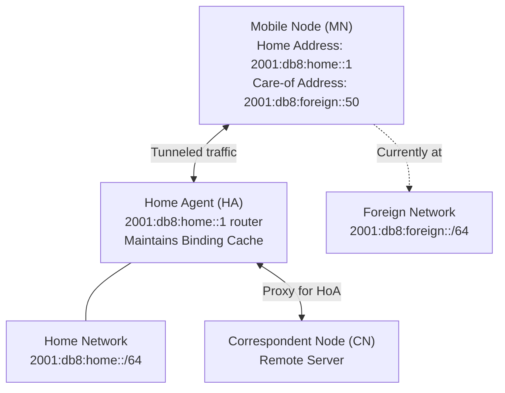
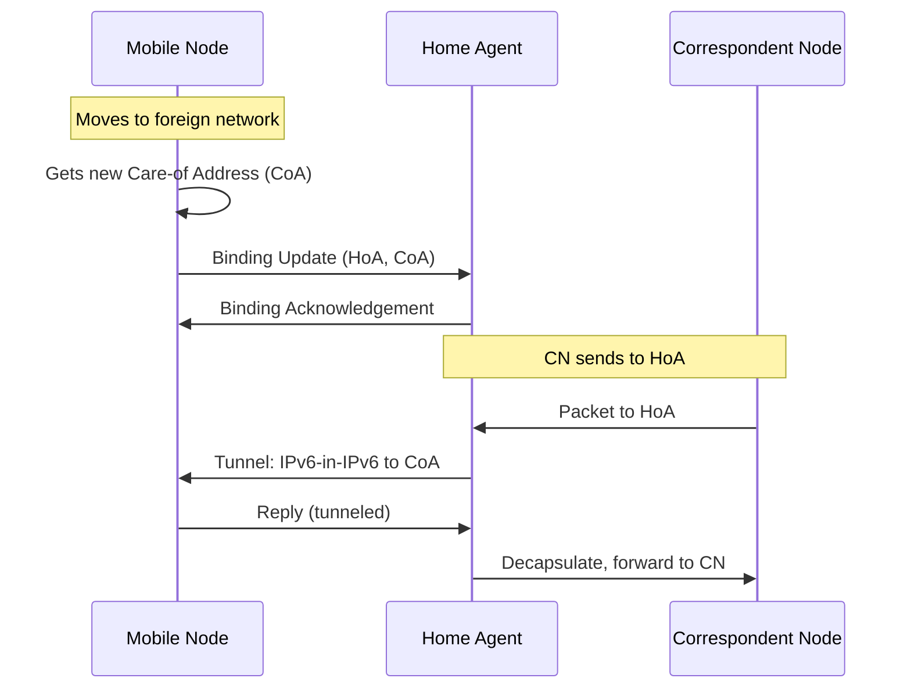

# How to Understand Mobile IPv6 Protocol Overview

Author: [nawazdhandala](https://www.github.com/nawazdhandala)

Tags: Mobile IPv6, MIPv6, Networking, Protocol, RFC 6275, Mobility

Description: Understand the Mobile IPv6 (MIPv6) protocol architecture, key components, and how it enables devices to maintain connectivity while moving between networks.

## Introduction

Mobile IPv6 (MIPv6), defined in RFC 6275, enables a device (Mobile Node) to maintain the same IPv6 address regardless of its physical location on the internet. This is essential for continuous TCP connections during network handoffs in mobile environments.

## Core Problem MIPv6 Solves

Without MIPv6, when a device moves from one network to another:
1. It gets a new IPv6 address on the new network
2. All existing TCP connections break
3. Applications must reconnect

MIPv6 solves this by providing address transparency — the Mobile Node keeps its permanent "Home Address" while physically connected elsewhere.

## Key Components



## Key Terminology

| Term | Abbreviation | Description |
|---|---|---|
| Mobile Node | MN | The moving device |
| Home Agent | HA | Router at home network; proxies traffic |
| Correspondent Node | CN | Remote host communicating with MN |
| Home Address | HoA | Permanent address; stays constant |
| Care-of Address | CoA | Temporary address at current location |
| Binding Update | BU | Message from MN to HA/CN registering CoA |
| Binding Acknowledgement | BA | Reply confirming registration |

## Protocol Flow



## MIPv6 Header Extension

MIPv6 uses a Mobility Header (Next Header = 135) with sub-types for different messages.

```
IPv6 Header
├── Next Header = 135 (Mobility)
└── Mobility Header
    ├── Payload Proto = 59 (No Next Header)
    ├── Header Len
    ├── MH Type (e.g., 5 = Binding Update)
    ├── Reserved
    ├── Checksum
    └── Message Data
```

## Setting Up MIPv6 on Linux (UMIP/MIPL2)

```bash
# Install the UMIP (USAGI Mobile IPv6) daemon
sudo apt-get install mip6d

# Example Mobile Node configuration
# /etc/mip6d.conf (Mobile Node role)
NodeConfig MN;

# Home Interface configuration
Interface "eth0" {
    MnIfPreference 1;
}

# Home Agent address
HomeAgent 2001:db8:home::1;

# Mobile Node's home address
Home 2001:db8:home::100/64;

# IPsec for BU authentication
UseMnHaIPsec enabled;
```

```bash
# Start the MIPv6 daemon
sudo mip6d -c /etc/mip6d.conf -d 1

# Check binding status
sudo mip6d -n
```

## RFC References

- RFC 6275 — Mobile IPv6 (MIPv6) specification
- RFC 3775 — Original MIPv6 specification (obsoleted by 6275)
- RFC 4877 — Mobile IPv6 Operation with IKEv2 and IPsec

## Conclusion

Mobile IPv6 provides seamless IP mobility through Home Agent tunneling and Binding Updates. While MIPv6 is the foundation, modern networks often use extensions like Proxy MIPv6 or LISP for host mobility. Use OneUptime to monitor Home Agent availability and connectivity health for MIPv6-dependent services.
