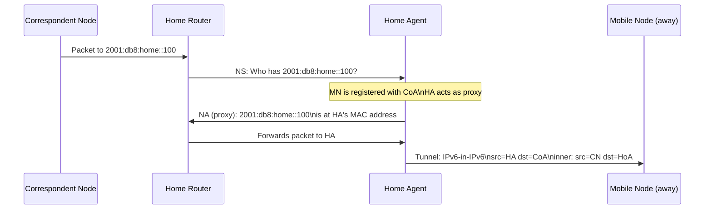

# How to Understand Mobile IPv6 Proxy Neighbor Advertisements

Author: [nawazdhandala](https://www.github.com/nawazdhandala)

Tags: Mobile IPv6, Proxy NDP, Neighbor Advertisement, MIPv6, NDP, RFC 4861

Description: Understand how the Mobile IPv6 Home Agent uses Proxy Neighbor Advertisements to intercept traffic destined for Mobile Nodes that are away from the home network.

## Introduction

When a Mobile Node is away from home, traffic sent to its Home Address (HoA) arrives on the home network. Since the MN is not physically present, no NDP entry exists for the HoA. The Home Agent uses Proxy Neighbor Advertisements to intercept this traffic and tunnel it to the MN's Care-of Address.

## The Problem Without Proxy NDP

```text
Home Network: 2001:db8:home::/64
Home Router: fe80::1 (2001:db8:home::1)
MN's HoA: 2001:db8:home::100 (MN is currently away)

Correspondent Node sends:
  IPv6 packet destined for 2001:db8:home::100

Home Router receives packet and needs to forward it:
  1. Looks up 2001:db8:home::100 in ND cache
  2. Not found - sends Neighbor Solicitation
     dst: 2001:db8:home::100's solicited-node multicast
  3. No response (MN is not on the link)
  4. Packet dropped!
```

## How Proxy Neighbor Advertisements Work

The Home Agent solicits on behalf of (proxies for) each registered Mobile Node.



## Proxy NDP Configuration on Linux

```bash
# Enable proxy NDP on the HA's home interface

echo "net.ipv6.conf.eth0.proxy_ndp = 1" | \
  sudo tee -a /etc/sysctl.d/99-ha.conf

sudo sysctl -p /etc/sysctl.d/99-ha.conf

# Add a proxy NDP entry for a registered MN's HoA
# (UMIP daemon does this automatically when a BU is received)
ip -6 neigh add proxy 2001:db8:home::100 dev eth0

# Verify proxy entries
ip -6 neigh show proxy dev eth0

# Expected output:
# 2001:db8:home::100 dev eth0
```

## How UMIP Manages Proxy Entries

```bash
# When a BU is received by UMIP:
# 1. UMIP validates the BU (IPsec + sequence number)
# 2. UMIP updates the Binding Cache (HoA → CoA)
# 3. UMIP adds a proxy NDP entry for the HoA
# 4. All future NS queries for HoA are answered by HA

# Check current proxy NDP entries (managed by UMIP)
ip -6 neigh show proxy

# Remove a proxy entry (when MN returns home or binding expires)
ip -6 neigh del proxy 2001:db8:home::100 dev eth0
```

## Sending Proxy Neighbor Advertisements

```python
# Conceptual Python code showing what the HA does

from scapy.all import *

def send_proxy_neighbor_advertisement(
    hoa: str,
    ha_mac: str,
    ha_lladdr: str,
    interface: str
):
    """
    Send a Proxy Neighbor Advertisement for a registered MN's HoA.
    This is sent in response to a Neighbor Solicitation.
    """
    # Build the Neighbor Advertisement
    na = (
        Ether(src=ha_mac, dst="ff:ff:ff:ff:ff:ff") /
        IPv6(src=ha_lladdr, dst="ff02::1") /
        ICMPv6ND_NA(
            tgt=hoa,     # Target = MN's HoA
            R=0,         # Not a router (for this proxy)
            S=0,         # Not solicited (unsolicited update)
            O=1          # Override existing ND cache entries
        ) /
        ICMPv6NDOptDstLLAddr(lladdr=ha_mac)
    )

    sendp(na, iface=interface)
    print(f"Sent proxy NA for {hoa} with MAC {ha_mac}")
```

## Unsolicited Proxy NAs After Binding Update

When a new binding is registered, the HA sends an unsolicited Proxy NA to update existing ND cache entries on the home link.

```bash
# Monitor proxy NA traffic on the home network
sudo tcpdump -i eth0 -n \
  "icmp6 and ip6[40] == 136 and ip6[41] & 0x20 != 0"
# Type 136 = NA, O flag (override) set = proxy NA

# Expected: HA sends NA saying HoA is reachable at HA's MAC
```

## Conclusion

Proxy Neighbor Advertisements are how the Home Agent intercepts traffic for absent Mobile Nodes. The HA answers NDP queries for each registered MN's HoA, attracting traffic that it then tunnels to the MN's CoA. Proxy NDP failures are a common cause of MIPv6 connectivity problems - monitor HA proxy NDP entries with Linux commands and cross-reference with OneUptime's connectivity checks.
