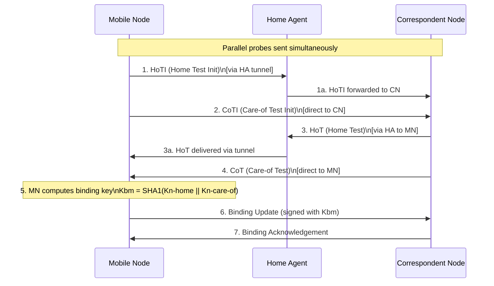

# How to Understand Mobile IPv6 Return Routability Procedure

Author: [nawazdhandala](https://www.github.com/nawazdhandala)

Tags: Mobile IPv6, Return Routability, MIPv6, Security, RFC 6275

Description: Understand the Mobile IPv6 Return Routability procedure that authenticates Binding Updates sent to Correspondent Nodes before enabling Route Optimization.

## Introduction

The Return Routability (RR) procedure is a lightweight security mechanism in Mobile IPv6 that verifies a Mobile Node can receive traffic at both its Home Address and Care-of Address before allowing Route Optimization with a Correspondent Node. Without RR, an attacker could forge BUs to redirect traffic.

## Why Return Routability Is Needed

Without RR, an attacker could send a BU to a CN claiming "send my traffic to CoA X":
```text
Attack: Attacker sends forged BU
  HoA: victim@2001:db8:home::100
  CoA: attacker@2001:db8:attacker::1
Result: CN sends victim's traffic to attacker
```

RR prevents this by requiring the MN to prove it can receive at **both** the HoA (via HA) **and** the CoA (directly).

## RR Procedure Flow



## Message Details

### Home Test Init (HoTI) - MH Type 1

Sent from CoA to CN (via HA tunnel), initiating the home-side test.

```text
MH Type: 1 (HoTI)
Reserved: 0
Home Init Cookie: 8 random bytes (generated by MN)
```

### Care-of Test Init (CoTI) - MH Type 2

Sent directly from CoA to CN, initiating the care-of-side test.

```text
MH Type: 2 (CoTI)
Reserved: 0
Care-of Init Cookie: 8 random bytes (different from HoTI cookie)
```

### Home Test (HoT) - MH Type 3

CN's reply to HoTI, sent via HA back to MN.

```text
MH Type: 3 (HoT)
Home Nonce Index: index into CN's nonce table
Home Init Cookie: echo of cookie from HoTI
Home Keygen Token: HMAC-SHA1 (CN's secret, HoA, nonce, 0)
```

### Care-of Test (CoT) - MH Type 4

CN's reply to CoTI, sent directly to CoA.

```text
MH Type: 4 (CoT)
Care-of Nonce Index: index into CN's nonce table
Care-of Init Cookie: echo of cookie from CoTI
Care-of Keygen Token: HMAC-SHA1 (CN's secret, CoA, nonce, 1)
```

## Binding Management Key Calculation

```python
import hashlib
import hmac

def compute_kbm(home_keygen_token: bytes,
                care_of_keygen_token: bytes) -> bytes:
    """
    Compute the Binding Management Key (Kbm) from RR tokens.
    RFC 6275 §5.2.5 - Kbm = first 20 bytes of
    SHA1(home_keygen_token | care_of_keygen_token)
    """
    combined = home_keygen_token + care_of_keygen_token
    kbm = hashlib.sha1(combined).digest()
    return kbm  # 20 bytes

def sign_binding_update(bu_data: bytes, kbm: bytes) -> bytes:
    """
    Compute the Binding Authorization Data option value.
    HMAC-SHA1 over the BU with Kbm, truncated to 12 bytes.
    """
    mac = hmac.new(kbm, bu_data, hashlib.sha1).digest()
    return mac[:12]  # Take first 96 bits
```

## Limitations of Return Routability

RR is not cryptographically strong:
- It does not authenticate the MN's identity
- It is vulnerable to on-path attackers who can intercept either probe
- It only provides proof of reachability, not authentication

For stronger security, RFC 4877 specifies MIPv6 with IKEv2/IPsec, which is recommended for production deployments.

## Conclusion

The Return Routability procedure is MIPv6's pragmatic compromise between security and deployability - it requires no pre-shared state between the MN and CN, yet prevents basic traffic hijacking attacks. Understand RR timing (it adds at least one RTT before Route Optimization begins) when monitoring MIPv6 handover latency with OneUptime.
