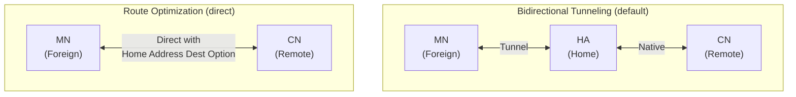
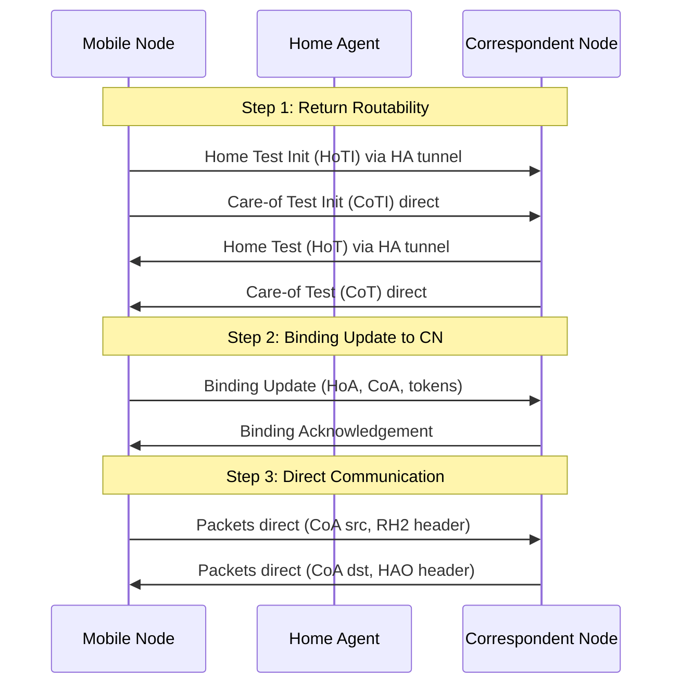

# How to Understand Mobile IPv6 Route Optimization

Author: [nawazdhandala](https://www.github.com/nawazdhandala)

Tags: Mobile IPv6, Route Optimization, MIPv6, Networking, Return Routability

Description: Understand Mobile IPv6 Route Optimization, which enables direct communication between a Mobile Node and Correspondent Node without routing through the Home Agent.

## Introduction

Route Optimization (RO) is a Mobile IPv6 extension that enables direct communication between the Mobile Node (MN) and a Correspondent Node (CN), bypassing the Home Agent. This eliminates the triangular routing inefficiency of Bidirectional Tunneling.

## Route Optimization vs Bidirectional Tunneling



With RO, the CN sends traffic directly to the MN's CoA, using the Home Address Destination Option to embed the HoA in the packet for application transparency.

## Route Optimization Packet Format

### CN to MN (Downlink with RO)

```text
IPv6 Header:
  Source:      2001:db8:cn::200 (CN)
  Destination: 2001:db8:foreign::50 (CoA - direct routing!)
  Next Header: 60 (Destination Options)

Destination Options Header:
  Home Address Option:
    Type:    201 (Home Address Destination Option)
    Length:  16
    Value:   2001:db8:home::100 (HoA)
  Next Header: 6 (TCP)

TCP Payload
```

The MN's kernel replaces the CoA destination with HoA before delivering to the application, maintaining address transparency.

### MN to CN (Uplink with RO)

```text
IPv6 Header:
  Source:      2001:db8:foreign::50 (CoA)
  Destination: 2001:db8:cn::200 (CN - direct!)
  Next Header: 43 (Routing Header Type 2)

Routing Header Type 2:
  Segments Left: 1
  Home Address:  2001:db8:home::100 (HoA)
  Next Header:   6 (TCP)

TCP Payload
```

The CN kernel restores the HoA source before passing to the CN application.

## The Route Optimization Procedure

Route Optimization requires the Return Routability (RR) procedure to authenticate the MN.



## Enabling Route Optimization

In the UMIP/MIPL2 daemon:

```bash
# /etc/mip6d.conf - MN with Route Optimization enabled

NodeConfig MN;

Interface "eth0" {
    MnIfPreference 1;
}

HomeAgent 2001:db8:home::1;
Home 2001:db8:home::100/64;

# Enable Route Optimization
RouteOptimization enabled;

# Security policies (needed for CN-bound BUs)
KeyMgmtMobCapability enabled;
```

```bash
# On the Correspondent Node - enable MIPv6 CN support
echo "net.ipv6.conf.all.accept_ra = 2" | sudo tee -a /etc/sysctl.conf
# The CN kernel must support Routing Header Type 2 processing
sudo sysctl -w net.ipv6.conf.all.rht2_support = 1
```

## Verifying Route Optimization

```bash
# On the MN - check CN binding cache entries
# (Direct entries, not via HA)
mip6d -n | grep "CN Binding"

# Capture direct traffic (no HA in path)
tcpdump -i eth0 -n \
  "ip6 and not host 2001:db8:home::1"
# Should show traffic directly between MN and CN
```

## Conclusion

Route Optimization eliminates the triangular routing penalty of Bidirectional Tunneling. It requires CN support for RH Type 2 headers and the Return Routability procedure. Monitor direct path latency with OneUptime to confirm RO is active and providing the expected latency reduction.
