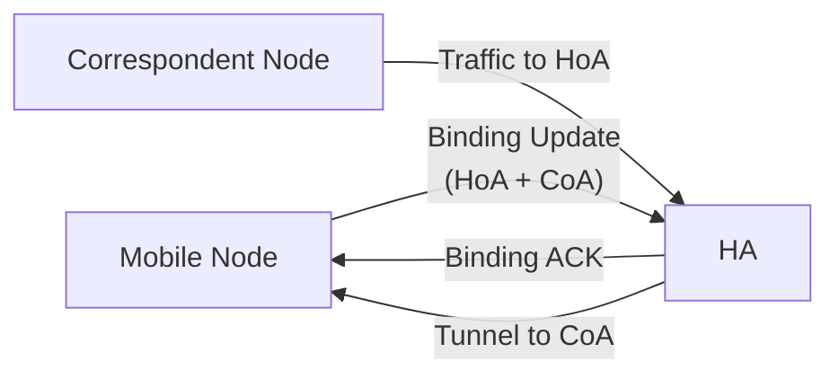

# How to Understand Mobile IPv6 Terminology

Author: [nawazdhandala](https://www.github.com/nawazdhandala)

Tags: Mobile IPv6, MIPv6, Home Address, Care-of Address, Home Agent, Networking

Description: A clear reference guide to Mobile IPv6 terminology including Home Address, Care-of Address, Home Agent, and related concepts defined in RFC 6275.

## Introduction

Mobile IPv6 introduces a set of specialized terms that differ from standard IPv6 networking. Understanding these terms precisely is essential before configuring or troubleshooting MIPv6 deployments.

## Core Address Types

### Home Address (HoA)

The Home Address is the permanent, topologically fixed IPv6 address assigned to the Mobile Node. It belongs to the home network prefix.

```text
Home Network Prefix: 2001:db8:home::/64
Mobile Node HoA:     2001:db8:home::100
```

- Applications always use the HoA
- Correspondent Nodes address traffic to the HoA
- The HoA never changes, regardless of the MN's physical location

### Care-of Address (CoA)

The Care-of Address is the temporary address the Mobile Node acquires at its current point of attachment (the foreign network).

```text
Foreign Network Prefix: 2001:db8:foreign::/64
Mobile Node CoA:        2001:db8:foreign::50 (assigned via SLAAC/DHCPv6)
```

There are two types:
- **Foreign Agent CoA**: provided by a Foreign Agent router (used in MIPv4, rare in MIPv6)
- **Co-located CoA**: acquired directly by the MN via SLAAC or DHCPv6 (standard in MIPv6)

## Core Entities

### Home Agent (HA)



The Home Agent is a router on the home network that:
1. Maintains the Binding Cache (HoA → CoA mapping)
2. Intercepts traffic sent to the MN's HoA using proxy NDP
3. Tunnels intercepted traffic to the MN's CoA

### Correspondent Node (CN)

The Correspondent Node is any IPv6 host communicating with the Mobile Node. CNs use the MN's HoA as the destination, unaware of MIPv6 details unless Route Optimization is used.

### Foreign Agent (FA)

Primarily a MIPv4 concept; in MIPv6, the MN acquires its own CoA directly.

## Mobility Operations

### Binding

A binding is a mapping between a Mobile Node's HoA and its current CoA, along with a lifetime value.

```text
Binding Entry Example:
  HoA:       2001:db8:home::100
  CoA:       2001:db8:foreign::50
  Lifetime:  600 seconds
  Sequence:  47
```

### Binding Update (BU)

Sent by the MN to the HA (and optionally to CNs) to register a new CoA.

```text
BU Message Fields:
  Sequence Number: monotonically increasing (replay protection)
  Lifetime:        registration lifetime in 4-second units
  K flag:          request BA
  H flag:          sent to Home Agent (not CN)
  A flag:          acknowledge requested
```

### Binding Acknowledgement (BA)

The HA's response to a BU, confirming the new binding.

```text
BA Message Fields:
  Status:    0 = Binding Update accepted
  Lifetime:  granted lifetime (may be less than requested)
  Sequence:  matches BU sequence number
```

### Home Registration

The specific BU sent to the Home Agent (H flag set) is called a Home Registration.

### Deregistration

Sending a BU with Lifetime = 0 removes the binding, returning the MN to home network behavior.

```python
# Pseudo-code illustrating binding lifecycle

class MobileIPv6:
    def register(self, home_address, care_of_address, lifetime=600):
        """Send Binding Update to Home Agent."""
        bu = BindingUpdate(
            hoa=home_address,
            coa=care_of_address,
            lifetime=lifetime,
            h_flag=True,  # Home registration
            k_flag=True,  # Request acknowledgement
        )
        self.send_to_home_agent(bu)

    def deregister(self, home_address):
        """Send BU with lifetime=0 to remove binding."""
        bu = BindingUpdate(
            hoa=home_address,
            coa=self.current_coa,
            lifetime=0,   # Deregistration
        )
        self.send_to_home_agent(bu)
```

## Additional Terms

| Term | Definition |
|---|---|
| Binding Cache | HA's table of HoA→CoA mappings |
| Binding Update List | MN's table of BUs sent to CNs and HA |
| Home Link | The network where the MN's HoA resides |
| Foreign Link | Any network the MN is currently visiting |
| Movement Detection | Process of detecting network change (NDP-based) |
| Return Routability | Security procedure for CN-bound Route Optimization |

## Conclusion

Mobile IPv6 terminology forms a consistent vocabulary for describing address mobility. The HoA/CoA distinction is the central concept: the HoA stays constant for applications, while the CoA changes with location. Understanding these terms is prerequisite to troubleshooting MIPv6 deployments monitored with OneUptime.
