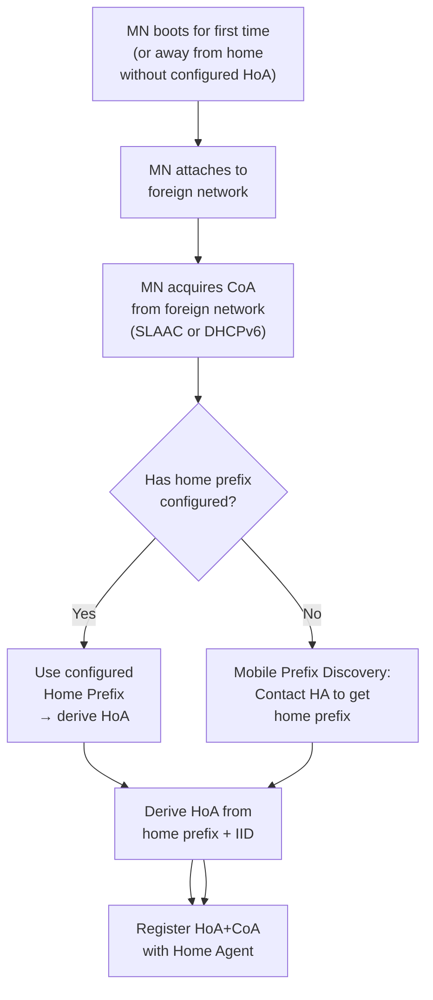

# How to Understand Mobile Prefix Discovery

Author: [nawazdhandala](https://www.github.com/nawazdhandala)

Tags: Mobile IPv6, Mobile Prefix Discovery, MPD, RFC 6275, NEMO, Networking

Description: Understand Mobile Prefix Discovery, which enables a Mobile Node to discover the home network prefix needed to generate a Home Address while away from the home network.

## Introduction

Mobile Prefix Discovery (MPD), defined in RFC 6275 §10.6, enables a Mobile Node that is away from its home network to discover the home network prefix. This is needed when the MN boots away from home and has no statically configured Home Address.

## When MPD Is Needed



## MPD Using ICMPv6 Messages

MPD reuses ICMPv6 Router Solicitation and Advertisement messages. The MN sends a Router Solicitation directly to the HA, which responds with a Router Advertisement containing the home prefix.

### Mobile Prefix Solicitation (MPS)

The MN sends an ICMPv6 Router Solicitation to the HA's address (not multicast), with a Mobility Header option indicating it is a Mobile Prefix Solicitation.

```text
IPv6 Header:
  Source: CoA (or link-local)
  Destination: HA address (unicast)

ICMPv6 Type 133 (Router Solicitation)
  Options:
    Source Link-Layer Address
    Mobile Node Identifier (MNID) option
```

### Mobile Prefix Advertisement (MPA)

The HA responds with a Router Advertisement containing the home prefix.

```text
IPv6 Header:
  Source: HA address
  Destination: CoA

ICMPv6 Type 134 (Router Advertisement)
  Flags: managed flag if DHCPv6 needed
  Options:
    Prefix Information Option:
      Prefix: 2001:db8:home::/64
      L flag: 1 (on-link)
      A flag: 1 (autonomous address config)
      Valid Lifetime: 2592000
      Preferred Lifetime: 604800
    Acknowledgement ID: (matches MPS)
```

## Deriving the Home Address from the Prefix

```python
import ipaddress
import secrets

def derive_home_address(home_prefix: str, use_eui64: bool = False,
                        interface_mac: str = None) -> str:
    """
    Derive a Home Address from the discovered home prefix.

    Two methods:
    1. EUI-64 from MAC address (predictable, RFC 4291)
    2. Stable privacy address (RFC 7217, recommended)
    """
    network = ipaddress.IPv6Network(home_prefix)
    prefix_int = int(network.network_address)

    if use_eui64 and interface_mac:
        # EUI-64 interface identifier from MAC address
        mac_bytes = bytes.fromhex(interface_mac.replace(":", ""))
        # Insert 0xFFFE in middle and flip universal/local bit
        eui64 = (
            mac_bytes[:3] +
            bytes([mac_bytes[0] ^ 0x02]) +  # Flip U/L bit (wrong position)
            b"\xff\xfe" +
            mac_bytes[3:]
        )
        iid = int.from_bytes(eui64, "big")
    else:
        # Random stable IID (simplified; RFC 7217 uses a hash)
        iid = int.from_bytes(secrets.token_bytes(8), "big")
        # Ensure not a multicast IID
        iid = iid & 0xFEFFFFFFFFFFFFFF

    home_addr_int = prefix_int | iid
    return str(ipaddress.IPv6Address(home_addr_int))

# Example

home_prefix = "2001:db8:home::/64"
hoa = derive_home_address(home_prefix)
print(f"Home Address: {hoa}")
```

## Static Configuration vs Dynamic Discovery

```bash
# Method 1: Static configuration in mip6d.conf
# /etc/mip6d.conf
NodeConfig MN;
Interface "eth0" {
    MnIfPreference 1;
}
HomeAgent 2001:db8:home::1;
# Explicitly configured home prefix + address
Home 2001:db8:home::100/64;

# Method 2: Dynamic discovery (no Home line)
NodeConfig MN;
Interface "eth0" {
    MnIfPreference 1;
}
HomeAgent 2001:db8:home::1;
# No Home line - UMIP will perform MPD to discover prefix
# and auto-configure the HoA
```

## Monitoring MPD

```bash
# Check if MPD occurred (UMIP logs)
journalctl -u mip6d | grep -i "prefix\|home address"

# Verify the derived home address
ip -6 addr show dev lo | grep 2001:db8:home

# Capture MPD exchange
tcpdump -i eth0 -n \
  "(icmp6[0] == 133 or icmp6[0] == 134) and ip6 dst 2001:db8:home::1"
```

## Conclusion

Mobile Prefix Discovery enables MIPv6 nodes to bootstrap their Home Address configuration without static provisioning. The HA acts as a proxy router for MPD by responding to direct Router Solicitations. Monitor your HA's ability to respond to MPD requests with OneUptime to ensure new or rebooted Mobile Nodes can register successfully.
