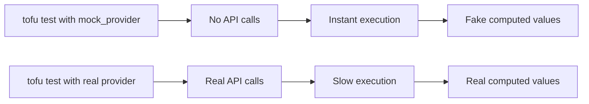

# How to Use Mock Providers in OpenTofu Tests

Author: [nawazdhandala](https://www.github.com/nawazdhandala)

Tags: OpenTofu, Testing, Mock Providers, Unit Testing, Infrastructure as Code

Description: Learn how to use OpenTofu's mock provider feature to run tests without real cloud credentials by simulating provider responses with controlled test data.

## Introduction

Mock providers, introduced in OpenTofu 1.7, allow you to replace a real cloud provider with a simulated one during tests. The mock provider returns fake but structurally valid resource data without making any API calls. This enables true unit testing of infrastructure modules-no credentials, no cost, no waiting.

## Declaring a Mock Provider

Replace a real `provider` block with a `mock_provider` block in your test file:

```hcl
# tests/s3_unit.tftest.hcl

# Instead of a real AWS provider, use a mock

mock_provider "aws" {
  # Alias matches the provider alias used in the module, if any
  # alias = "us_east_1"
}

run "bucket_created_with_correct_name" {
  command = apply

  variables {
    bucket_name = "my-test-bucket"
    region      = "us-east-1"
  }

  assert {
    condition     = aws_s3_bucket.this.bucket == "my-test-bucket"
    error_message = "Bucket name should match the input variable"
  }
}
```

With a mock provider, `tofu test` generates placeholder values for provider-computed attributes (IDs, ARNs, etc.) without calling AWS.

## Overriding Mock Return Values

You can specify exactly what values the mock should return for a given resource type using `mock_resource`:

```hcl
mock_provider "aws" {
  mock_resource "aws_s3_bucket" {
    defaults = {
      # Override the auto-generated bucket ARN
      arn    = "arn:aws:s3:::my-test-bucket"
      region = "us-east-1"
    }
  }

  mock_data "aws_caller_identity" {
    defaults = {
      account_id = "123456789012"
      arn        = "arn:aws:iam::123456789012:user/test"
      user_id    = "AIDATEST123456789012"
    }
  }
}

run "arn_format_is_valid" {
  command = apply

  assert {
    condition     = startswith(aws_s3_bucket.this.arn, "arn:aws:s3:::")
    error_message = "Bucket ARN should start with arn:aws:s3:::"
  }
}
```

## Mocking Multiple Providers

When a module uses multiple providers, mock each one:

```hcl
mock_provider "aws" {
  mock_resource "aws_instance" {
    defaults = {
      id         = "i-0abc123def456789"
      public_ip  = "54.1.2.3"
      private_ip = "10.0.1.10"
    }
  }
}

mock_provider "cloudflare" {
  mock_resource "cloudflare_record" {
    defaults = {
      id = "abc123"
    }
  }
}

run "dns_record_points_to_instance_ip" {
  command = apply

  assert {
    condition     = cloudflare_record.web.value == aws_instance.web.public_ip
    error_message = "DNS record should point to the instance's public IP"
  }
}
```

## Mock Providers vs Real Providers



## Limitations of Mock Providers

- Mock providers do not validate whether your configuration would actually succeed in a real deployment.
- Complex provider logic (e.g., automatic security group rules, subnet calculations) is not simulated.
- Use mock providers for unit tests; complement with real-provider integration tests for end-to-end confidence.

## Complete Example: EC2 Module Test

```hcl
# tests/ec2_unit.tofutest.hcl

mock_provider "aws" {
  mock_resource "aws_instance" {
    defaults = {
      id            = "i-mockinstance12345"
      public_ip     = "1.2.3.4"
      private_ip    = "10.0.1.5"
      instance_state = "running"
    }
  }
}

variables {
  ami_id        = "ami-0abcdef1234567890"
  instance_type = "t3.micro"
  name          = "web-server"
}

run "instance_has_correct_type" {
  command = apply

  assert {
    condition     = aws_instance.this.instance_type == "t3.micro"
    error_message = "Instance type should be t3.micro"
  }
}

run "instance_has_name_tag" {
  command = apply

  assert {
    condition     = aws_instance.this.tags["Name"] == "web-server"
    error_message = "Instance must have a Name tag matching the 'name' variable"
  }
}
```

## Conclusion

Mock providers unlock fast, credential-free infrastructure unit testing. Use them for the bulk of your test coverage, and reserve real-provider tests for integration checks that need to verify actual cloud behaviour.
