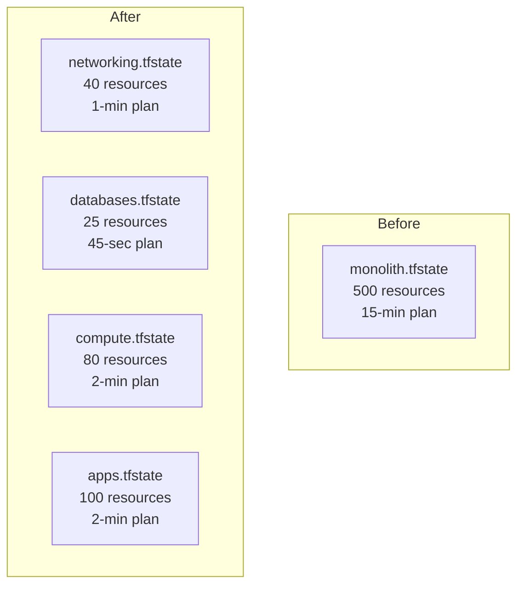

# How to Modularize Infrastructure to Reduce State File Size

Author: [nawazdhandala](https://www.github.com/nawazdhandala)

Tags: OpenTofu, Performance, State Management, Modularization, Infrastructure as Code, Best Practices

Description: Learn how to break a large monolithic OpenTofu state file into smaller, focused state files to improve plan speed, reduce blast radius, and enable team autonomy.

## Introduction

A state file with hundreds of resources causes slow plans, large lock contention windows, and high blast radius when something goes wrong. Modularizing into separate state files - each managing a focused set of resources - is the most impactful long-term performance and safety improvement.

## Current vs Target Architecture



## Step 1: Identify Logical Boundaries

Group resources by lifecycle and ownership:

```text
networking/      → VPC, subnets, route tables, NAT gateways (rarely changes)
security/        → Security groups, IAM roles (moderate change rate)
databases/       → RDS, ElastiCache (changes rarely, high sensitivity)
compute/         → EC2, Auto Scaling, EKS (changes frequently)
applications/    → ECS services, Lambda functions (changes most frequently)
```

## Step 2: Move Resources to New Configurations

```bash
# 1. Add the resource to the new configuration file

# 2. Remove it from the old configuration
# 3. Move the state entry to the new state file

# Export state from the old config
tofu state pull > old-state.json

# Initialize the new configuration
cd networking/
tofu init

# Move the state entry
tofu state mv \
  -state=/path/to/old/terraform.tfstate \
  -state-out=./networking.tfstate \
  aws_vpc.main aws_vpc.main
```

## Step 3: Replace Direct References with Remote State

After splitting, cross-state references use `terraform_remote_state`:

```hcl
# compute/main.tf - read VPC outputs from networking state
data "terraform_remote_state" "networking" {
  backend = "s3"
  config = {
    bucket = "my-opentofu-state"
    key    = "networking/tofu.tfstate"
    region = "us-east-1"
  }
}

resource "aws_autoscaling_group" "app" {
  vpc_zone_identifier = data.terraform_remote_state.networking.outputs.private_subnet_ids
  # ...
}
```

## Step 4: Networking Module Exports Outputs

```hcl
# networking/outputs.tf
output "vpc_id" {
  value = aws_vpc.main.id
}

output "private_subnet_ids" {
  value = aws_subnet.private[*].id
}

output "public_subnet_ids" {
  value = aws_subnet.public[*].id
}
```

## Recommended Directory Structure

```text
infrastructure/
├── networking/
│   ├── main.tf
│   ├── outputs.tf
│   └── backend.tf
├── security/
│   ├── main.tf
│   ├── outputs.tf
│   └── backend.tf
├── databases/
│   ├── main.tf
│   └── backend.tf
└── compute/
    ├── main.tf
    └── backend.tf
```

Each directory has its own remote backend configured:

```hcl
# networking/backend.tf
terraform {
  backend "s3" {
    bucket = "my-opentofu-state"
    key    = "networking/tofu.tfstate"
    region = "us-east-1"
  }
}
```

## Conclusion

Splitting a monolithic state file into focused configurations is a foundational improvement for any infrastructure that has grown beyond 100 resources. It reduces plan time from minutes to seconds, limits blast radius to a single domain, and enables teams to work on their area without blocking each other's pipelines.
