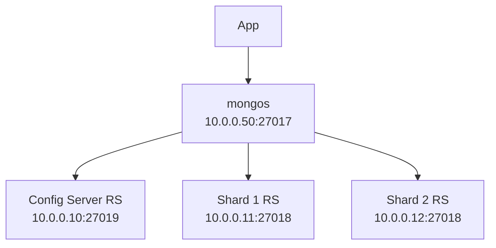

# How to Set Up MongoDB Sharded Cluster with IPv4 Config Servers

Author: [nawazdhandala](https://www.github.com/nawazdhandala)

Tags: MongoDB, Sharding, IPv4, Config Server, Mongos, Distributed Database, Configuration

Description: Learn how to set up a MongoDB sharded cluster with IPv4 config servers and shards to horizontally scale a large dataset across multiple servers.

---

MongoDB sharding splits data across multiple servers (shards), allowing horizontal scaling beyond what a single node can handle. The cluster consists of config servers (metadata), shard replica sets (data), and mongos routers (client-facing).

## Cluster Architecture



## Step 1: Start Config Servers

```yaml
# /etc/mongod-configsvr.conf (on 10.0.0.10)

net:
  bindIp: 10.0.0.10,127.0.0.1
  port: 27019

replication:
  replSetName: configReplSet

sharding:
  clusterRole: configsvr

storage:
  dbPath: /var/lib/mongodb/configsvr
```

```bash
mongod --config /etc/mongod-configsvr.conf --fork --logpath /var/log/mongodb/configsvr.log

# Initialize the config server replica set
mongosh --host 10.0.0.10 --port 27019
```

```javascript
rs.initiate({
  _id: "configReplSet",
  configsvr: true,
  members: [{ _id: 0, host: "10.0.0.10:27019" }]
})
```

## Step 2: Start Shard Replica Sets

```yaml
# /etc/mongod-shard1.conf (on 10.0.0.11)
net:
  bindIp: 10.0.0.11,127.0.0.1
  port: 27018

replication:
  replSetName: shard1ReplSet

sharding:
  clusterRole: shardsvr

storage:
  dbPath: /var/lib/mongodb/shard1
```

```javascript
// Initialize shard 1 replica set
rs.initiate({ _id: "shard1ReplSet", members: [{ _id: 0, host: "10.0.0.11:27018" }] })
// Repeat for shard 2 on 10.0.0.12
```

## Step 3: Start the mongos Router

```yaml
# /etc/mongos.conf (on 10.0.0.50)
net:
  bindIp: 10.0.0.50,127.0.0.1
  port: 27017

sharding:
  configDB: configReplSet/10.0.0.10:27019
```

```bash
mongos --config /etc/mongos.conf --fork --logpath /var/log/mongodb/mongos.log
```

## Step 4: Add Shards via mongos

```javascript
// Connect to mongos
mongosh --host 10.0.0.50 --port 27017

// Add shard replica sets to the cluster
sh.addShard("shard1ReplSet/10.0.0.11:27018")
sh.addShard("shard2ReplSet/10.0.0.12:27018")

// Enable sharding on a database
sh.enableSharding("myapp")

// Shard a collection on a hash-based shard key
sh.shardCollection("myapp.orders", { _id: "hashed" })

// Check cluster status
sh.status()
```

## Key Takeaways

- Config servers require a replica set; production deployments use 3 members for high availability.
- `clusterRole: configsvr` and `shardsvr` must be set correctly in `mongod.conf` for each role.
- mongos is stateless - run multiple mongos instances for high availability without data concerns.
- Always bind to specific IPv4 addresses rather than `0.0.0.0` to limit the attack surface.
