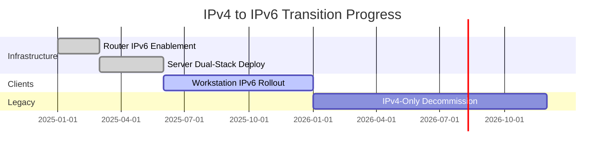

# How to Monitor IPv4 to IPv6 Transition Progress on Your Network

Author: [nawazdhandala](https://www.github.com/nawazdhandala)

Tags: IPv6, IPv4, Network Monitoring, Dual-Stack, Network Transition

Description: Learn how to track and measure the progress of IPv4 to IPv6 migration on your network using tools like ping6, traceroute6, SNMP, and custom scripts.

## Why Monitoring the Transition Matters

Migrating from IPv4 to IPv6 is rarely done overnight. Most networks operate in a dual-stack mode for an extended period—serving both protocols simultaneously. Without systematic monitoring, it's easy to lose track of which hosts are IPv6-capable, which tunnels are active, and whether IPv6 traffic is actually being preferred over IPv4 where intended.

## Step 1: Inventory Dual-Stack Hosts

Start by identifying which hosts in your network already have IPv6 addresses assigned. A simple scan using `nmap` reveals dual-stack capability:

```bash
# Scan a subnet for hosts responding on both IPv4 and IPv6
nmap -6 -sn fe80::/64 --interface eth0   # link-local discovery
nmap -4 -sn 192.168.1.0/24               # baseline IPv4 count
```

Compare the two outputs to calculate the percentage of hosts that are IPv6-enabled.

## Step 2: Check IPv6 Address Assignment on Linux Hosts

On individual Linux hosts, verify whether a global unicast IPv6 address (GUA) has been assigned:

```bash
# List all interfaces and their IPv6 addresses
ip -6 addr show

# Check for a global unicast address (starts with 2xxx or 3xxx)
ip -6 addr show scope global
```

A host without a `scope global` IPv6 address is still IPv4-only and hasn't completed the transition.

## Step 3: Monitor IPv6 Traffic Ratios with SNMP

If your routers support SNMP, you can poll IPv6 traffic counters using `ipv6IfStatsInReceives` and compare against `ipInReceives` for IPv4. Use `snmpwalk` to retrieve these values:

```bash
# Poll IPv4 input packets
snmpwalk -v2c -c public 192.168.1.1 1.3.6.1.2.1.4.3

# Poll IPv6 input packets (ipv6IfStatsInReceives)
snmpwalk -v2c -c public 192.168.1.1 1.3.6.1.2.1.55.1.6.1.1
```

Track these values over time to chart the growing proportion of IPv6 traffic.

## Step 4: Automate a Transition Progress Report

The following Python script queries a list of hosts and reports which ones have IPv6 addresses in DNS:

```python
import socket
import csv

# List of hostnames to audit for IPv6 readiness
hosts = ["server1.example.com", "server2.example.com", "server3.example.com"]

results = []
for host in hosts:
    try:
        # getaddrinfo returns all address families; check for AF_INET6
        addrs = socket.getaddrinfo(host, None)
        has_ipv6 = any(a[0] == socket.AF_INET6 for a in addrs)
        has_ipv4 = any(a[0] == socket.AF_INET for a in addrs)
    except socket.gaierror:
        has_ipv4 = has_ipv6 = False

    results.append({"host": host, "ipv4": has_ipv4, "ipv6": has_ipv6})

# Write results to CSV for tracking over time
with open("ipv6_transition_report.csv", "w", newline="") as f:
    writer = csv.DictWriter(f, fieldnames=["host", "ipv4", "ipv6"])
    writer.writeheader()
    writer.writerows(results)

ipv6_count = sum(1 for r in results if r["ipv6"])
print(f"IPv6 readiness: {ipv6_count}/{len(results)} hosts ({100*ipv6_count//len(results)}%)")
```

Run this script weekly and store the CSV files to visualize your transition trajectory over time.

## Step 5: Verify IPv6 Preference in DNS and Applications

Even when both stacks are available, confirm that Happy Eyeballs (RFC 6555) is preferring IPv6:

```bash
# Verify which address family is used for a connection
curl -v --ipv6 https://example.com 2>&1 | grep "Connected to"
curl -v --ipv4 https://example.com 2>&1 | grep "Connected to"

# Check DNS resolution order
dig AAAA example.com +short   # IPv6 address record
dig A example.com +short       # IPv4 address record
```

If the AAAA record exists and is reachable, modern clients will prefer it automatically.

## Visualizing Progress

Use a Mermaid diagram to represent a typical transition timeline:



## Conclusion

Monitoring IPv4-to-IPv6 transition progress requires inventory scanning, traffic ratio analysis, and DNS AAAA record tracking. Automate weekly audits with scripts and track the percentage of dual-stack hosts over time to keep the migration on schedule. Tools like OneUptime can surface these metrics alongside uptime and latency data for a unified network health view.
