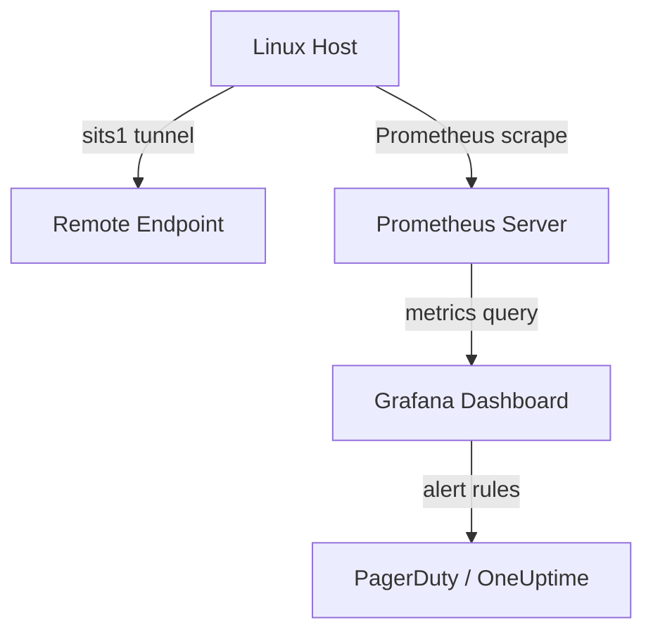

# How to Monitor IPv6 Tunnel Performance

Author: [nawazdhandala](https://www.github.com/nawazdhandala)

Tags: IPv6, Tunneling, Network Monitoring, Performance, Observability

Description: Learn how to monitor IPv6 tunnel performance using Linux tools, metrics collection, and observability platforms to detect latency, packet loss, and throughput degradation.

## Why Monitor IPv6 Tunnel Performance?

IPv6 tunnels (6in4, GRE, IPIP, SIT) introduce additional encapsulation overhead and a dependency on the underlying IPv4 transport. Without monitoring, you may not notice gradual performance degradation, asymmetric routing issues, or intermittent packet loss until users start complaining.

## Key Metrics to Track

- **Latency**: Added by tunnel encapsulation and remote endpoint processing
- **Packet loss**: Often caused by MTU mismatches or upstream congestion
- **Throughput**: Reduced by CPU overhead from software tunnel processing
- **Error counters**: Overruns, drops, and checksum errors on tunnel interfaces

## Using ip -s link to View Interface Statistics

The `ip` command shows per-interface byte and error counters, including tunnel interfaces:

```bash
# Show statistics for a specific tunnel interface
# -s flag adds statistics, -s -s adds even more detail
ip -s -s link show sit1

# To watch statistics in real time, poll every 2 seconds
watch -n 2 'ip -s link show sit1'
```

## Continuous Latency Monitoring with ping6

Use `ping6` to continuously measure round-trip time to the remote tunnel endpoint:

```bash
# Send continuous pings to the remote IPv6 tunnel endpoint
# -i 1: interval 1 second, -c 100: send 100 pings
ping6 -i 1 -c 100 2001:db8:tunnel::2

# For flood ping (requires root), measure high-rate packet loss
ping6 -f -c 10000 2001:db8:tunnel::2
```

## Using iperf3 for Throughput Testing

`iperf3` lets you measure actual tunnel throughput in both directions:

```bash
# On the remote tunnel endpoint (server side)
iperf3 -s -6

# On the local end (client side), connect to the remote IPv6 address
# -t 30: run for 30 seconds, -P 4: use 4 parallel streams
iperf3 -6 -c 2001:db8:tunnel::2 -t 30 -P 4

# Reverse test: server sends, client receives
iperf3 -6 -c 2001:db8:tunnel::2 -R -t 30
```

## Monitoring with vnstat for Long-Term Trends

`vnstat` tracks bandwidth usage per interface over time, useful for trend analysis:

```bash
# Initialize monitoring on the tunnel interface
vnstat -i sit1

# Show hourly statistics
vnstat -i sit1 -h

# Show daily statistics
vnstat -i sit1 -d

# Show monthly statistics
vnstat -i sit1 -m
```

## Collecting Metrics with Prometheus Node Exporter

The Prometheus Node Exporter exposes Linux network interface metrics automatically. After installing it, query tunnel performance with PromQL:

```promql
# Rate of bytes received on the tunnel interface over the last 5 minutes
rate(node_network_receive_bytes_total{device="sit1"}[5m])

# Packet error rate on the tunnel interface
rate(node_network_receive_errs_total{device="sit1"}[5m])

# Packet drop rate
rate(node_network_receive_drop_total{device="sit1"}[5m])
```

## Setting Up an ICMP Monitor in OneUptime

To get continuous latency and availability data for your tunnel endpoint, set up an ICMP monitor in OneUptime:

1. Navigate to **Monitors** and create a new monitor.
2. Select **Ping Monitor** (ICMP).
3. Enter the remote tunnel endpoint's IPv6 address (e.g., `2001:db8:tunnel::2`).
4. Set check interval to 1 minute.
5. Configure an alert if latency exceeds 50ms or packet loss exceeds 1%.

This gives you historical latency graphs and instant alerting when the tunnel degrades.

## Visualizing with a Dashboard



## Summary

Effective IPv6 tunnel monitoring combines real-time CLI tools (`ip -s`, `ping6`, `iperf3`) with long-term metrics collection (Prometheus, vnstat) and alerting platforms like OneUptime. Monitor latency, throughput, and error counters consistently to catch tunnel issues before they impact end users.
