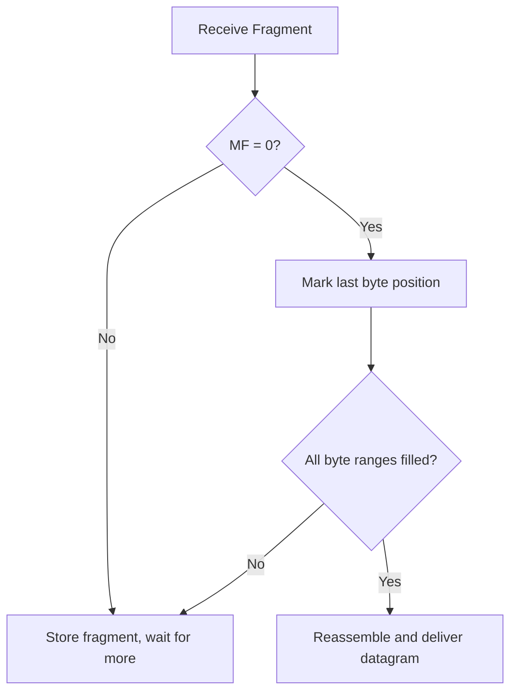

# How to Understand the More Fragments Flag in IPv4

Author: [nawazdhandala](https://www.github.com/nawazdhandala)

Tags: IPv4, Networking, Fragmentation, Packet Analysis, TCP/IP

Description: The More Fragments (MF) flag in the IPv4 header signals whether additional fragments follow the current one, allowing receivers to detect the last fragment and trigger reassembly.

## What Is the More Fragments Flag?

The More Fragments (MF) flag occupies bit 2 of the 3-bit Flags field in the IPv4 header. When set to 1, it tells the receiving host that more fragments belonging to the same datagram are in transit. The final fragment of a datagram has MF=0 combined with a non-zero Fragment Offset, which signals the receiver that all data has arrived.

## Flags Field Summary

| Bit | Name | Meaning when set |
|-----|------|-----------------|
| 0 | Reserved | Always 0 |
| 1 | DF | Do not fragment |
| 2 | MF | More fragments follow |

## Fragmentation Example

Consider a 4000-byte datagram sent over a path with an MTU of 1500 bytes. The IP header is 20 bytes, leaving 1480 bytes of payload per fragment.

| Fragment | Offset (bytes) | Offset field (÷8) | MF |
|----------|---------------|-------------------|----|
| 1        | 0             | 0                 | 1  |
| 2        | 1480          | 185               | 1  |
| 3        | 2960          | 370               | 0  |

The last fragment has MF=0, telling the receiver that reassembly can begin once all fragments are received.

## Reading the MF Flag with Scapy

```python
from scapy.all import IP, UDP, Raw, fragment

# Create a large UDP datagram that will require fragmentation
pkt = IP(dst="192.168.1.10") / UDP(dport=9999) / Raw(b"D" * 4000)

# Fragment into pieces fitting a 1500-byte MTU
frags = fragment(pkt, fragsize=1480)

for i, f in enumerate(frags):
    mf = 1 if f[IP].flags & 0x1 else 0  # MF is bit 0 of the Scapy flags int
    offset = f[IP].frag * 8              # Fragment offset in bytes
    print(f"Fragment {i+1}: offset={offset} MF={mf}")
```

## Capturing MF Fragments with tcpdump

```bash
# Capture packets where the MF flag is set (more fragments follow)
tcpdump -i eth0 'ip[6] & 0x20 != 0'

# Capture all fragments (MF set OR non-zero offset)
tcpdump -i eth0 '(ip[6] & 0x20 != 0) or (ip[6:2] & 0x1fff != 0)'
```

## Reassembly Logic

When a host receives fragments, it:

1. Stores each fragment in a buffer indexed by (src IP, dst IP, protocol, ID).
2. Tracks which byte ranges have been received.
3. Waits until a fragment with MF=0 arrives.
4. Checks that all byte ranges from 0 to the end of the last fragment are filled.
5. Reassembles and delivers the complete datagram to the upper layer.



## Security Implications

Fragmentation-based attacks exploit MF handling:
- **Teardrop attack**: Overlapping fragment offsets cause buffer corruption on vulnerable stacks.
- **Fragment flooding**: Sending many incomplete fragment sets exhausts reassembly buffers.

Most modern firewalls reassemble fragments before inspection to prevent evasion through fragmentation.

## Key Takeaways

- MF=1 means more fragments are coming; MF=0 on the last fragment signals completion.
- Receivers use the MF flag together with Fragment Offset to detect when all data has arrived.
- Fragmentation-aware firewalls should reassemble before deep packet inspection.
- Prefer path MTU discovery to avoid fragmentation altogether.
