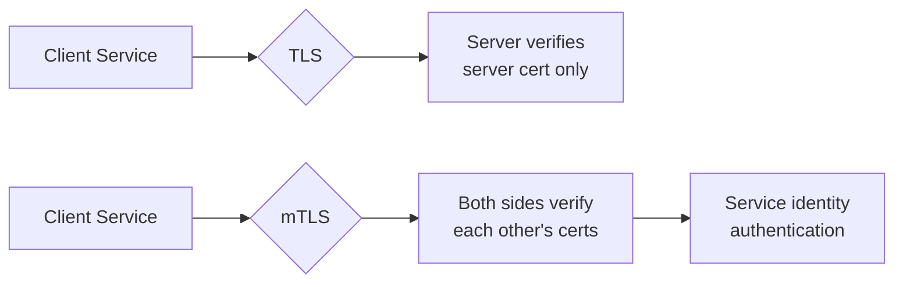

# How to Configure mTLS with Service Mesh Using OpenTofu

Author: [nawazdhandala](https://www.github.com/nawazdhandala)

Tags: OpenTofu, mTLS, Service Mesh, Istio, Linkerd, Security, Kubernetes, Infrastructure as Code

Description: Learn how to configure mutual TLS (mTLS) between services using Istio or Linkerd service mesh with OpenTofu, ensuring all service-to-service communication is encrypted and authenticated.

---

Mutual TLS (mTLS) means both sides of a service-to-service connection present certificates, providing encryption in transit and mutual authentication. Service meshes automate certificate issuance, rotation, and enforcement without requiring application changes. OpenTofu configures the mesh policies.

## mTLS vs TLS



## Istio Strict mTLS

```hcl
# istio_mtls.tf

# Cluster-wide strict mTLS

resource "kubernetes_manifest" "peer_auth_strict" {
  manifest = {
    apiVersion = "security.istio.io/v1beta1"
    kind       = "PeerAuthentication"
    metadata = {
      name      = "default"
      namespace = "istio-system"  # Applies cluster-wide
    }
    spec = {
      mtls = { mode = "STRICT" }
    }
  }
}

# Override for a specific namespace - permissive during migration
resource "kubernetes_manifest" "peer_auth_permissive" {
  manifest = {
    apiVersion = "security.istio.io/v1beta1"
    kind       = "PeerAuthentication"
    metadata = {
      name      = "permissive"
      namespace = "legacy-apps"  # Allow non-mesh traffic
    }
    spec = {
      mtls = { mode = "PERMISSIVE" }
    }
  }
}
```

## Istio Authorization Policy

```hcl
# Restrict which services can call each other
resource "kubernetes_manifest" "allow_frontend_to_api" {
  manifest = {
    apiVersion = "security.istio.io/v1beta1"
    kind       = "AuthorizationPolicy"
    metadata = {
      name      = "allow-frontend-to-api"
      namespace = "apps"
    }
    spec = {
      selector = {
        matchLabels = { app = "api-service" }
      }
      action = "ALLOW"
      rules = [{
        from = [{
          source = {
            principals = ["cluster.local/ns/apps/sa/frontend-service"]
          }
        }]
        to = [{
          operation = {
            methods = ["GET", "POST"]
            paths   = ["/api/*"]
          }
        }]
      }]
    }
  }
}

# Deny all traffic by default
resource "kubernetes_manifest" "deny_all" {
  manifest = {
    apiVersion = "security.istio.io/v1beta1"
    kind       = "AuthorizationPolicy"
    metadata = {
      name      = "deny-all"
      namespace = "apps"
    }
    spec = {
      # Empty spec = deny all
    }
  }
}
```

## Certificate Rotation Configuration

```hcl
# Configure certificate lifetimes
resource "kubernetes_manifest" "peer_auth_with_cert_config" {
  manifest = {
    apiVersion = "security.istio.io/v1beta1"
    kind       = "PeerAuthentication"
    metadata = {
      name      = "default"
      namespace = "istio-system"
    }
    spec = {
      mtls = { mode = "STRICT" }
    }
  }
}

# Istiod handles certificate rotation automatically
# Certificates are rotated at 80% of their lifetime
# Default cert lifetime is 24 hours
```

## Linkerd mTLS (Automatic)

```hcl
# Linkerd enables mTLS automatically when annotation is present
resource "kubernetes_namespace" "secure_apps" {
  metadata {
    name = "secure-apps"
    annotations = {
      "linkerd.io/inject" = "enabled"
    }
  }
}

# Linkerd Server policy - restrict who can access this service
resource "kubernetes_manifest" "server_policy" {
  manifest = {
    apiVersion = "policy.linkerd.io/v1beta3"
    kind       = "Server"
    metadata = {
      name      = "api-server"
      namespace = "secure-apps"
    }
    spec = {
      podSelector = {
        matchLabels = { app = "api-service" }
      }
      port = {
        number = 8080
      }
      proxyProtocol = "HTTP/2"
    }
  }
}

resource "kubernetes_manifest" "server_authorization" {
  manifest = {
    apiVersion = "policy.linkerd.io/v1beta3"
    kind       = "ServerAuthorization"
    metadata = {
      name      = "allow-frontend"
      namespace = "secure-apps"
    }
    spec = {
      server = { name = "api-server" }
      client = {
        meshTLS = {
          serviceAccounts = [
            { name = "frontend-service", namespace = "secure-apps" }
          ]
        }
      }
    }
  }
}
```

## Verification

```bash
# Verify mTLS is active between services in Istio
istioctl authn tls-check api-service.apps.svc.cluster.local

# Check Linkerd mTLS status
linkerd viz edges deployment -n secure-apps

# View certificate details
kubectl exec -it <pod> -n apps -c istio-proxy -- \
  openssl s_client -connect api-service:8080 -showcerts
```

## Best Practices

- Start with `PERMISSIVE` mode during service mesh adoption to avoid breaking existing traffic, then migrate to `STRICT` namespace by namespace.
- Use `AuthorizationPolicy` in Istio (or `ServerAuthorization` in Linkerd) to enforce which service identities can call each endpoint.
- Service mesh certificates are short-lived (24 hours for Istio, 24 hours for Linkerd) and auto-rotated - this is a security feature, not a limitation.
- Monitor certificate rotation via the mesh control plane metrics - alerts on failed rotations prevent service disruption.
- Test mTLS in staging before enforcing strict mode in production - confirm all services have sidecars injected before switching to STRICT.
