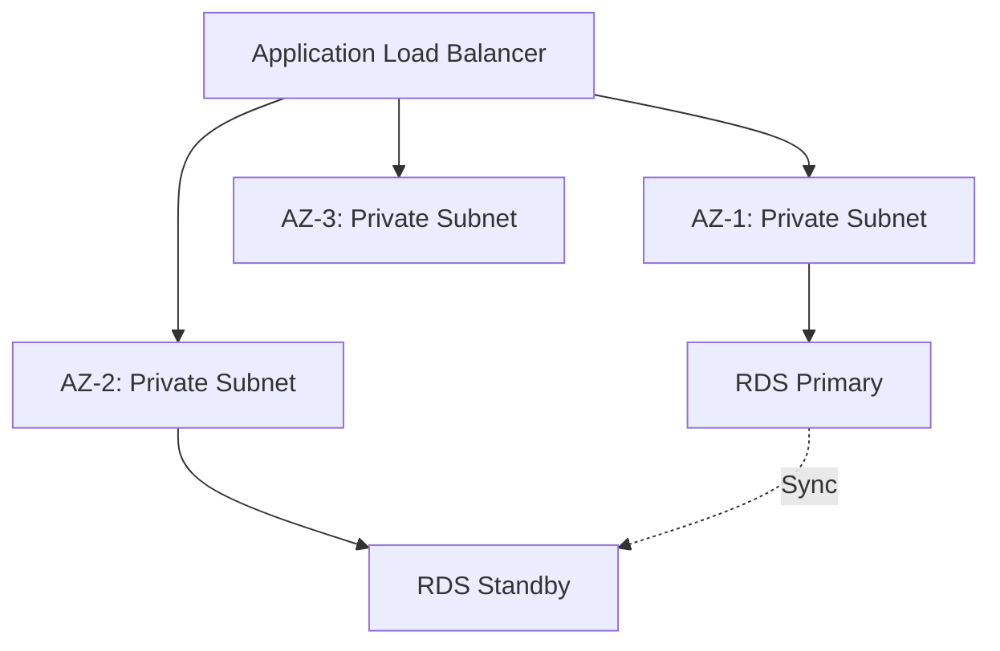

# How to Deploy a Multi-AZ Architecture with OpenTofu on AWS

Author: [nawazdhandala](https://www.github.com/nawazdhandala)

Tags: OpenTofu, AWS, Multi-AZ, High Availability, Infrastructure as Code

Description: Learn how to design and deploy a Multi-AZ architecture on AWS with OpenTofu that distributes resources across availability zones for fault tolerance.

## Introduction

A Multi-AZ architecture distributes your application across multiple Availability Zones (AZs), so a failure in one zone does not affect availability. OpenTofu's `count` and `for_each` expressions make it straightforward to create AZ-aware configurations.

## Fetching Available AZs

```hcl
data "aws_availability_zones" "available" {
  state = "available"
}

locals {
  az_count = min(var.desired_az_count, length(data.aws_availability_zones.available.names))
  azs      = slice(data.aws_availability_zones.available.names, 0, local.az_count)
}
```

## Multi-AZ Networking

```hcl
resource "aws_vpc" "main" {
  cidr_block           = var.vpc_cidr
  enable_dns_hostnames = true
}

resource "aws_subnet" "public" {
  count             = local.az_count
  vpc_id            = aws_vpc.main.id
  cidr_block        = cidrsubnet(var.vpc_cidr, 8, count.index)
  availability_zone = local.azs[count.index]
  map_public_ip_on_launch = true
  tags = { Name = "public-${local.azs[count.index]}" }
}

resource "aws_subnet" "private" {
  count             = local.az_count
  vpc_id            = aws_vpc.main.id
  cidr_block        = cidrsubnet(var.vpc_cidr, 8, count.index + local.az_count)
  availability_zone = local.azs[count.index]
  tags = { Name = "private-${local.azs[count.index]}" }
}

resource "aws_nat_gateway" "main" {
  count         = local.az_count
  allocation_id = aws_eip.nat[count.index].id
  subnet_id     = aws_subnet.public[count.index].id
}
```

## Multi-AZ RDS

```hcl
resource "aws_db_instance" "main" {
  identifier        = "${var.name}-db"
  engine            = "postgres"
  instance_class    = var.db_instance_class
  allocated_storage = 100
  multi_az          = true  # Active-standby across two AZs

  db_subnet_group_name   = aws_db_subnet_group.main.name
  vpc_security_group_ids = [aws_security_group.rds.id]

  backup_retention_period = 7
  skip_final_snapshot     = false
}
```

## Multi-AZ ECS Service

```hcl
resource "aws_ecs_service" "app" {
  name            = var.service_name
  cluster         = aws_ecs_cluster.main.id
  task_definition = aws_ecs_task_definition.app.arn
  desired_count   = local.az_count  # One task per AZ minimum

  network_configuration {
    # Spread across all private subnets (one per AZ)
    subnets         = aws_subnet.private[*].id
    security_groups = [aws_security_group.ecs.id]
  }

  # Force spreading across AZs
  placement_constraints {
    type       = "distinctInstance"
  }
}
```

## Architecture Diagram



## Conclusion

Multi-AZ deployments with OpenTofu are driven by parameterising on AZ count. Verify your configuration always deploys at least one resource per AZ, test AZ failure scenarios in staging, and use Route53 health checks to reroute traffic automatically when an AZ becomes unhealthy.
