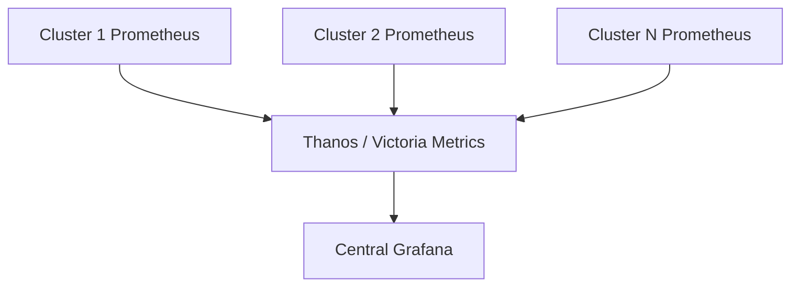

# How to Set Up Multi-Cluster Monitoring in Rancher

Author: [nawazdhandala](https://www.github.com/nawazdhandala)

Tags: Rancher, Monitoring, Prometheus, Grafana, Multi-Cluster, Kubernetes, Observability

Description: Learn how to configure multi-cluster monitoring in Rancher using Prometheus and Grafana to collect and visualize metrics from all managed clusters in a central dashboard.

---

Rancher includes a built-in monitoring stack based on Prometheus and Grafana. For multi-cluster environments, you can run per-cluster monitoring with a central aggregation layer, or push metrics from all clusters to a central Prometheus instance.

---

## Architecture Options



---

## Step 1: Enable Rancher Monitoring Per Cluster

Install the Rancher Monitoring app on each managed cluster via the Rancher UI or Helm:

```bash
# Enable monitoring on a cluster via Helm
helm repo add rancher-charts https://charts.rancher.io
helm repo update

helm install rancher-monitoring \
  rancher-charts/rancher-monitoring \
  --namespace cattle-monitoring-system \
  --create-namespace \
  --set prometheus.prometheusSpec.retention=15d \
  --set prometheus.prometheusSpec.storageSpec.volumeClaimTemplate.spec.resources.requests.storage=50Gi
```

---

## Step 2: Configure Remote Write to a Central Prometheus

Each cluster's Prometheus can remote-write metrics to a central instance (e.g., Thanos Receive or Victoria Metrics):

```yaml
# Patch the Prometheus CR to add remoteWrite
apiVersion: monitoring.coreos.com/v1
kind: Prometheus
metadata:
  name: rancher-monitoring-prometheus
  namespace: cattle-monitoring-system
spec:
  remoteWrite:
    - url: https://central-prometheus.example.com/api/v1/write
      # Add a cluster label so you can filter by cluster in Grafana
      writeRelabelConfigs:
        - targetLabel: cluster
          replacement: production-us-east
      basicAuth:
        username:
          name: remote-write-creds
          key: username
        password:
          name: remote-write-creds
          key: password
```

Apply using `kubectl patch` or via the Rancher UI's YAML editor.

---

## Step 3: Install Thanos as a Central Aggregator

On the management cluster, deploy Thanos to aggregate metrics:

```bash
helm repo add bitnami https://charts.bitnami.com/bitnami

helm install thanos bitnami/thanos \
  --namespace thanos \
  --create-namespace \
  --set query.enabled=true \
  --set queryFrontend.enabled=true \
  --set receive.enabled=true \
  --set objstoreConfig="
    type: S3
    config:
      bucket: my-thanos-bucket
      endpoint: s3.amazonaws.com
      region: us-east-1
  "
```

---

## Step 4: Configure Grafana for Multi-Cluster Dashboards

Add the Thanos Query endpoint as a Prometheus datasource in Grafana, then use the `cluster` label in dashboard queries:

```promql
# CPU usage per cluster
sum by (cluster, namespace) (
  rate(container_cpu_usage_seconds_total{container!=""}[5m])
)
```

Import the **Kubernetes / Multi-cluster** dashboard (Grafana ID `15757`) for a pre-built multi-cluster overview.

---

## Step 5: Set Up Cross-Cluster Alerting

Create AlertManager routes that include the `cluster` label for accurate alert routing:

```yaml
# alertmanager-config.yaml
route:
  receiver: default
  routes:
    - match:
        cluster: production-us-east
        severity: critical
      receiver: pagerduty-prod
    - match:
        cluster: staging
        severity: warning
      receiver: slack-staging

receivers:
  - name: pagerduty-prod
    pagerduty_configs:
      - service_key: <prod-pagerduty-key>
  - name: slack-staging
    slack_configs:
      - api_url: <slack-webhook-url>
        channel: '#staging-alerts'
```

---

## Best Practices

- Use **consistent retention** across all cluster Prometheus instances and rely on Thanos for long-term storage.
- Add the `cluster`, `region`, and `env` labels to all remote-written metrics via relabeling.
- Deploy Grafana with **folder-per-cluster** organization for large environments.
- Alert on **federation scrape failures** so you know when a cluster's metrics go dark.
