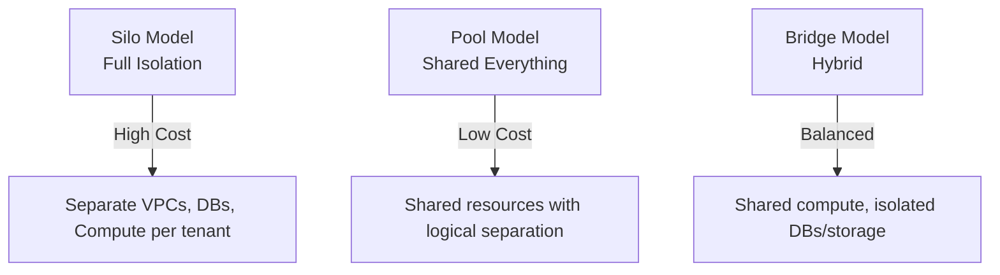

# How to Set Up Multi-Tenant Infrastructure with OpenTofu

Author: [nawazdhandala](https://www.github.com/nawazdhandala)

Tags: OpenTofu, Multi-Tenant, SaaS, Infrastructure as Code, AWS, Isolation, Architecture

Description: Learn how to design and manage multi-tenant infrastructure using OpenTofu with tenant isolation patterns, shared services, and per-tenant resource provisioning.

---

Multi-tenant infrastructure serves multiple customers from shared or isolated resources. The key challenge is balancing cost efficiency (sharing infrastructure) with security (tenant isolation). OpenTofu makes it practical to define isolation patterns as code and provision per-tenant resources consistently.

## Tenant Isolation Models



## Per-Tenant Database Isolation (Bridge Model)

```hcl
# main.tf

terraform {
  required_providers {
    aws = {
      source  = "hashicorp/aws"
      version = "~> 5.30"
    }
  }
}

provider "aws" {
  region = var.aws_region
}

variable "tenants" {
  description = "Map of tenant configurations"
  type = map(object({
    tier          = string  # basic, professional, enterprise
    db_size       = string
    storage_gb    = number
  }))
}

# Create isolated RDS database per tenant
resource "aws_db_instance" "tenant" {
  for_each = var.tenants

  identifier    = "tenant-${each.key}-db"
  engine        = "postgres"
  engine_version = "15.4"
  instance_class = each.value.tier == "enterprise" ? "db.r5.large" : "db.t3.small"
  allocated_storage = each.value.storage_gb
  db_name       = replace(each.key, "-", "_")
  username      = "admin"
  password      = random_password.tenant_db[each.key].result

  db_subnet_group_name   = aws_db_subnet_group.tenants.name
  vpc_security_group_ids = [aws_security_group.tenant_db.id]

  # Use multi-AZ for enterprise tenants
  multi_az = each.value.tier == "enterprise"

  backup_retention_period = each.value.tier == "enterprise" ? 30 : 7
  skip_final_snapshot     = false

  tags = {
    Tenant    = each.key
    Tier      = each.value.tier
    ManagedBy = "opentofu"
  }
}

resource "random_password" "tenant_db" {
  for_each = var.tenants
  length   = 32
  special  = false
}
```

## Per-Tenant S3 Storage Isolation

```hcl
# storage.tf
resource "aws_s3_bucket" "tenant" {
  for_each = var.tenants

  bucket = "${var.project_name}-tenant-${each.key}-${data.aws_caller_identity.current.account_id}"

  tags = {
    Tenant = each.key
    Tier   = each.value.tier
  }
}

# Bucket policy restricts access to tenant-specific IAM role
resource "aws_s3_bucket_policy" "tenant" {
  for_each = var.tenants

  bucket = aws_s3_bucket.tenant[each.key].id

  policy = jsonencode({
    Version = "2012-10-17"
    Statement = [{
      Effect    = "Allow"
      Principal = {
        AWS = aws_iam_role.tenant[each.key].arn
      }
      Action   = ["s3:GetObject", "s3:PutObject", "s3:DeleteObject", "s3:ListBucket"]
      Resource = [
        aws_s3_bucket.tenant[each.key].arn,
        "${aws_s3_bucket.tenant[each.key].arn}/*"
      ]
    }]
  })
}
```

## Per-Tenant IAM Roles

```hcl
# iam.tf
resource "aws_iam_role" "tenant" {
  for_each = var.tenants

  name = "${var.project_name}-tenant-${each.key}-role"

  assume_role_policy = jsonencode({
    Version = "2012-10-17"
    Statement = [{
      Effect = "Allow"
      Principal = {
        # Allow the application service role to assume this tenant role
        AWS = aws_iam_role.application.arn
      }
      Action = "sts:AssumeRole"
      Condition = {
        StringEquals = {
          "sts:ExternalId" = each.key
        }
      }
    }]
  })

  tags = {
    Tenant = each.key
  }
}
```

## Tenant Configuration in Variables

```hcl
# Example terraform.tfvars
tenants = {
  "acme-corp" = {
    tier       = "enterprise"
    db_size    = "db.r5.large"
    storage_gb = 200
  }
  "startup-co" = {
    tier       = "basic"
    db_size    = "db.t3.small"
    storage_gb = 20
  }
  "mid-market-inc" = {
    tier       = "professional"
    db_size    = "db.t3.medium"
    storage_gb = 50
  }
}
```

## Best Practices

- Use `for_each` with a tenant map so adding a new tenant is a one-line change to your variables file.
- Use resource tagging to separate tenant costs in AWS Cost Explorer - tag every resource with the tenant identifier.
- Implement a tenant onboarding module that provisions the complete set of tenant resources and outputs credentials.
- Use IAM role assumption with external ID to prevent confused deputy attacks when switching tenant contexts.
- Store per-tenant secrets (DB passwords, API keys) in separate AWS Secrets Manager paths (`/tenant/{name}/db-password`) for isolation.
