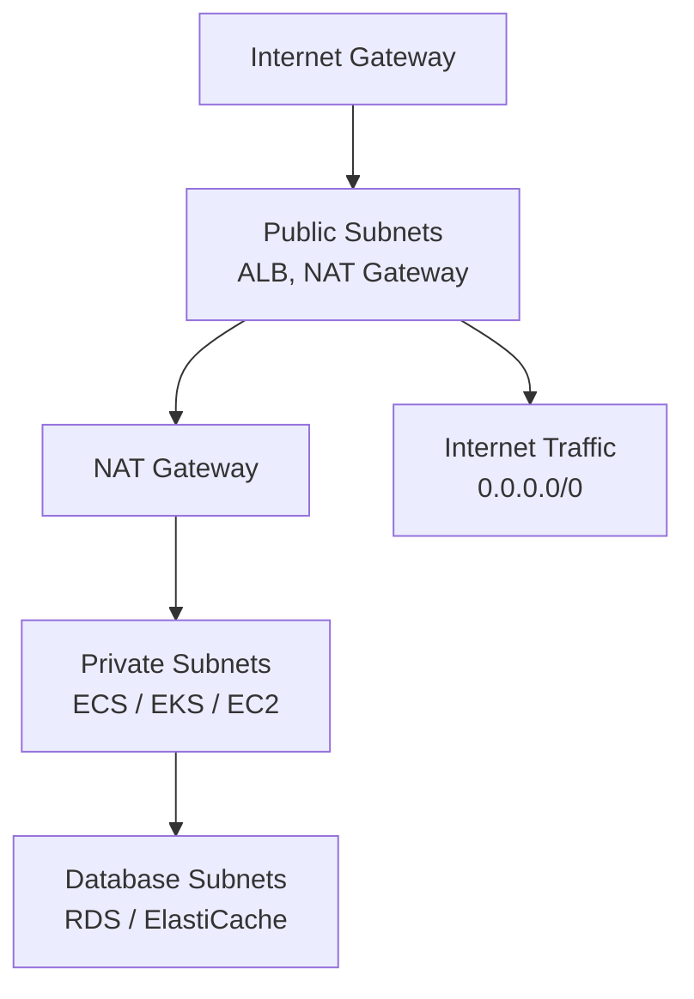

# How to Build a Multi-Tier VPC on AWS with OpenTofu

Author: [nawazdhandala](https://www.github.com/nawazdhandala)

Tags: OpenTofu, AWS, VPC, Multi-Tier, Subnets, NAT Gateway, Security Groups, Infrastructure as Code

Description: Learn how to build a production-grade multi-tier AWS VPC with public, private, and database subnets using OpenTofu, including NAT gateways, route tables, and network ACLs.

---

A multi-tier VPC separates infrastructure into layers — public (load balancers), private (application servers), and isolated (databases) — each with its own subnet, routing, and security controls. OpenTofu manages the entire network stack as code with consistent configurations across AZs.

## Multi-Tier VPC Architecture



## VPC and Internet Gateway

```hcl
# vpc.tf
locals {
  azs = slice(data.aws_availability_zones.available.names, 0, var.az_count)

  public_subnets   = [for i, az in local.azs : cidrsubnet(var.vpc_cidr, 4, i)]
  private_subnets  = [for i, az in local.azs : cidrsubnet(var.vpc_cidr, 4, i + 4)]
  database_subnets = [for i, az in local.azs : cidrsubnet(var.vpc_cidr, 4, i + 8)]
}

data "aws_availability_zones" "available" {
  state = "available"
}

resource "aws_vpc" "main" {
  cidr_block           = var.vpc_cidr  # e.g., "10.0.0.0/16"
  enable_dns_hostnames = true
  enable_dns_support   = true

  tags = {
    Name        = "${var.prefix}-vpc"
    Environment = var.environment
    ManagedBy   = "opentofu"
  }
}

resource "aws_internet_gateway" "main" {
  vpc_id = aws_vpc.main.id

  tags = {
    Name = "${var.prefix}-igw"
  }
}
```

## Subnets Across Availability Zones

```hcl
# subnets.tf

# Public subnets — internet-facing resources
resource "aws_subnet" "public" {
  count = length(local.azs)

  vpc_id                  = aws_vpc.main.id
  cidr_block              = local.public_subnets[count.index]
  availability_zone       = local.azs[count.index]
  map_public_ip_on_launch = true

  tags = {
    Name                     = "${var.prefix}-public-${local.azs[count.index]}"
    "kubernetes.io/role/elb" = "1"  # For EKS ALB controller
    Tier                     = "public"
  }
}

# Private subnets — application tier
resource "aws_subnet" "private" {
  count = length(local.azs)

  vpc_id            = aws_vpc.main.id
  cidr_block        = local.private_subnets[count.index]
  availability_zone = local.azs[count.index]

  tags = {
    Name                              = "${var.prefix}-private-${local.azs[count.index]}"
    "kubernetes.io/role/internal-elb" = "1"  # For EKS internal ALB
    Tier                              = "private"
  }
}

# Database subnets — isolated tier
resource "aws_subnet" "database" {
  count = length(local.azs)

  vpc_id            = aws_vpc.main.id
  cidr_block        = local.database_subnets[count.index]
  availability_zone = local.azs[count.index]

  tags = {
    Name = "${var.prefix}-database-${local.azs[count.index]}"
    Tier = "database"
  }
}

# RDS subnet group
resource "aws_db_subnet_group" "main" {
  name       = "${var.prefix}-db-subnet-group"
  subnet_ids = aws_subnet.database[*].id

  tags = {
    Name = "${var.prefix}-db-subnet-group"
  }
}
```

## NAT Gateways and Routing

```hcl
# nat.tf

# Elastic IPs for NAT gateways
resource "aws_eip" "nat" {
  count  = var.single_nat_gateway ? 1 : length(local.azs)
  domain = "vpc"

  tags = {
    Name = "${var.prefix}-nat-eip-${count.index}"
  }

  depends_on = [aws_internet_gateway.main]
}

# NAT gateways — one per AZ for HA, or single for cost savings
resource "aws_nat_gateway" "main" {
  count = var.single_nat_gateway ? 1 : length(local.azs)

  allocation_id = aws_eip.nat[count.index].id
  subnet_id     = aws_subnet.public[count.index].id

  tags = {
    Name = "${var.prefix}-nat-${count.index}"
  }

  depends_on = [aws_internet_gateway.main]
}

# Route tables
resource "aws_route_table" "public" {
  vpc_id = aws_vpc.main.id

  route {
    cidr_block = "0.0.0.0/0"
    gateway_id = aws_internet_gateway.main.id
  }

  tags = { Name = "${var.prefix}-public-rt" }
}

resource "aws_route_table" "private" {
  count  = var.single_nat_gateway ? 1 : length(local.azs)
  vpc_id = aws_vpc.main.id

  route {
    cidr_block     = "0.0.0.0/0"
    nat_gateway_id = aws_nat_gateway.main[var.single_nat_gateway ? 0 : count.index].id
  }

  tags = { Name = "${var.prefix}-private-rt-${count.index}" }
}

resource "aws_route_table" "database" {
  vpc_id = aws_vpc.main.id
  # No route to internet — database tier is fully isolated
  tags = { Name = "${var.prefix}-database-rt" }
}

# Route table associations
resource "aws_route_table_association" "public" {
  count          = length(local.azs)
  subnet_id      = aws_subnet.public[count.index].id
  route_table_id = aws_route_table.public.id
}

resource "aws_route_table_association" "private" {
  count          = length(local.azs)
  subnet_id      = aws_subnet.private[count.index].id
  route_table_id = aws_route_table.private[var.single_nat_gateway ? 0 : count.index].id
}

resource "aws_route_table_association" "database" {
  count          = length(local.azs)
  subnet_id      = aws_subnet.database[count.index].id
  route_table_id = aws_route_table.database.id
}
```

## Network ACLs for Database Tier

```hcl
# nacl.tf — additional layer of defense for database subnets

resource "aws_network_acl" "database" {
  vpc_id     = aws_vpc.main.id
  subnet_ids = aws_subnet.database[*].id

  # Allow inbound from private subnets only
  ingress {
    rule_no    = 100
    protocol   = "tcp"
    action     = "allow"
    cidr_block = var.vpc_cidr
    from_port  = 5432  # PostgreSQL
    to_port    = 5432
  }

  # Allow ephemeral port responses
  egress {
    rule_no    = 100
    protocol   = "tcp"
    action     = "allow"
    cidr_block = var.vpc_cidr
    from_port  = 1024
    to_port    = 65535
  }

  # Deny all other inbound
  ingress {
    rule_no    = 32766
    protocol   = "-1"
    action     = "deny"
    cidr_block = "0.0.0.0/0"
    from_port  = 0
    to_port    = 0
  }

  tags = { Name = "${var.prefix}-database-nacl" }
}
```

## Outputs

```hcl
output "vpc_id" {
  value = aws_vpc.main.id
}

output "public_subnet_ids" {
  value = aws_subnet.public[*].id
}

output "private_subnet_ids" {
  value = aws_subnet.private[*].id
}

output "database_subnet_ids" {
  value = aws_subnet.database[*].id
}

output "nat_gateway_ips" {
  description = "NAT gateway public IPs — allowlist these at external services"
  value       = aws_eip.nat[*].public_ip
}
```

## Best Practices

- Use `single_nat_gateway = true` in development and `false` (one per AZ) in production — NAT gateways cost ~$32/month each, but losing a single NAT gateway takes down all private subnets in that AZ.
- Set `var.az_count = 3` for production — three AZs provides redundancy without adding significant cost.
- Use `cidrsubnet()` to calculate subnet CIDRs programmatically — this prevents CIDR overlap errors and makes it easy to add more subnets later without manual calculation.
- Tag subnets with `kubernetes.io/role/elb` and `kubernetes.io/role/internal-elb` if you plan to run EKS — the AWS Load Balancer Controller uses these tags to discover subnets for load balancers.
- Never route database subnets to the internet — use VPC endpoints for AWS services and application-level connectivity for any external dependencies.
