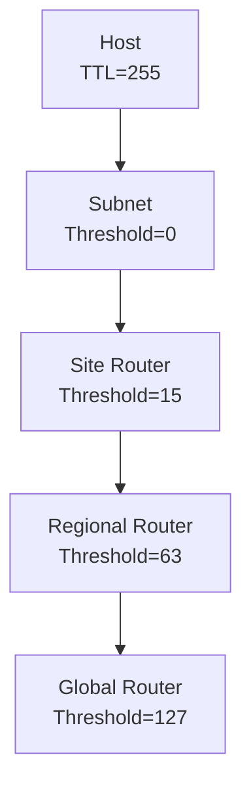

# How to Understand Multicast Scoping and TTL Thresholds

Author: [nawazdhandala](https://www.github.com/nawazdhandala)

Tags: Networking, Multicast, TTL, Scoping, IPv4, Routing

Description: Understand how IPv4 multicast scoping works through TTL thresholds and administratively-scoped address ranges to control where multicast traffic travels.

## Introduction

Multicast scoping prevents traffic from leaking beyond its intended boundary - a subnet, a campus, or a region. IPv4 uses two complementary scoping mechanisms: **TTL-based scoping** (per-hop decrement) and **administratively-scoped addresses** (RFC 2365).

## TTL-Based Scoping

Every IP packet carries a TTL field. Multicast routers enforce per-interface TTL thresholds: if a packet's TTL is ≤ the threshold, the router will not forward it out that interface.

Standard TTL threshold conventions:

| TTL | Scope |
|---|---|
| 0 | Restricted to the same host process |
| 1 | Link-local (same subnet) |
| 15 | Site boundary |
| 63 | Regional boundary |
| 127 | Continent boundary |
| 255 | Unrestricted global |

A packet sent with TTL=1 will never cross a router. A packet sent with TTL=32 can traverse up to 32 hops before being discarded.

## Administratively Scoped Addresses (RFC 2365)

The **239.0.0.0/8** block is reserved for private, administratively-scoped multicast - analogous to RFC 1918 private unicast addresses. Packets in this range SHOULD NOT be forwarded outside the organization's administrative boundary.

Sub-ranges within 239.0.0.0/8:

| Range | Scope |
|---|---|
| 239.255.0.0/16 | Link-local scope (do not route) |
| 239.192.0.0/14 | Organization-local scope |
| 239.0.0.0/8 | Site-local scope (organizational boundary) |

## Configuring TTL Thresholds on Cisco Routers

```text
! Interface facing the WAN - block site-local multicast (TTL ≤ 15)
interface GigabitEthernet0/0
 ip multicast ttl-threshold 15

! Interface facing the LAN - allow all local traffic
interface GigabitEthernet0/1
 ip multicast ttl-threshold 0
```

## Configuring TTL Thresholds with smcroute on Linux

```bash
# smcroute does not directly expose TTL thresholds,

# but iptables can enforce scope at the Linux level:

# Drop multicast leaving the LAN interface with TTL <= 1
sudo iptables -t mangle -A POSTROUTING \
  -o eth0 \
  -d 239.0.0.0/8 \
  -m ttl --ttl-lt 2 \
  -j DROP
```

## Using RFC 2365 Addresses in Applications

Prefer `239.x.x.x` addresses for any multicast that should stay within your organization:

```python
#!/usr/bin/env python3
import socket

# Use an administratively-scoped address - will not be forwarded by
# well-configured border routers even if TTL > 1
GROUP = "239.192.10.1"
PORT  = 5000
TTL   = 15  # Site-local scope

sock = socket.socket(socket.AF_INET, socket.SOCK_DGRAM)
sock.setsockopt(socket.IPPROTO_IP, socket.IP_MULTICAST_TTL, TTL)
sock.sendto(b"org-local multicast message", (GROUP, PORT))
```

## Scope Diagram



Each router's threshold determines whether a packet crosses that boundary.

## Best Practices

1. Always use `239.0.0.0/8` for internal/organizational multicast
2. Set TTL to the minimum needed (e.g., TTL=1 for link-local service discovery)
3. Configure TTL thresholds on border routers to prevent scope leakage
4. Document the TTL convention your organization uses

## Conclusion

Combine administratively-scoped addresses (`239.0.0.0/8`) with appropriate TTL values to create a defense-in-depth scoping strategy. The address block prevents border routers from forwarding private multicast, while TTL thresholds add a per-interface enforcement layer.
